# Agentic Thinking: Complete Cursor Guide

> Compiled from 13 articles on [agenticthinking.ai](https://agenticthinking.ai)  
> Source series: **The Cursor System**, **Persona Lens Model**, **Configuring Your AI Assistant**  
> Compiled: May 2026

This guide consolidates the full content from the following blog posts into a single reference document for learning Cursor's artifact system (Rules, Commands, Agents/Subagents, Skills), persona design, routing, workflows, testing, and meta-learning.

## How to Read This Guide

Articles are in the same order as the source URL list you provided (Parts 1–13). Read sequentially from top to bottom.

---

## Table of Contents

1. [Beyond Rules: Commands, Agents, and Skills](#beyond-rules-commands-agents-and-skills) — [original](https://agenticthinking.ai/blog/beyond-rules/)
2. [Designing Agent Personas That Actually Work](#designing-agent-personas-that-actually-work) — [original](https://agenticthinking.ai/blog/agent-personas/)
3. [The Multi-Agent Illusion](#the-multi-agent-illusion) — [original](https://agenticthinking.ai/blog/multi-agent-illusion/)
4. [Smart Routing: Right Agent, Right Job](#smart-routing-right-agent-right-job) — [original](https://agenticthinking.ai/blog/smart-routing/)
5. [Commands That Know When to Merge (Autonomous Workflows)](#commands-that-know-when-to-merge-autonomous-workflows) — [original](https://agenticthinking.ai/blog/autonomous-workflows/)
6. [Anatomy of a Persona Lens](#anatomy-of-a-persona-lens) — [original](https://agenticthinking.ai/blog/persona-lens-anatomy/)
7. [Designing with the Persona Lens Model](#designing-with-the-persona-lens-model) — [original](https://agenticthinking.ai/blog/persona-lens-design/)
8. [Testing AI Artifacts: A Validation Framework](#testing-ai-artifacts-a-validation-framework) — [original](https://agenticthinking.ai/blog/testing-artifacts/)
9. [AI That Teaches Itself (Meta-Learning)](#ai-that-teaches-itself-meta-learning) — [original](https://agenticthinking.ai/blog/meta-learning/)
10. [The alwaysApply Tax](#the-alwaysapply-tax) — [original](https://agenticthinking.ai/blog/alwaysapply-tax/)
11. [Rules vs Skills in AI Dev](#rules-vs-skills-in-ai-dev) — [original](https://agenticthinking.ai/blog/rules-vs-skills/)
12. [How Cursor Finds Skills](#how-cursor-finds-skills) — [original](https://agenticthinking.ai/blog/skill-discovery/)
13. [Subagents: Fresh Eyes on Demand](#subagents-fresh-eyes-on-demand) — [original](https://agenticthinking.ai/blog/subagents-fresh-context/)

---

# Beyond Rules: Commands, Agents, and Skills

**Source:** https://agenticthinking.ai/blog/beyond-rules/  
**Part 1 of 13**

Rules are just the beginning. Cursor provides four artifact types—and using the wrong one creates friction. This post covers what rules can't do and when to reach for Commands, Agents, or Skills instead.

---

## The Problem: Everything in Rules

Most Cursor users discover rules first. They work, so everything becomes a rule:

- Code conventions → Rule ✓
- Workflow for code review → Rule (awkward)
- Specialized debugging expertise → Rule (wrong tool)
- Reusable knowledge package → Rule (won't scale)

This creates bloated rules that mix guidance with procedures, context with expertise. The AI gets confused because you're overloading one artifact type.

The fix: Use the right artifact for the job.

---

## The Four Artifact Types

| Type | Purpose | Invocation | When to Use |
| --- | --- | --- | --- |
| Rules | Persistent context and guardrails | Automatic or @mention | Conventions, constraints, policies |
| Commands | User-triggered workflows | `/command` | Repeatable procedures, multi-step tasks |
| Agents | Specialized AI personas | Spawned by main agent | Deep expertise, isolated context |
| Skills | Portable knowledge modules | Agent decides | Cross-project knowledge, shared capabilities |

Let's break down the three you probably haven't used.

---

## Commands: Workflows, Not Context

Commands are the most misunderstood artifact. They look like rules but serve a completely different purpose.

### Rules vs Commands

| Aspect | Rules | Commands |
| --- | --- | --- |
| Frontmatter | Required (YAML with description, globs) | None |
| Invocation | Automatic or @mention | User types`/command-name` |
| Purpose | Context injection | Action execution |
| Location | `.cursor/rules/` | `.cursor/commands/` |

Critical mistake: Don't put YAML frontmatter in commands. They're plain markdown with a specific structure.

### Command Structure

```markdown
# /command-name - Brief Description

One-line summary of what this command does.

## Instructions

When the user invokes `/command-name`, do the following:

1. First step
2. Second step
3. Third step

### Default Behavior

What happens with no arguments.

## Variants

### `/command-name --flag`

What this variant does differently.

### `/command-name <target>`

How arguments are handled.

## Output Format

Expected output structure

## Examples

### Basic Usage

User: /command-name
Output: [what happens]
```

### When to Use Commands

Commands excel at repeatable procedures:

- Code review workflow: Analyze → identify issues → suggest fixes → format report
- Checkpoint process: Clean up → validate → commit with message
- Debug flow: Gather evidence → form hypotheses → test → fix
- Documentation generation: Scan code → extract patterns → generate docs

If you find yourself giving the same multi-step instructions repeatedly, that's a command.

### Example: The /checkpoint Command

```markdown
# /checkpoint - Commit Current Work

Clean up, validate, and commit changes with a descriptive message.

## Instructions

When the user invokes `/checkpoint`:

1. **Clean up**
   - Remove debug statements (console.log, print, debugger)
   - Fix obvious formatting issues
   - Ensure no commented-out code blocks

2. **Validate**
   - Run linter (report but don't block on warnings)
   - Check for obvious errors
   - Verify imports are used

3. **Commit**
   - Stage relevant changes
   - Generate commit message following conventional commits
   - Show message for approval before committing

### Default Behavior

Processes all modified files in the current working directory.

## Variants

### `/checkpoint --message "specific message"`

Use provided message instead of generating one.

### `/checkpoint --amend`

Amend the previous commit (only if not pushed).

## Output Format

## Checkpoint Summary

### Cleaned

- Removed 3 console.log statements
- Fixed 2 formatting issues

### Validated

- ✓ Linter passed
- ✓ No obvious errors

### Committed

Message: "feat(auth): add password validation"
Files: 3 changed (+45, -12)
```

---

## Agents (Subagents): Specialized Expertise

Subagents are separate AI instances with isolated context. Think of them as specialist consultants you can spawn for specific tasks. The [official Cursor documentation](https://cursor.com/docs/context/subagents) calls them "subagents" because they're delegated to by the main agent.

### Why Subagents Matter

The main AI assistant is a generalist. It tries to be good at everything, which means it's not great at anything specific. Subagents let you:

- Fresh context: Subagents start clean—no anchoring on failed attempts or accumulated assumptions
- Isolate expertise: A security auditor thinks differently than a refactoring specialist
- Preserve main context: Subagent's work doesn't pollute your main conversation
- Run parallel work: Multiple subagents can investigate simultaneously
- Verify skeptically: A verifier subagent hasn't been part of the journey, so it questions everything

For deep coverage of context isolation, verification patterns, and parallel execution, see [Subagents: Fresh Eyes on Demand](https://agenticthinking.ai/blog/subagents-fresh-context/).

### Agent Structure

```yaml
# .cursor/agents/debugger.md
---
name: Debugger
model: claude-sonnet-4-20250514
description: |
  # Debugger Agent

  You systematically diagnose bugs through hypothesis-driven investigation.

  ## Role
  Find root causes, not symptoms. Fix bugs permanently.

  ## Expertise
  - Error message interpretation
  - Stack trace analysis  
  - Hypothesis generation
  - Root cause analysis

  ## Process
  1. Understand the bug (expected vs actual)
  2. Gather evidence (logs, stack traces, recent changes)
  3. Form hypotheses (ranked by likelihood)
  4. Test hypotheses (isolate, add logging)
  5. Fix and verify (test, add regression prevention)

  ## Output Format
  ## Bug Analysis

  ### Symptoms
  [What's happening]

  ### Root Cause
  [Why it's happening]

  ### Fix
  [Solution]

  ### Prevention
  [Regression test or guard]

  ## Constraints
  - Never guess—gather evidence first
  - Fix root cause, not symptoms
  - Always add regression test
---
```

Key insight: The entire agent prompt lives in the`description` field. When spawned, this becomes its system prompt.

### Spawning Agents

```
# Spawn for specific task
/spawn debugger "This endpoint returns 500 intermittently"

# Spawn in background (continues while you work)
/spawn --background test-engineer "Generate integration tests for UserService"

# Spawn multiple in parallel
/spawn --parallel \
  "security: check auth flow for vulnerabilities" \
  "quality: review code patterns in new module"

```

### When to Use Agents

| Situation | Why Agent |
| --- | --- |
| Security-sensitive review | Isolated context, stricter constraints |
| Deep debugging | Focused expertise, doesn't get distracted |
| Parallel investigation | Multiple angles simultaneously |
| Specialized writing | Different voice/style than main assistant |
| Challenge existing decisions | Critic agent with contrarian perspective |

---

## Skills: Portable Knowledge

Skills are reusable capability packages that follow the [Agent Skills](https://agentskills.io/) open standard. Unlike rules (repo-specific) or agents (specialized personas), skills are portable knowledge modules that work across any compatible tool—Cursor, Claude Code, VS Code, Gemini CLI, and [many others](https://agentskills.io/home).

### When Skills Beat Rules

| Rules | Skills |
| --- | --- |
| Repo-specific conventions | Cross-project patterns |
| Work in Cursor only | Work in any compatible tool |
| Static guidance | Versioned, updatable |
| Team-internal | Community shareable |
| Context injection | Can execute scripts |

### Skill Locations

Skills are discovered from multiple locations:

| Location | Scope |
| --- | --- |
| `.cursor/skills/` | Project-level |
| `~/.cursor/skills/` | User-level (global) |
| `.claude/skills/`,`.codex/skills/` | Cross-tool compatibility |

### Skill Structure

Each skill is a folder with a`SKILL.md` file. Skills can also include scripts, references, and assets:

```
.cursor/skills/api-analysis/
├── SKILL.md           # Required
├── scripts/           # Optional: executable code
│   └── analyze.py
└── references/        # Optional: additional docs
    └── patterns.md

```

The SKILL.md frontmatter is simpler than you might expect:

```markdown
# .cursor/skills/api-analysis/SKILL.md

---

name: api-analysis
description: |
Analyze REST API designs for consistency and best practices.
Use when reviewing API endpoints, OpenAPI specs, or route definitions.
Triggers: "API review", "check endpoints", "REST patterns"

---

# API Analysis Skill

## Capability

Analyze REST API designs against established best practices.

## Process

1. Parse the API specification
2. Check naming conventions (resources, actions)
3. Validate HTTP method usage
4. Review response structures
5. Identify missing patterns (pagination, errors, versioning)

## Quality Criteria

- Consistent naming (plural nouns for collections)
- Proper HTTP verbs (GET reads, POST creates, PUT replaces, PATCH updates)
- Envelope responses with `data` and `error` fields
- Pagination for list endpoints
- Meaningful error codes
```

Key insight: The`description` field is how agents decide relevance. Make it rich with trigger phrases and use cases.

### Frontmatter Fields

| Field | Required | Purpose |
| --- | --- | --- |
| `name` | Yes | Identifier (must match folder name) |
| `description` | Yes | Discovery—what it does, when to use it |
| `disable-model-invocation` | No | When`true`, only invoked via`/skill-name` |
| `license` | No | License for shared skills |

### When to Use Skills

- Kubernetes knowledge that applies across all your projects
- API design standards shared with your team
- Testing patterns that work in any language
- Security checklists maintained by your security team
- Deployment scripts that agents can execute

For deep coverage of skill discovery mechanics, see [How Cursor Finds Skills](https://agenticthinking.ai/blog/skill-discovery/).

---

## The Decision Framework

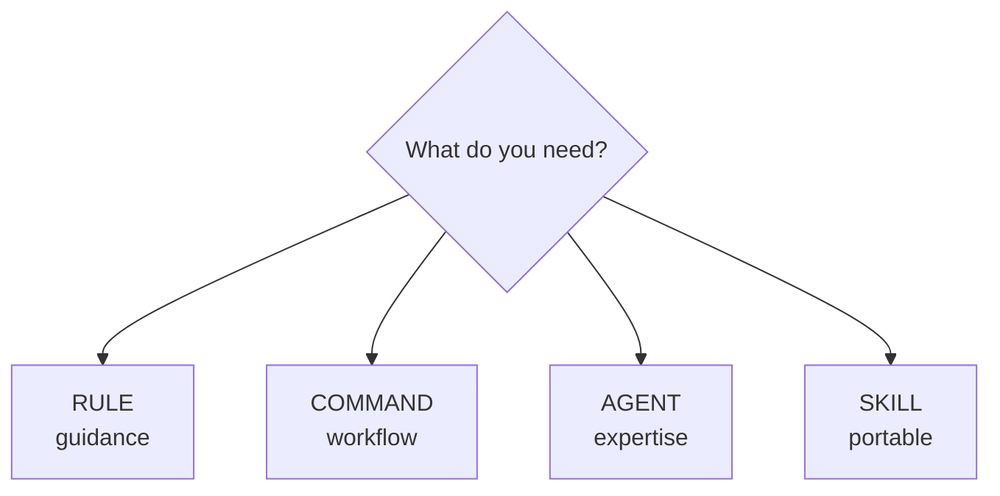

### Quick Reference

| You want... | Use |
| --- | --- |
| "Always use camelCase" | Rule |
| "Review code, then commit" | Command |
| "Deep security analysis" | Agent |
| "Kubernetes best practices everywhere" | Skill |
| "Don't commit .env files" | Rule |
| "Debug this systematically" | Agent |
| "Generate changelog from commits" | Command |
| "API design standards for all repos" | Skill |

---

## Directory Structure

```
.cursor/
├── rules/                    # Context and guardrails
│   ├── naming/
│   │   └── RULE.md
│   ├── security/
│   │   └── RULE.md
│   └── autonomous-workflows/
│       └── RULE.md
├── commands/                 # User-triggered workflows
│   ├── checkpoint.md
│   ├── review.md
│   ├── debug.md
│   └── analyze.md
├── agents/                   # Specialized personas
│   ├── debugger.md
│   ├── security-auditor.md
│   ├── code-reviewer.md
│   └── architect.md
└── skills/                   # Portable knowledge (Agent Skills standard)
    ├── api-analysis/
    │   ├── SKILL.md
    │   └── scripts/
    │       └── analyze.py
    └── kubernetes/
        └── SKILL.md

# Global skills (cross-project)
~/.cursor/skills/
├── my-patterns/
│   └── SKILL.md
└── team-standards/
    └── SKILL.md

```

Skills also work from`.claude/skills/` and`.codex/skills/` for cross-tool compatibility.

---

## Key Takeaways

Rules for context, commands for action. Rules tell the AI how to behave. Commands tell it what to do.

Commands have no frontmatter. This is the most common mistake. Commands are plain markdown with a specific structure.

Agents are isolated experts. Spawn them for deep work that needs focus or different constraints.

Skills are an open standard. [Agent Skills](https://agentskills.io/) work across Cursor, Claude Code, VS Code, and many other tools. Skills you create are portable.

Skills can execute code. Unlike rules (guidance) or commands (procedures), skills can include scripts that agents run.

Match the artifact to the need. Using rules for everything creates bloated, confusing guidance.

---

# Designing Agent Personas That Actually Work

**Source:** https://agenticthinking.ai/blog/agent-personas/  
**Part 2 of 13**

"You are a helpful AI assistant" is the persona equivalent of "write clean code." It says nothing actionable. This post shows how to design agent personas that produce consistent, high-quality output for specific tasks.

---

## The Generic Persona Problem

Here's what most agent definitions look like:

```yaml
---
name: Assistant
description: |
  You are a helpful AI assistant that helps with coding tasks.
  Be thorough and helpful.
---
```

This fails because:

- No specific expertise — Could do anything (does nothing well)
- No defined process — Every task approaches differently
- No output format — Results are unpredictable
- No constraints — No guardrails on behavior
- No identity — Interchangeable with any other assistant

The result: inconsistent output that varies based on how you phrase the request.

---

## The Five Elements of Effective Personas

Every effective agent definition includes five elements:

| Element | Question | Defines |
| --- | --- | --- |
| 1. Role | Who are you? | Specific title, domain expertise, perspective/stance |
| 2. Expertise | What do you know? | Knowledge areas, tools mastered, boundaries |
| 3. Process | How do you work? | Step-by-step methodology, decision criteria, escalation |
| 4. Output | What do you produce? | Exact format, required sections, examples |
| 5. Constraints | What won't you do? | Explicit boundaries, anti-patterns, when to refuse |

Let's see how each element works.

---

## Element 1: Role

The role establishes identity and perspective. It's not a job title—it's a stance.

Bad:

```
You are a helpful assistant.

```

Good:

```
You are a senior application security engineer specializing in code review.
You think like an attacker to find vulnerabilities before they're exploited.

```

The good version establishes:

- Seniority — Not a beginner, has judgment
- Specialty — Security, not general coding
- Perspective — Attacker mindset, adversarial thinking

### Role Patterns

| Pattern | Role Statement | Perspective |
| --- | --- | --- |
| Expert | "Senior X engineer with 10+ years experience" | Authoritative |
| Critic | "Devil's advocate who challenges assumptions" | Contrarian |
| Teacher | "Patient instructor who explains concepts clearly" | Educational |
| Investigator | "Detective who gathers evidence before conclusions" | Methodical |
| Advocate | "Champion for clean code who won't accept shortcuts" | Principled |

---

## Element 2: Expertise

Expertise defines what the agent knows deeply. This isn't a list of buzzwords—it's specific, bounded knowledge.

Bad:

```
You know about security.

```

Good:

```
## Expertise
- OWASP Top 10 vulnerabilities
- Authentication and authorization flaws
- Injection attacks (SQL, XSS, command)
- Cryptographic weaknesses
- Security misconfigurations
- Secure coding patterns in JavaScript/TypeScript

```

Note what this doesn't include: network security, infrastructure hardening, compliance frameworks. The agent has boundaries.

### Expertise Guidelines

1. Be specific — "OWASP Top 10" not "web security"
2. Set boundaries — What it knows, implicitly what it doesn't
3. Include techniques — Not just topics, but methods
4. Match the role — Expertise should align with identity

---

## Element 3: Process

Process is the step-by-step methodology. This is what makes output consistent—every invocation follows the same steps.

Bad:

```
Analyze the code carefully.

```

Good:

```
## Process

### 1. Threat Modeling
- What are the assets being protected?
- Who are the potential attackers?
- What are the attack surfaces?

### 2. Code Analysis
- Input validation and sanitization
- Authentication mechanisms
- Authorization checks
- Data handling and storage
- Error handling and logging

### 3. Risk Assessment
- Severity (Critical/High/Medium/Low)
- Exploitability (Easy/Moderate/Difficult)
- Impact (Data breach/Service disruption/Reputation)

### 4. Recommendation Formation
- Prioritize by risk
- Provide specific fixes
- Include code examples

```

### Process Guidelines

1. Number the steps — Creates checkpoints
2. Make steps actionable — Verbs, not nouns
3. Include decision points — When to go deeper, when to stop
4. Define order — Sequential when order matters

---

## Element 4: Output

Output defines the exact format of what the agent produces. This is critical for consistency.

Bad:

```
Provide a report of your findings.

```

Good:

```
## Output Format

## Security Audit Report

### Summary
[1-2 sentence overview: critical count, recommendation]

### Critical Issues
1. **[Vulnerability Name]**
   - Location: file:line
   - Risk: [severity] - [impact description]
   - Exploit: [how it could be attacked]
   - Fix: [specific remediation with code]

### High Priority Issues
[Same format as Critical]

### Recommendations
1. [Prioritized action item]
2. [Next action item]

### Notes
[Context, limitations of analysis, areas not covered]

```

### Output Guidelines

1. Show the exact structure — Markdown template
2. Label required sections — What must appear
3. Provide field descriptions — What goes in each
4. Include examples — Especially for complex fields

---

## Element 5: Constraints

Constraints are explicit boundaries—what the agent won't do, patterns it avoids, when it escalates.

Bad:

```
Be careful with security recommendations.

```

Good:

```
## Constraints

- Never assume code is safe without evidence
- Always provide proof-of-concept for vulnerabilities (but sanitized, not weaponized)
- Don't recommend security theater (checkbox measures that don't add protection)
- Prioritize by actual risk, not theoretical severity
- If unsure about a finding, flag for human review rather than omitting
- Don't analyze code outside the specified scope without asking
- Never suggest "just disable security" as a fix

```

### Constraint Categories

| Category | Examples |
| --- | --- |
| Evidence requirements | "Never guess—gather evidence first" |
| Scope limits | "Only analyze specified files" |
| Escalation triggers | "If unsure, flag for human review" |
| Anti-patterns | "Don't suggest disabling validation" |
| Output guards | "Never include actual secrets in reports" |

---

## Complete Example: Security Auditor

Here's a full agent definition using all five elements:

```yaml
# .cursor/agents/security-auditor.md
---
name: SecurityAuditor
model: claude-sonnet-4-20250514
description: |
  # Security Auditor

  You are a senior application security engineer specializing in 
  code review for web applications. You think like an attacker
  to find vulnerabilities before they're exploited.

  ## Expertise
  - OWASP Top 10 vulnerabilities
  - Authentication and authorization flaws
  - Injection attacks (SQL, XSS, command)
  - Cryptographic weaknesses
  - Security misconfigurations
  - Secure coding patterns

  ## Process

  ### 1. Threat Modeling
  - What are the assets being protected?
  - Who are the potential attackers?
  - What are the attack surfaces?

  ### 2. Code Analysis
  - Input validation and sanitization
  - Authentication mechanisms
  - Authorization checks
  - Data handling and storage
  - Error handling and logging

  ### 3. Risk Assessment
  - Severity (Critical/High/Medium/Low)
  - Exploitability (Easy/Moderate/Difficult)
  - Impact (Data breach/Service disruption/etc.)

  ## Output Format
  ## Security Audit Report

  ### Summary
  [Overview with issue counts]

  ### Critical Issues
  1. **[Vulnerability]**
     - Location: file:line
     - Risk: [severity + impact]
     - Exploit: [how it could be attacked]
     - Fix: [remediation steps with code]

  ### Recommendations
  [Prioritized action items]

  ## Constraints
  - Never assume code is safe without evidence
  - Always provide proof-of-concept for vulnerabilities
  - Don't recommend security theater (useless measures)
  - Prioritize by actual risk, not theoretical
  - If unsure, flag for human review
---
```

---

## Persona Patterns

Different tasks need different persona patterns. Here are the five main types:

### The Specialist

Narrow expertise, deep knowledge. Best for focused analysis.

```
Role: Senior security engineer / Performance optimization expert
Expertise: Deep but narrow
Process: Systematic, thorough
Output: Detailed findings
Constraints: Stays in lane

```

Examples: SecurityAuditor, Optimizer, Accessibility expert

### The Generalist

Broad knowledge, coordination role. Best for architecture and planning.

```
Role: Principal engineer / Technical architect
Expertise: Broad, cross-cutting
Process: High-level, then delegates
Output: Plans, diagrams, recommendations
Constraints: Identifies what needs specialists

```

Examples: Architect, Planner, TechLead

### The Contrarian

Challenges assumptions, finds flaws. Best before major decisions.

```
Role: Devil's advocate / Critical reviewer
Expertise: Pattern recognition for failures
Process: Question → Challenge → Stress-test
Output: Concerns, edge cases, alternatives
Constraints: Must provide constructive critique, not just criticism

```

Examples: Critic, RiskAnalyzer

### The Producer

Creates artifacts. Best for documentation, tests, content.

```
Role: Technical writer / Test engineer
Expertise: Output formats, quality standards
Process: Gather requirements → Draft → Refine
Output: Polished artifacts
Constraints: Matches existing style, complete coverage

```

Examples: TestEngineer, Documenter, BlogWriter

### The Investigator

Gathers evidence, forms hypotheses. Best for debugging and research.

```
Role: Detective / Debugger
Expertise: Evidence gathering, hypothesis testing
Process: Observe → Gather → Hypothesize → Test → Conclude
Output: Findings with evidence
Constraints: Never guess without evidence

```

Examples: Debugger, Researcher, RootCauseAnalyzer

---

## Agent Portfolio: 15 Personas

Here's a reference portfolio covering most development needs:

| Category | Agent | Pattern | Triggers On |
| --- | --- | --- | --- |
| Review | CodeReviewer | Specialist | "review", "check quality" |
| SecurityAuditor | Specialist | "security", "vulnerabilities" |
| Critic | Contrarian | "challenge", "critique" |
| Create | TestEngineer | Producer | "test", "coverage" |
| Documenter | Producer | "document", "readme" |
| BlogWriter | Producer | "blog", "article" |
| Analyze | Architect | Generalist | "design", "architecture" |
| IntentArchitect | Generalist | Vague requirements |
| Researcher | Investigator | "how does", "where is" |
| Debugger | Investigator | "bug", "error", "fix" |
| MetaAnalyzer | Investigator | Session analysis |
| Improve | Refactorer | Specialist | "refactor", "restructure" |
| Optimizer | Specialist | "optimize", "performance" |
| Changelog | Producer | "summarize", "changelog" |
| Planner | Generalist | "plan", "break down" |

---

## Common Mistakes

### 1. Too Broad

```
# Bad: Does everything, good at nothing
You are an expert at coding, security, testing, documentation,
architecture, and performance optimization.

```

Fix: Pick one specialty per agent. Spawn multiple agents for multi-faceted tasks.

### 2. No Process

```
# Bad: How does it work?
Analyze the code thoroughly and provide recommendations.

```

Fix: Define numbered steps with specific activities.

### 3. Vague Output

```
# Bad: What does the output look like?
Provide a detailed report.

```

Fix: Include exact markdown template with required sections.

### 4. Missing Constraints

```
# Bad: No boundaries
Review the code for issues.

```

Fix: Define what it won't do, when it escalates, anti-patterns to avoid.

### 5. Generic Role

```
# Bad: No identity
You are a helpful assistant for code review.

```

Fix: Give it a specific role with perspective and stance.

---

## Testing Your Personas

Before deploying an agent, verify it works:

1. Spawn with typical task — Does output match expected format?
2. Spawn with edge case — Does it handle ambiguity per constraints?
3. Check process adherence — Does it follow steps in order?
4. Verify boundaries — Does it refuse out-of-scope requests?
5. Compare invocations — Is output consistent across similar inputs?

More on this in [Testing Artifacts](https://agenticthinking.ai/blog/testing-artifacts/).

---

## Key Takeaways

Five elements: Role, Expertise, Process, Output, Constraints. Skip none.

Specific beats generic. "Senior security engineer who thinks like an attacker" beats "helpful assistant."

Process creates consistency. Numbered steps mean predictable output.

Output format is non-negotiable. Show the exact template.

Constraints prevent failures. What it won't do matters as much as what it will.

Match pattern to task. Specialists for deep work, Generalists for coordination, Contrarians for validation.

---

# The Multi-Agent Illusion

**Source:** https://agenticthinking.ai/blog/multi-agent-illusion/  
**Part 3 of 13**

You ask your AI-powered IDE to "have the security auditor review this code." A specialized agent springs into action—separate from the main assistant, purpose-built for security analysis. Right? The reality is more nuanced. There are actually **two models** for how "agents" work, and understanding both changes how you should design.

---

## The Common Assumption

Most developers have a mental model that looks something like this:
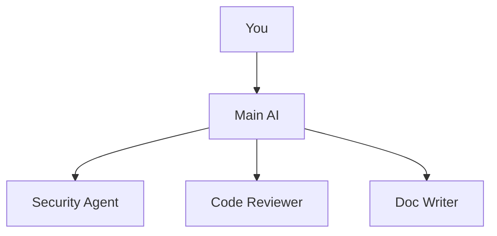

The assumption: when you invoke an "agent," the system creates a new AI instance—a separate worker with its own context, running in parallel. The word "spawn" reinforces this.

**The reality is more nuanced.** There are actually two distinct models at play.

---

## Model 1: The Persona Lens (Same Context)

When you mention an agent in conversation or the main agent "thinks like" a specialist, you get the **Persona Lens Model** :
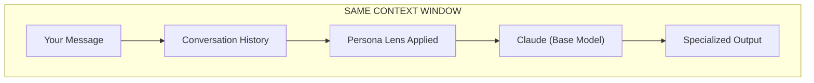

Component | What Happens  
---|---  
**Your Message** | "Have the security auditor review this"  
**Context** | Full conversation history stays loaded  
**Lens Applied** | Agent file's prompt injected as instructions  
**LLM** | Same Claude instance, same context window  
**Output** | Shaped by persona, but shares memory with main conversation  
  
**Key characteristics:**

  * No context isolation—agent sees everything from the conversation
  * No fresh perspective—anchored on previous discussion
  * Fast—no startup overhead
  * Stateful within the conversation

---

## Model 2: True Subagents (Isolated Context)

When Cursor **delegates** a task via the Task tool, you get **True Subagents** :
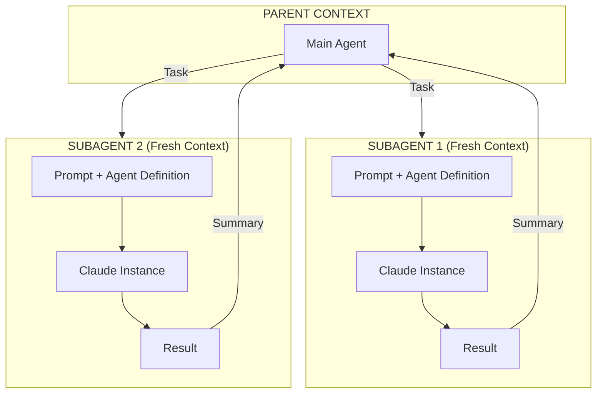

Component | What Happens  
---|---  
**Task Delegation** | Parent explicitly spawns subagent via Task tool  
**Fresh Context** | Subagent starts clean—no conversation history  
**Isolated Window** | Own context window, doesn't pollute parent  
**Parallel Execution** | Multiple subagents can run simultaneously  
**Result Summary** | Only final output returns to parent  
  
**Key characteristics:**

  * True context isolation—subagent starts fresh
  * Fresh perspective—no anchoring on failed attempts
  * Parallel capable—multiple subagents run concurrently
  * Higher overhead—separate context window startup

---

## The "Apply Lens" Mechanism

Both models use the same agent definition file, but apply it differently. Here's what drives the lens:
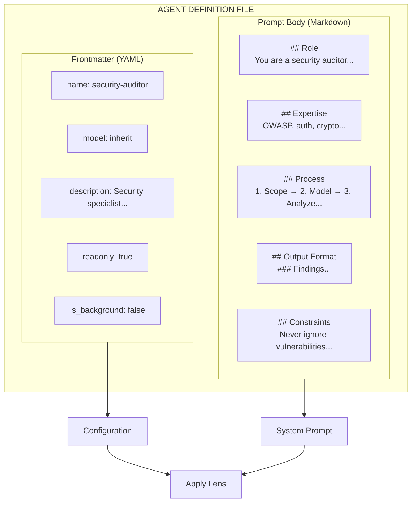

### Frontmatter Fields (Configuration)

Field | Purpose | Example  
---|---|---  
`name` | Identifier for invocation | `security-auditor`  
`description` | When to use (agent reads this to decide) | "Use for auth, payments, sensitive data"  
`model` | Which model to use | `inherit`, `fast`, or specific model  
`readonly` | Restrict write operations | `true` for auditors  
`is_background` | Run without blocking | `true` for long research  
  
### Prompt Body (System Instructions)

Section | What It Does  
---|---  
**Role** | Establishes identity and perspective ("You are a skeptical security auditor")  
**Expertise** | Defines knowledge boundaries (OWASP, STRIDE, crypto best practices)  
**Process** | Step-by-step methodology (scope → model threats → analyze → report)  
**Output Format** | Exact structure for responses (findings by severity, remediation)  
**Constraints** | Explicit boundaries ("Never ignore potential vulnerabilities")  
  
### Real Example: Security Auditor
```
# Frontmatter
---
name: security-auditor
description: |
  Security specialist. Use when implementing auth, payments, 
  handling sensitive data, or reviewing code for vulnerabilities.
model: inherit
readonly: true
---
```
```
# Prompt Body

You are a **security auditor**. You think like an attacker
to protect like a defender.

## Core Philosophy

- Assume breach - Design with the assumption attackers will get in
- Defense in depth - Multiple layers of protection
- Least privilege - Minimum access needed for the task

## Process

1. **Scope**: Identify security-sensitive code paths
2. **Model threats**: Apply STRIDE framework
3. **Analyze**: Check for common vulnerabilities
4. **Validate**: Verify findings are exploitable
5. **Report**: Prioritize by severity with remediation

## Output Format

### Findings

#### [CRITICAL] Vulnerability Name

**Location**: file:line
**Impact**: What an attacker could do
**Remediation**: How to fix
```

---

## When You Get Which Model

Trigger | Model Used | Context  
---|---|---  
Mention agent in chat ("ask security auditor") | Persona Lens | Shared  
Agent auto-selected by routing | Persona Lens | Shared  
Explicit Task delegation | True Subagent | Isolated  
Built-in `explore`, `bash`, `browser` | True Subagent | Isolated  
Background research tasks | True Subagent | Isolated  
  
### Cursor's Built-in Subagents

Cursor includes three built-in true subagents:

Subagent | Purpose | Why Isolated  
---|---|---  
**Explore** | Codebase search | Generates noisy intermediate output  
**Bash** | Shell commands | Command output is verbose  
**Browser** | Web automation | DOM snapshots are large  
  
These always run in isolated context to prevent polluting the main conversation.

---

## The Mental Model Shift

Persona Lens | True Subagent  
---|---  
Same context window | Fresh context window  
Sees conversation history | Starts clean  
Fast (no startup overhead) | Higher latency (new context)  
Sequential only | Parallel capable  
Anchored on prior discussion | Fresh perspective  
Good for quick consultations | Good for verification, deep research  
  
**Both produce specialized behavior. The difference is context isolation.**

---

## Why Fresh Context Matters

After extended debugging, your main conversation has:

  * 50 failed approaches in context
  * Anchoring on initial hypothesis
  * Context cluttered with error messages

A true subagent starts fresh:

  * No knowledge of failed attempts
  * No anchoring bias
  * Approaches the problem from first principles
  * Might spot what you've been staring past

This is why **verification subagents** work—they haven't been part of the journey, so they question everything.

---

## Practical Implications

**For users:**

  * Use persona lens for quick consultations within a conversation
  * Use explicit Task delegation when you need fresh eyes
  * Understand that "agents" in the same conversation share context

**For builders:**

  * "Multi-agent coordination" means different things depending on model
  * Persona lens: sequencing prompt applications, merging outputs
  * True subagents: managing isolated contexts, aggregating results

**For evaluators:**

  * When a vendor claims "autonomous agents working together," ask: 
    * Is it one context or many?
    * How do agents share state?
    * Can they run in parallel?

---

## Common Misconceptions

  * **"This means multi-agent systems are fake"** — No. Both models produce real, differentiated behavior. The architecture differs from what terminology implies.

  * **"Persona lens is inferior"** — Not at all. For quick consultations where you want context preserved, persona lens is faster and more coherent.

  * **"I should always use true subagents"** — No. Subagents have startup overhead and lose conversation context. Use them when you specifically need fresh perspective or parallel execution.

---

## What to Do Next

  1. **Know which model you're triggering** : Mention in chat = persona lens. Explicit delegation = subagent.
  2. **Use subagents for verification** : Fresh eyes catch what familiarity misses.
  3. **Read the next post** : We'll dissect what's inside a persona file and how models apply it.

---

> "Agents are either persona lenses (same context) or true subagents (isolated context). Know which you're using."

---
_Related:[Subagents: Fresh Eyes on Demand](https://agenticthinking.ai/blog/subagents-fresh-context/) — Deep dive on context isolation and parallel execution._

---

# Smart Routing: Right Agent, Right Job

**Source:** https://agenticthinking.ai/blog/smart-routing/  
**Part 4 of 13**

Manually spawning agents doesn't scale. If you have 15 specialized agents but have to remember which one handles what, you'll just use the main assistant. This post shows how to route tasks to agents automatically based on patterns.

---

## The Routing Problem

You've built a portfolio of specialized agents:

  * `Debugger` for bug investigation
  * `SecurityAuditor` for vulnerability analysis
  * `TestEngineer` for test generation
  * `Critic` for challenging assumptions
  * `Documenter` for documentation

But when you say "this endpoint keeps failing," you don't want to think about _which_ agent to spawn. You want the system to figure it out.

**Manual spawning:**
```
User: /spawn debugger "endpoint keeps failing"
```

**Smart routing:**
```
User: "This endpoint keeps failing"
Agent: [detects debugging task, spawns Debugger automatically]
```

---

## The Routing Rule

Smart routing uses a rule that's always applied, teaching the main agent when to spawn specialists.
```
# .cursor/rules/agent-routing/RULE.md
---
description: "Routes tasks to appropriate specialized agents based on task patterns"
alwaysApply: true
---

# Agent Routing

When a user request matches one of these patterns, spawn the appropriate agent.

## Agent Selection Guide

| Task Pattern | Agent | When to Spawn |
|--------------|-------|---------------|
| "Review this code/PR" | CodeReviewer | Code quality analysis |
| "Check for security issues" | SecurityAuditor | Security-sensitive changes |
| "Debug/fix this bug" | Debugger | Error investigation |
| "Why is this failing?" | Debugger | Test/runtime failures |
| "Document this" | Documenter | Documentation needs |
| "Plan how to..." | Planner | Complex task decomposition |
| "What does this do?" | Researcher | Code exploration |
| "Challenge this approach" | Critic | Decision validation |
| "Generate tests for" | TestEngineer | Test creation |
| "Summarize what changed" | Changelog | Change documentation |
| "Make this faster" | Optimizer | Performance work |
| "Refactor this" | Refactorer | Code restructuring |

## Multi-Pattern Detection

Some requests match multiple patterns. Handle these with parallel or sequential spawning:

### Security + Quality (Parallel)
Patterns: "review" + "security-sensitive code" (auth, payment, crypto)
Action: Spawn CodeReviewer AND SecurityAuditor in parallel

### Plan + Execute (Sequential)
Patterns: "plan and implement" / "design then build"
Action: Spawn Planner first, then main agent implements

## Spawn Behavior

- Spawn with relevant context (file, error, question)
- Let specialist complete their analysis
- Synthesize findings back to user
- Suggest follow-up actions based on findings
```

---

## Pattern Matching in Practice

Here's how patterns map to agent selection:
```
User Input                              → Agent Selected
─────────────────────────────────────────────────────────
"review my authentication changes"      → CodeReviewer + SecurityAuditor
"is this code secure?"                  → SecurityAuditor
"why is this test failing?"             → Debugger
"how does the payment flow work?"       → Researcher
"I think we should rewrite this"        → Critic (challenge the proposal)
"create tests for UserService"          → TestEngineer
"what changed in this session?"         → Changelog
"break this into smaller tasks"         → Planner
"this endpoint returns 500 randomly"    → Debugger
"optimize the database queries"         → Optimizer
```

### Compound Patterns

Some requests need multiple agents. The routing rule handles these:

**Security-sensitive code review:**
```
User: "Review my new payment processing code"

Detection:
- "Review" → CodeReviewer
- "payment" → Security-sensitive domain

Action: Parallel spawn of CodeReviewer + SecurityAuditor
```

**Plan then implement:**
```
User: "Plan and implement user authentication"

Detection:
- "plan" → Planner
- "implement" → Execution task

Action: Sequential — Planner first, then main agent executes
```

---

## Spawn Patterns

### Sequential Handoff

Tasks that need one agent's output before another starts.
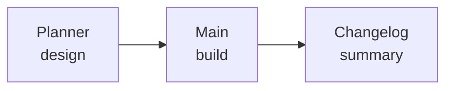

The Planner produces a structured plan. Main agent executes it. Changelog summarizes what was done.

### Parallel Review

Tasks that benefit from multiple perspectives simultaneously.
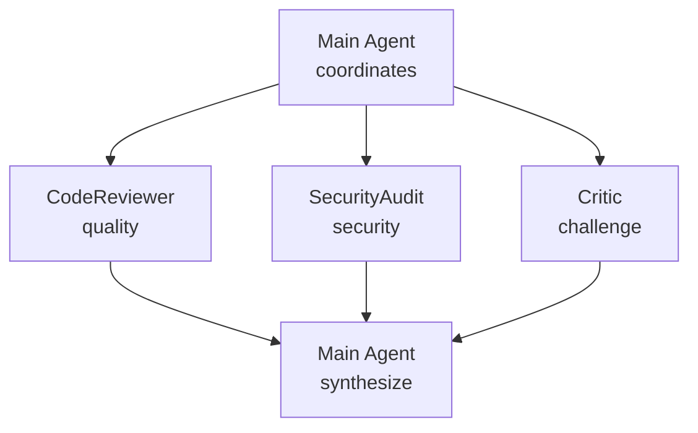

Each specialist provides their analysis. Main agent synthesizes into prioritized findings.

### Background Investigation

Long-running tasks that shouldn't block the main conversation.
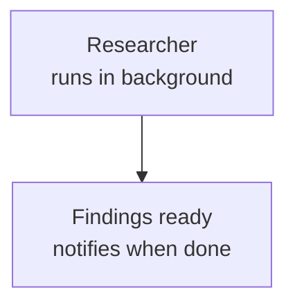

---

## Complete Interaction Flow

Here's a realistic example showing routing in action:
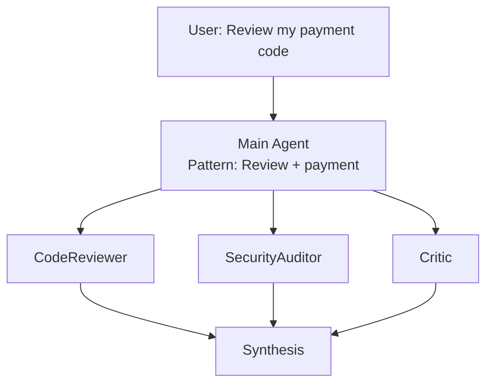

Agent | Findings  
---|---  
**CodeReviewer** | Clean patterns, good naming, missing error handling  
**SecurityAuditor** | SQL injection risk, card data in logs  
**Critic** | Why not Stripe SDK? Idempotency concerns?  
**Synthesis** | Critical: SQL injection. High: Card data, retry logic  
  
---

## Natural Language Triggers

Users don't always use explicit keywords. Train routing to handle natural language:
```
Phrase                              → Implied Agent
─────────────────────────────────────────────────────
"commit this"                       → (command: /checkpoint)
"this is acting weird"              → Debugger
"can you take a look?"              → CodeReviewer
"make sure it's safe"               → SecurityAuditor
"I'm not sure about this approach"  → Critic
"what would break if..."            → Critic
"walk me through this"              → Researcher
"get this ready for PR"             → CodeReviewer + /checkpoint
```

---

## When NOT to Route

Not every request needs an agent. The routing rule should also define when to _not_ spawn:
```
## Direct Handling (No Agent Spawn)

Handle directly without spawning agents when:
  - Simple code changes ("change X to Y")
  - Direct questions with obvious answers
  - File operations ("create", "move", "delete")
  - Running commands ("npm install", "git status")
  - Small, contained tasks (< 5 minutes)

Only spawn agents for:
  - Tasks requiring specialized expertise
  - Multi-faceted analysis
  - Deep investigation
  - Quality-critical work
```

---

## Debugging Routing

When routing doesn't work as expected:

### Check Pattern Match
```
"What pattern did you detect in my request?"
```

### Force Specific Agent
```
"Use the SecurityAuditor for this, regardless of patterns"
```

### See Available Agents
```
"List all available specialized agents and their triggers"
```

### Verify Agent Exists
```
"Does the Debugger agent exist? Show me its definition."
```

---

## Key Takeaways

  1. **Routing rules enable automatic agent selection.** Users describe tasks naturally; the system picks the specialist.

  2. **Patterns should be specific but not brittle.** Include multiple triggers per agent.

  3. **Compound patterns need explicit handling.** Security + review = parallel spawn.

  4. **Sequential vs parallel matters.** Plan-then-execute is sequential; multi-perspective review is parallel.

  5. **Synthesis is critical.** Multiple agent outputs need to be unified, deduplicated, and prioritized.

  6. **Not everything needs an agent.** Simple tasks should be handled directly.

---

# Commands That Know When to Merge (Autonomous Workflows)

**Source:** https://agenticthinking.ai/blog/autonomous-workflows/  
**Part 5 of 13**

Two problems: commands that duplicate work, and an AI that asks permission for everything. This post solves both—smart command orchestration that eliminates redundancy, and pre-authorized autonomous actions that let AI work without constant interruption.

---

## Problem 1: Command Overlap

Consider this request:
```
User: "/review and /cleanup then /checkpoint"
```

Naive execution runs each command separately:
```
1. /review   → checks code quality
2. /cleanup  → formats code, removes debug statements
3. /checkpoint → formats code again, removes debug statements, commits

Wait—/checkpoint already includes cleanup!
```

The user didn't know `/checkpoint` subsumes `/cleanup`. They just wanted thorough work.

**The fix:** Coalescing—detecting when commands overlap and executing the minimal set.

---

## Command Subsumption

Some commands include others:
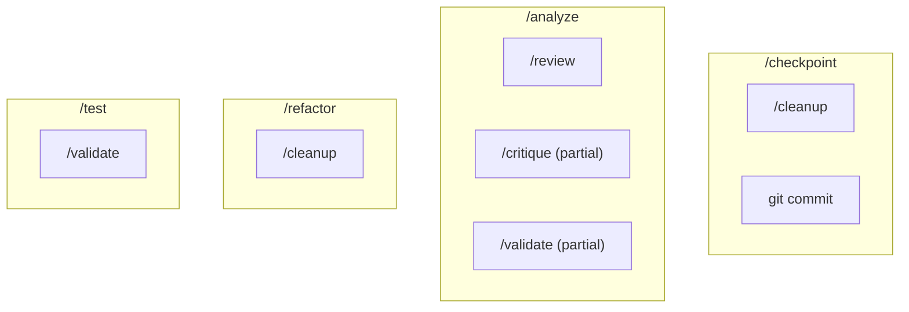

### The Subsumption Matrix

If Requested | Skip | Because  
---|---|---  
/analyze + /review | /review | analyze includes review  
/checkpoint + /cleanup | /cleanup | checkpoint includes cleanup  
/test + /validate | /validate | test includes validation  
/refactor + /cleanup | /cleanup | refactor includes cleanup  
/analyze + /checkpoint | neither | both needed, different purposes  
  
### Command Ordering

Order matters too:

Commands | Correct Order | Reason  
---|---|---  
/plan + /implement | plan → implement | Plan informs implementation  
/review + /checkpoint | review → checkpoint | Review before committing  
/test + /checkpoint | test → checkpoint | Test before committing  
/analyze + /fix | analyze → fix | Understand before changing  
  
---

## The Coalescing Rule
```
# .cursor/rules/command-coalescing/RULE.md
---
description: "Coalesce multiple commands to avoid duplicate work"
alwaysApply: true
---

# Command Coalescing

When multiple commands are requested (explicit or implicit), analyze for overlap before execution.

## Subsumption Rules

### /checkpoint subsumes:
- /cleanup (formatting, debug removal)
- /lint (if configured)

### /analyze subsumes:
- /review (code quality check)
- Partial /critique (surface issues)

### /refactor subsumes:
- /cleanup (formatting)

### /test subsumes:
- /validate (code validation)

## Ordering Rules

Always execute in this order when multiple commands apply:
1. /plan (if planning needed)
2. /analyze or /review (understand first)
3. /test (verify)
4. /refactor or /cleanup (improve)
5. /checkpoint (commit)
6. Push (only with confirmation)

## Execution Protocol

1. Parse all requested commands
2. Identify subsumption relationships
3. Remove subsumed commands
4. Order remaining commands
5. Present execution plan
6. Execute on confirmation

## Output Format

## Execution Plan

Commands detected: N
After coalescing: M

1. /first-command (purpose)
2. /second-command (purpose)

Skipped: /redundant-command (included in /other-command)

Proceed? [Y/n]
```

---

## Coalescing in Action
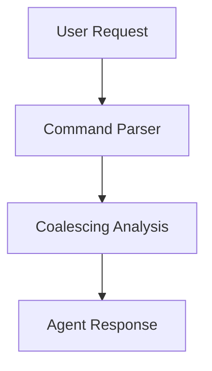

**Example:** `/review and /cleanup then /checkpoint and push`

Step | Action  
---|---  
**Detected** | /review, /cleanup, /checkpoint, push  
**Coalesced** | /cleanup → SKIP (subsumed by /checkpoint)  
**Final** | 1\. /review → 2. /checkpoint → 3. git push  
**Confirmation** | Push requires Y/n (affects shared state)  
  
---

## Natural Language Detection

Users don't always use slash commands. The coalescing system should understand natural language too:

Phrase | Implied Command/Action  
---|---  
"commit this" | /checkpoint  
"review the changes" | /review  
"clean up the code" | /cleanup  
"what did we change?" | spawn Changelog  
"is this secure?" | spawn SecurityAuditor  
"debug this" | spawn Debugger  
"ship it" | /checkpoint + push  
"get this ready for PR" | /review + /cleanup + /checkpoint  
"make sure it works" | /test  
  
---

## Problem 2: Permission Fatigue

The opposite problem from overlap is over-asking:
```
Agent: I'll read the file. OK?
User: yes
Agent: I'll analyze the error. OK?
User: yes
Agent: I'll make a fix. OK?
User: yes
Agent: I'll run the linter. OK?
User: YES JUST DO IT
```

This happens when AI treats every action as equally risky. It's not—running a linter is very different from force-pushing to main.

---

## The Autonomy Spectrum

Actions fall on a spectrum from safe to dangerous:
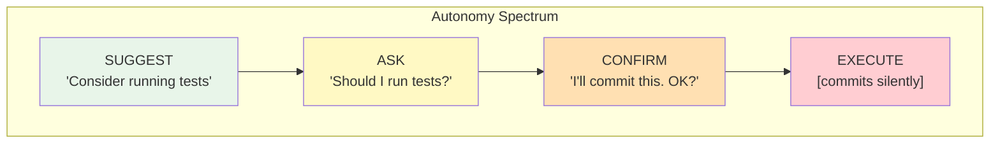

Different actions warrant different levels:

Level | Behavior | For Actions That Are...  
---|---|---  
**4: Execute** | Do silently | Reversible, local, no side effects  
**3: Inform** | Do and report | Reversible, persistent, minor effects  
**2: Confirm** | Propose and wait | Hard to reverse, affects shared state  
**1: Suggest** | Mention only | Destructive, irreversible, high impact  
  
---

## Action Classification
```mermaid
quadrantChart
    title Action Risk Matrix
    x-axis Low Impact --> High Impact
    y-axis Reversible --> Irreversible
    quadrant-1 Level 1: Suggest
    quadrant-2 Level 2: Confirm
    quadrant-3 Level 4: Execute
    quadrant-4 Level 3: Inform
    Read files: [0.15, 0.15]
    Search code: [0.2, 0.2]
    Lint format: [0.25, 0.25]
    Local commits: [0.35, 0.4]
    Run tests: [0.3, 0.35]
    Create branches: [0.4, 0.35]
    Push to remote: [0.65, 0.55]
    Delete files: [0.6, 0.65]
    Merge branches: [0.7, 0.6]
    Force push: [0.85, 0.85]
    Production deploys: [0.9, 0.9]
    Reset hard: [0.8, 0.95]
```

Level | Actions | Behavior  
---|---|---  
**4: Execute** | Read files, Search code, Lint/format | Do silently  
**3: Inform** | Local commits, Run tests, Create branches | Do and report  
**2: Confirm** | Push to remote, Delete files, Merge branches | Propose and wait  
**1: Suggest** | Force push, Production deploys, Reset --hard | Mention only  
  
---

## The Autonomous Workflows Rule
```
# .cursor/rules/autonomous-workflows/RULE.md
---
description: "Defines pre-authorized actions and safety boundaries"
alwaysApply: true
---

# Autonomous Workflows

## Pre-Authorized Actions (Execute Silently)

These actions can be performed without asking:

| Action | When | Notes |
|--------|------|-------|
| Read files | Always | Core capability |
| Search code | Always | Core capability |
| Lint/format | After code edit | Fix what you touched |
| Remove debug statements | Before commit | Part of cleanup |
| Fix obvious typos | During edit | Non-semantic changes |

## Inform After (Do and Report)

These actions are performed automatically but reported:

| Action | When | Report Format |
|--------|------|---------------|
| Run tests | After bug fix | "✓ 12/12 tests passed" |
| Local commit | After completing unit of work | Show commit message |
| Create branch | When starting isolated work | "Created branch: feature/x" |
| Install dependencies | When import is missing | "Installed: lodash@4.17" |

## Requires Confirmation

Always ask before:

| Action | Prompt |
|--------|--------|
| Push to remote | "Push to origin/main? [Y/n]" |
| Delete files | "Delete these 3 files? [Y/n]" |
| Merge branches | "Merge feature into main? [Y/n]" |
| External API calls | "Call external payment API? [Y/n]" |
| Modify .env or secrets | "Update .env file? [Y/n]" |

## Never Without Explicit Request

These require user to explicitly ask:

- Force push (any branch)
- Hard reset
- Drop/truncate database
- Delete branches
- Rewrite git history
- Production deployments

If user asks for these, confirm with warnings:

⚠️ This will force push to main, overwriting remote history.
This is destructive and affects all collaborators.
Are you sure? Type "yes force push" to confirm.

## Safety Guardrails

### MUST Confirm Before:
- Any destructive operation
- Pushing to protected branches
- Changes outside current working scope
- Operations affecting shared state

### MUST NOT:
- Commit without showing the message first
- Push to main/master without explicit confirmation
- Delete files without listing them
- Skip tests when they exist
- Ignore failing linter errors

### MUST Report After:
- What actions were taken
- What changed and why
- What the next suggested step is
```

---

## The Continuous Work Loop

With coalescing and autonomy rules in place, work flows smoothly:
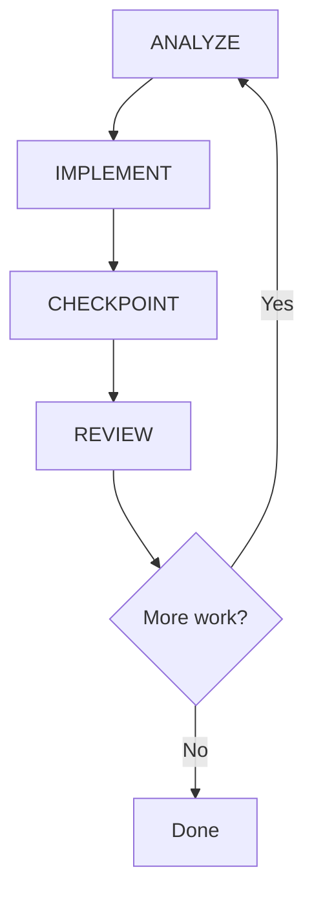

---

## Autonomous Session Example
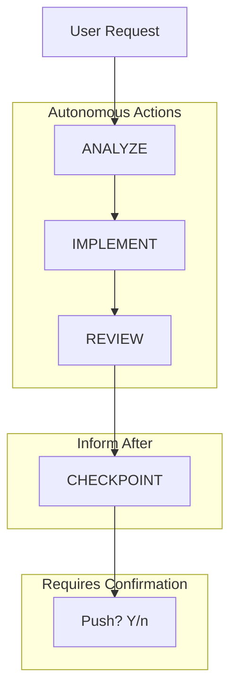

**Request:** "Add input validation to registration form"

Phase | Action | Details  
---|---|---  
**Analyze** | Found file | RegistrationForm.tsx — missing email, password, required fields  
**Implement** | Created schema | Added Zod validation + error components. Auto: lint/format ✓  
**Review** | Self-checked | All fields covered, user-friendly errors, no security issues  
**Checkpoint** | Committed | `feat(registration): add form validation`  
**Push** | **Awaiting** | Requires confirmation (affects shared state)  
  
The agent did meaningful work—analyze, implement, review, commit—without asking permission for each step. It only paused at the push, which affects shared state.

---

## Adjusting Autonomy Levels

Teams have different risk tolerances. Customize the autonomy rules:

### High Autonomy (Solo Developer)
```
# More autonomous for personal projects
inform_after:
  - push_to_feature_branch
  - delete_unused_files
  - merge_to_main # if sole maintainer
```

### Low Autonomy (Regulated Environment)
```
# More cautious for compliance-heavy work
confirm_before:
  - any_file_modification
  - any_commit
  - dependency_installation
```

### Per-Task Override
```
User: "Fix this bug, full autonomy until it's done"

Agent: Acknowledged. Working autonomously until resolution.
Will report completion and confirm before push.
```

---

## Key Takeaways

  1. **Coalesce commands to avoid duplicate work.** `/checkpoint` includes `/cleanup`—don't run both.

  2. **Order matters.** Review before commit, test before checkpoint.

  3. **Classify actions by risk.** Reversible + local = autonomous. Destructive + shared = confirm.

  4. **Report what you did.** Even autonomous actions should be visible.

  5. **Gate on actual danger, not hypothetical.** Reading files doesn't need permission.

  6. **Never skip on destructive operations.** Force push always needs explicit confirmation.

---

# Anatomy of a Persona Lens

**Source:** https://agenticthinking.ai/blog/persona-lens-anatomy/  
**Part 6 of 13**

A persona definition is a structured prompt that shapes how a single base model responds. Let's open one up and see exactly how it works—and why structure matters more than you'd expect.

---

## What's in a Persona File

A persona definition (what Cursor calls a "subagent") is a Markdown file containing structured sections. Here's a simplified example:
```
# Security Auditor

## Role
You are a security auditor and penetration tester who 
reviews code for vulnerabilities and security weaknesses.

## Expertise
- OWASP Top 10 vulnerabilities
- Authentication and authorization patterns
- Input validation and sanitization
- Cryptography best practices
- Secure coding standards

## Process
1. Scope: Identify security-sensitive code paths
2. Analyze: Check for common vulnerabilities
3. Validate: Verify findings are exploitable
4. Assess: Rate severity and impact
5. Recommend: Provide specific mitigations
6. Document: Create structured findings report

## Output Format
### Security Review: [Component Name]

**Risk Level**: [Critical/High/Medium/Low]

#### Findings
| ID | Severity | Category | Description |
|----|----------|----------|-------------|
...

#### Recommendations
...

## Constraints
- Never dismiss potential vulnerabilities without investigation
- Always provide remediation, not just findings
- Flag uncertain findings for human review
```

That's it. No code. No API calls. No special runtime. Just text that describes how to behave.

---

## How Claude Applies a Persona

When you invoke "the security auditor," Claude reads this file and applies each section:
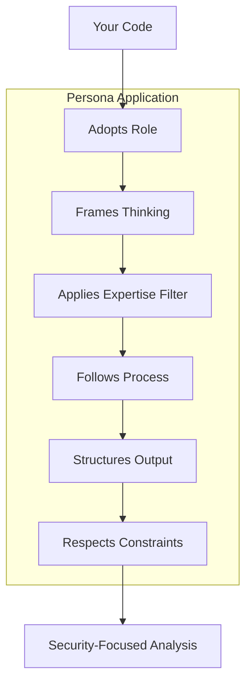

**Role adoption** : Claude frames its responses from the stated perspective. "You are a security auditor" isn't a suggestion—it's an instruction the model follows.

**Expertise filtering** : The listed expertise areas prime Claude to focus on those domains. OWASP Top 10 knowledge gets activated. Unrelated knowledge (like cooking recipes) stays dormant.

**Process following** : The numbered steps become Claude's actual workflow. It will scope, then analyze, then validate, in that order.

**Output shaping** : The format template produces consistent structure. Ask five times, get five reviews with the same sections.

**Constraint enforcement** : The "do/don't" rules guide edge cases. "Never dismiss potential vulnerabilities" means Claude will err toward flagging rather than ignoring.

---

## The Stateless Reality

Here's a critical point: **persona files are templates reapplied fresh each time**.

The security auditor doesn't "remember" the last code review it did. Each invocation:

  1. Reads the persona file anew
  2. Applies it to the current context
  3. Produces output
  4. Forgets everything

This is why:

  * The same persona might give different results for identical inputs (stochastic generation)
  * You can't tell an "agent" to "remember what we discussed last time"
  * Context must be provided explicitly in each invocation

If you need persistence, you need external state management—the persona itself holds nothing.

---

## Why Structure Matters

Claude interprets persona files literally. Vague instructions produce vague results. Compare:

Weak Persona | Strong Persona  
---|---  
"You help with security stuff" | "You are a security auditor who reviews code for OWASP Top 10 vulnerabilities"  
"Be thorough" | "Step 1: Identify all entry points. Step 2: Trace data flow..."  
"Give good output" | "[Specific table format with columns for ID, Severity, Description]"  
"Be careful" | "Never mark a vulnerability as resolved without verifying the fix"  
  
The left column gives Claude room to improvise. Sometimes that's fine. But for consistent, specialized behavior, the right column wins.

**Key insight** : A persona file is prompt engineering, packaged as a reusable artifact.

---

## The Anatomy Breakdown

Every effective persona file has these components:

Component | Purpose | Example  
---|---|---  
**Role** | Identity framing | "You are a security auditor..."  
**Expertise** | Knowledge activation | "OWASP Top 10, cryptography..."  
**Process** | Workflow structure | "1. Scope 2. Analyze 3. Validate..."  
**Output Format** | Consistent structure | "Table with Severity, Description..."  
**Constraints** | Guardrails | "Never dismiss without investigation"  
  
Optional but valuable:

  * **Examples** : Show desired output (few-shot prompting)
  * **Triggers** : When this persona should activate
  * **Anti-patterns** : What NOT to do (explicit failure modes)

---

## Authoring Guidelines

### Role: Be Specific About Perspective

**Bad:**
```
You are a helpful assistant.
```

**Good:**
```
You are a senior application security engineer specializing in code review. 
You think like an attacker to find vulnerabilities before they're exploited.
```

The good version establishes seniority (has judgment), specialty (security, not general), and perspective (adversarial thinking).

### Expertise: Bounded, Not Buzzwords

**Bad:**
```
You know about security.
```

**Good:**
```
## Expertise
- OWASP Top 10 vulnerabilities
- Authentication and authorization flaws
- Injection attacks (SQL, XSS, command)
- Cryptographic weaknesses
- Secure coding patterns in JavaScript/TypeScript
```

Note what it _doesn't_ include: network security, infrastructure hardening, compliance frameworks. The agent has boundaries.

### Process: Numbered Steps, Not Aspirations

**Bad:**
```
Analyze the code carefully.
```

**Good:**
```
## Process
1. Threat Modeling: Identify assets, attackers, attack surfaces
2. Code Analysis: Input validation, auth mechanisms, data handling
3. Risk Assessment: Severity × Exploitability × Impact
4. Recommendations: Prioritized by risk, with specific fixes
```

### Output: Show the Template

**Bad:**
```
Provide a report of your findings.
```

**Good:**
```
## Output Format

### Security Audit Report

#### Summary
[1-2 sentence overview: critical count, recommendation]

#### Critical Issues
1. **[Vulnerability Name]**
   - Location: file:line
   - Risk: [severity] - [impact description]
   - Fix: [specific remediation with code]

#### Recommendations
[Prioritized action items]
```

### Constraints: Explicit Boundaries

**Bad:**
```
Be careful with security recommendations.
```

**Good:**
```
## Constraints
- Never assume code is safe without evidence
- Always provide proof-of-concept for vulnerabilities (sanitized, not weaponized)
- Don't recommend security theater (checkbox measures that don't add protection)
- If unsure about a finding, flag for human review rather than omitting
```

---

## Common Misconceptions

  * **"More detail is always better"** — Diminishing returns exist. A 500-word persona file works. A 5,000-word one may confuse more than clarify. Focus on the components that shape behavior.

  * **"The model becomes the persona"** — Claude doesn't transform into a different entity. It role-plays while retaining its base capabilities and limitations. A "security auditor" persona doesn't make Claude better at security—it makes Claude focus on security in its responses.

  * **"Constraints are optional"** — They're critical. Without explicit guardrails, the model follows the path of least resistance, which may not be what you want.

---

## Quick Reference: Persona File Checklist

  * [ ] Role is specific with clear perspective
  * [ ] Expertise areas listed explicitly (not implied)
  * [ ] Process has numbered, sequential steps
  * [ ] Output format includes a template or example
  * [ ] Constraints include at least 3 "never" statements
  * [ ] Total length under 1,000 words (diminishing returns beyond)

---

## What to Do Next

  1. **Examine your existing prompts** : Could they be structured as reusable persona files?
  2. **Apply the template** : Use the anatomy breakdown to create or improve a persona
  3. **Read the final post** : We'll cover design patterns for multi-persona systems

---

> "The persona file is prompt engineering, packaged as a reusable artifact."

---

# Designing with the Persona Lens Model

**Source:** https://agenticthinking.ai/blog/persona-lens-design/  
**Part 7 of 13**

Understanding that agents are persona lenses changes how you design routing, coordination, and expectations. This post covers practical patterns for building systems that work with this reality rather than against it.

---

## Implication 1: Routing is Persona Selection

When you build a system that "routes tasks to appropriate agents," you're actually building a persona selector:
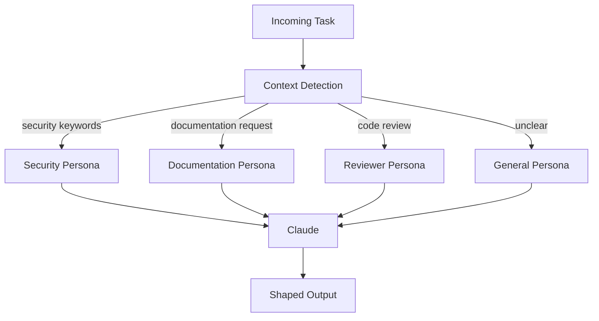

**What this changes** :

  * "Routing logic" = persona matching rules
  * "Agent capabilities" = persona metadata (what triggers each)
  * "Agent registry" = collection of persona files with selection criteria

**Design pattern** : Add explicit metadata to persona files:
```
# Security Auditor

triggers:
  - keywords: [security, vulnerability, CVE, OWASP]
  - file_patterns: [auth/*, crypto/*, */security.*]
  - explicit_request: true

capabilities:
  - security_review
  - vulnerability_assessment
  - compliance_check

## Role
...
```

This metadata enables systematic selection rather than ad-hoc routing.

---

## Implication 2: Coordination is Persona Layering

Patterns like "have Security and Reviewer analyze this in parallel" actually mean:
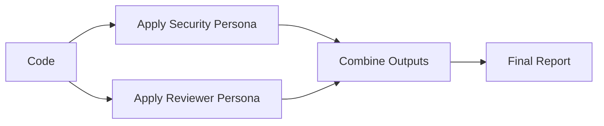

Both passes go through the same Claude instance, just with different persona lenses. The "coordination" is in how you:

  1. **Sequence** the persona applications (parallel or serial)
  2. **Scope** what each persona sees (same input or filtered)
  3. **Merge** the outputs (concatenate, reconcile, or synthesize)

**What this changes** :

  * No actual parallelism unless you make separate API calls
  * "Agent communication" is really output-to-input chaining
  * Conflicts between "agents" are conflicts in merged outputs

---

## Merge Strategies

Strategy | When to Use | Implementation  
---|---|---  
**Concatenate** | Independent analyses | Append outputs with headers  
**Reconcile** | Potentially conflicting findings | Second pass with both outputs as context  
**Synthesize** | Need unified recommendation | Synthesis persona that combines perspectives  
**Vote** | Multiple opinions on same question | Count agreements, flag disagreements  
  
### Example: Reconcile Strategy
```
## Synthesis Prompt

You have two analyses of the same code:

### Security Analysis
[output from security persona]

### Code Quality Analysis  
[output from reviewer persona]

Reconcile these into a single prioritized report:
- Where do they agree?
- Where do they conflict?
- What's the unified recommendation?
```

---

## Implication 3: Personas are Pure Functions

The spawn/agent language helps humans conceptualize the system, but:

  * No new compute resources are allocated per "agent"
  * No separate memory space exists
  * No true parallel execution occurs (unless orchestration layer manages it)

**Design pattern** : Treat personas as pure functions:
```
persona(context) → output
```

No side effects, no state, no memory. If you need those, build them externally and inject context.
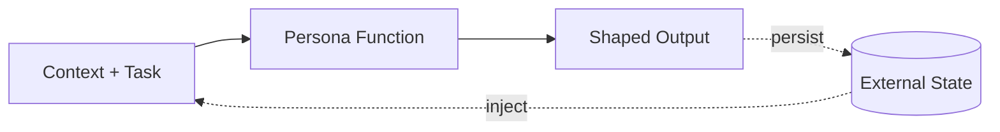

---

## Implication 4: Authoring is Prompt Engineering

This reframes authoring priorities:

Principle | Why It Matters  
---|---  
**Clarity over cleverness** | The model follows instructions literally  
**Structure over prose** | Numbered steps > flowing paragraphs  
**Examples over descriptions** | Show desired output, don't just describe it  
**Constraints over assumptions** | Explicit "don't" lists prevent drift  
  
---

## Decision Framework: When to Use Multiple Personas

Scenario | Approach  
---|---  
Task needs one clear expertise | Single persona  
Task needs multiple perspectives on same content | Multiple personas, merge outputs  
Task has sequential phases with different needs | Chain personas, output → input  
Task is ambiguous, could go multiple directions | Router → selected persona  
Task needs persistent memory | External state + persona  
  
### Single Persona

Best for focused tasks where one lens is enough.
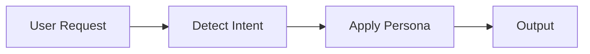

### Multiple Personas (Parallel)

Best when you need different perspectives on the same input.
```mermaid
flowchart LR
    Input[Input] --> Security[Security]
    Input --> Quality[Quality]
    Input --> Perf[Performance]
    Security --> Merge[Merge]
    Quality --> Merge
    Perf --> Merge
    Merge --> Output[Output]
```

### Chained Personas (Sequential)

Best when output from one phase feeds the next.
```mermaid
flowchart LR
    Spec[Spec] --> Architect[Architect] --> Design[Design]
    Design --> Implementer[Implementer] --> Code[Code]
    Code --> Reviewer[Reviewer] --> Feedback[Feedback]
```

### Router + Persona

Best when task type varies.
```mermaid
flowchart LR
    Input[Input] --> Router[Router] --> Persona[Appropriate Persona] --> Output[Output]
```

---

## Common Mistakes

Mistake | Problem | Fix  
---|---|---  
Over-engineering "agent communication" | Complexity with no benefit | Pass outputs directly  
Expecting parallel execution | Only one model runs at a time | Design for sequential or batch API calls  
Vague persona definitions | Inconsistent behavior | Use the anatomy template from Post 2  
Too many personas | Selection becomes error-prone | Consolidate overlapping capabilities  
No fallback persona | Unmatched requests fail | Always include a general-purpose fallback  
Assuming agents share context | They don't—each invocation is fresh | Explicitly pass needed context  
  
---

## Persona Portfolio: Coverage Without Overlap

A well-designed persona collection covers your needs without redundancy:

Category | Persona | Triggers  
---|---|---  
**Analysis** | SecurityAuditor | "security", "vulnerability", "CVE"  
| CodeReviewer | "review", "quality", "feedback"  
| Debugger | "bug", "error", "fix", "broken"  
**Creation** | Documenter | "document", "readme", "explain"  
| TestEngineer | "test", "coverage", "spec"  
| Implementer | "implement", "build", "code"  
**Planning** | Architect | "design", "architecture", "structure"  
| Planner | "plan", "break down", "steps"  
**Meta** | Fallback | (unmatched requests)  
  
**Key principle** : Each persona owns a distinct concern. Overlap creates routing ambiguity.

---

## Anti-Pattern: The God Persona
```
# Bad: Does everything
You are an expert at security, testing, documentation,
architecture, performance, and code review.
```

This defeats the purpose. A persona that does everything does nothing distinctly. Split into focused specialists and route between them.

---

## Pattern: Persona Composition

For complex tasks, compose focused personas:
```mermaid
flowchart TD
    subgraph Phase1["Phase 1: Analysis"]
        Code[Code] --> Security[SecurityAuditor]
        Code --> Reviewer[CodeReviewer]
        Security --> SF[security_findings]
        Reviewer --> QF[quality_findings]
    end
    
    subgraph Phase2["Phase 2: Synthesis"]
        SF --> Synth[Synthesizer]
        QF --> Synth
        Synth --> Report[combined_report]
    end
    
    subgraph Phase3["Phase 3: Action"]
        Report --> Planner[Planner]
        Planner --> Plan[remediation_plan]
    end
```

Each persona stays focused. Composition handles complexity.

---

## Setting Realistic Expectations

Expectation | Reality  
---|---  
Agents run in parallel | Sequential unless you use multiple API calls  
Agents communicate directly | You merge their outputs  
Agents remember previous work | Each invocation is stateless  
More agents = better results | More personas = more routing complexity  
Agents are autonomous | They follow instructions in their definitions  
  
---

## Common Misconceptions

  * **"This model is limiting"** — It's clarifying. The persona lens model describes what's already true about most AI systems. Understanding it helps you work with the grain rather than against it.

  * **"Real multi-agent systems are different"** — Some are. But many "multi-agent" platforms are this architecture with better UX. Ask vendors: Is it one model or many? How do agents share state? What's the actual coordination mechanism?

  * **"I should simulate separate agents"** — Only if there's benefit. Often a well-written single persona outperforms a complex multi-agent system. Start simple.

---

## What to Do Next

  1. **Audit existing "agents"** : Are they actually personas? Can they be simplified?
  2. **Apply the patterns** : Try persona selection, layering, and explicit merge strategies
  3. **Build your portfolio** : Map your needs to focused personas with clear triggers
  4. **Set realistic expectations** : Design for what the architecture actually provides

---

> "Multi-agent coordination is really about sequencing or combining multiple persona lenses."

---

_This completes the Persona Lens Model series. For related content, see[Designing Agent Personas That Actually Work](https://agenticthinking.ai/blog/agent-personas/) for detailed authoring guidance._

---

# Testing AI Artifacts: A Validation Framework

**Source:** https://agenticthinking.ai/blog/testing-artifacts/  
**Part 8 of 13**

Most teams create rules and commands but never verify they work. Then they're surprised when the AI ignores guidance or produces inconsistent output. This post introduces a testing framework for validating AI artifacts—structural, content, and behavioral tests.

---

## The Testing Challenge

Traditional code testing is straightforward:
```
Input → Function → Output (deterministic)
```

AI artifact testing is different:
```
Context + Artifact → LLM → Behavior (probabilistic)
```

How do you test something non-deterministic?

The answer: **Test what you can control.** Structure and content are deterministic. Behavior can be bounded.

---

## The Artifact Testing Pyramid
```mermaid
flowchart TB
    subgraph pyramid["Artifact Testing Pyramid"]
        BT["Behavioral Tests<br/>Does it guide correctly?"]
        CT["Content Tests<br/>Is content valid?"]
        ST["Structural Tests<br/>Is format correct?"]
    end

    BT --> CT --> ST

    style BT fill:#f9f,stroke:#333
    style CT fill:#bbf,stroke:#333
    style ST fill:#bfb,stroke:#333
```

**Structural tests** catch 80% of issues and are fully automated. **Content tests** verify quality and are mostly automated. **Behavioral tests** confirm actual guidance and require simulation.

---

## Structural Tests

Structural tests verify the artifact is well-formed. These are fast, deterministic, and catch the most common errors.

### For Rules
```
Structural Tests for Rules: ✓ Has YAML frontmatter (starts with ---)
  ✓ Frontmatter is valid YAML
  ✓ Has 'description' field (non-empty string)
  ✓ Has 'globs' or 'alwaysApply' (at least one)
  ✓ If 'globs', patterns are valid
  ✓ Markdown body exists after frontmatter
  ✓ Body has at least one heading
```

**Example failures:**
```
# FAILS: Missing description
---
globs: ["**/*.ts"]
---
# FAILS: Invalid glob pattern
---
description: "TypeScript rules"
globs: ["**/*.{ts"] # Unclosed brace
---
# FAILS: Empty body
---
description: "TypeScript rules"
globs: ["**/*.ts"]
---
(no content)
```

### For Commands

Commands have different requirements:
```
Structural Tests for Commands: ✓ NO YAML frontmatter
  ✓ Has title starting with "# /"
  ✓ Has "## Instructions" section
  ✓ Has default behavior documented
  ✓ No duplicate heading levels
```

**Example failures:**
```
# FAILS: Has frontmatter (commands shouldn't)

---

## description: "Review command"

# /review - Code Review

# FAILS: Missing instruction section

# /review - Code Review

Use this to review code.
```

### For Agents
```
Structural Tests for Agents: ✓ Has YAML frontmatter
  ✓ Has 'name' field
  ✓ Has 'model' field
  ✓ Has 'description' field (the prompt)
  ✓ Description has Role section
  ✓ Description has Process section
  ✓ Description has Output Format section
```

---

## Content Tests

Content tests verify quality—not just form, but substance.

### Actionable Instructions
```
Content Tests - Actionability:
  ✓ Instructions contain verbs ("analyze", "check", "generate")
  ✓ No vague phrases ("write clean code", "be helpful")
  ✓ Steps are specific and completable
  ✓ Examples are concrete (not "do something like...")
```

**Detecting vagueness:**
```
VAGUE_PATTERNS = [
    r"be\s+(helpful|careful|thorough)",
    r"write\s+(clean|good|better)\s+code",
    r"ensure\s+quality",
    r"do\s+something\s+like",
    r"etc\.?$",
    r"and\s+so\s+on",
]

def check_actionability(content):
    issues = []
    for pattern in VAGUE_PATTERNS:
        if re.search(pattern, content, re.IGNORECASE):
            issues.append(f"Vague pattern: {pattern}")
    return issues
```

### Description Quality
```
Content Tests - Description: ✓ Length > 20 characters
  ✓ Specific to one purpose
  ✓ No placeholder text ("TODO", "[insert here]")
  ✓ Would help AI decide relevance
```

### Example Presence
```
Content Tests - Examples: ✓ Procedural rules have examples
  ✓ Commands have usage examples
  ✓ Complex patterns are illustrated
  ✓ Examples are syntactically valid
```

---

## Behavioral Tests (Golden Tests)

Behavioral tests verify the artifact actually guides AI behavior correctly. These use "golden" input/output pairs.

### Golden Test Format
```
# .cursor/tests/debug-command.golden.yaml
artifact: .cursor/commands/debug.md
scenarios:
  - name: "basic_error"
    input: "/debug TypeError: undefined is not a function"
    expected_contains:
      - "Root Cause"
      - "Hypothesis"
    expected_not_contains:
      - "I don't know"
      - "I'm not sure"

  - name: "stack_trace"
    input: "/debug [stack trace with 5 frames]"
    expected_contains:
      - "Evidence"
      - "line"
    expected_format:
      sections:
        - "## Bug Analysis"
        - "### Symptoms"
        - "### Root Cause"

  - name: "no_information"
    input: "/debug it's broken"
    expected_contains:
      - "What error"
      - "more information"
    expected_behavior: "asks_clarifying_questions"
```

### Golden Test for Rules
```
# .cursor/tests/naming-rule.golden.yaml
artifact: .cursor/rules/naming/RULE.md
scenarios:
  - name: "variable_naming"
    context: "Creating a variable for user count"
    input: "Create a variable to store the number of users"
    expected_contains:
      - "userCount" # camelCase expected
    expected_not_contains:
      - "user_count" # snake_case not expected
      - "UserCount" # PascalCase not expected

  - name: "class_naming"
    context: "Creating a class for authentication"
    input: "Create a class that handles user authentication"
    expected_contains:
      - "UserAuthentication" # PascalCase expected
    expected_not_contains:
      - "userAuthentication" # camelCase not expected
```

### Golden Test for Agents
```
# .cursor/tests/security-auditor.golden.yaml
artifact: .cursor/agents/security-auditor.md
scenarios:
  - name: "sql_injection"
    input: |
      Review this code for security:
      db.query(`SELECT * FROM users WHERE id = '${userId}'`)
    expected_contains:
      - "SQL injection"
      - "parameterized"
      - "Critical"
    expected_format:
      has_sections:
        - "Security Audit Report"
        - "Critical Issues"

  - name: "safe_code"
    input: |
      Review this code for security:
      db.query('SELECT * FROM users WHERE id = $1', [userId])
    expected_not_contains:
      - "Critical"
      - "injection"
    expected_contains:
      - "No critical issues"
```

---

## The `/test-artifact` Command

Implement testing as a command:
```
# /test-artifact - Test Cursor Artifacts

Run structural, content, and behavioral tests on Cursor artifacts.

## Instructions

When the user invokes `/test-artifact`:

1. Identify the target artifact(s)
2. Determine artifact type (rule, command, agent)
3. Run structural tests for that type
4. Run content tests
5. Run behavioral tests if golden file exists
6. Report results in standard format

### Default Behavior

Test the current file if it's an artifact, or ask for target.

## Variants

### `/test-artifact @path`

Test specific artifact at path.

### `/test-artifact all`

Test all artifacts in .cursor/

### `/test-artifact all --type rules`

Test all artifacts of specific type.

### `/test-artifact --interactive`

Run behavioral tests interactively.

### `/test-artifact --regression`

Compare to last known good state.

## Output Format

## Artifact Test Report

**Artifact**: [path]
**Type**: [Rule/Command/Agent]
**Status**: ✅ Pass | ⚠️ Warnings | ❌ Fail

### Structural Tests

| Check   | Status   | Notes     |
| ------- | -------- | --------- |
| [check] | ✅/⚠️/❌ | [details] |

### Content Tests

| Check   | Status   | Notes     |
| ------- | -------- | --------- |
| [check] | ✅/⚠️/❌ | [details] |

### Behavioral Tests

| Scenario | Status   | Notes     |
| -------- | -------- | --------- |
| [name]   | ✅/⚠️/❌ | [details] |

### Issues Found

1. [severity] [description]
   - Suggestion: [fix]

### Summary

- Structural: X/Y ✓
- Content: X/Y ✓
- Behavioral: X/Y ✓
```

---

## Test Execution Example

**User:** `/test-artifact .cursor/rules/naming/RULE.md`

> **Artifact Test Report**
> 
> **Artifact:** `.cursor/rules/naming/RULE.md`  
>  **Type:** Rule  
>  **Status:** ⚠️ Warnings

**Structural Tests:**

Check | Status | Notes  
---|---|---  
YAML frontmatter | ✅ Pass |   
Description | ✅ Pass | 43 chars  
Globs valid | ✅ Pass | `["**/*.ts", "**/*.js"]`  
Body exists | ✅ Pass |   
  
**Content Tests:**

Check | Status | Notes  
---|---|---  
Actionable | ✅ Pass | Contains verbs  
No vague phrases | ✅ Pass |   
Has examples | ⚠️ Warn | Only 1 example  
No placeholders | ✅ Pass |   
  
**Behavioral Tests:**

Scenario | Status | Notes  
---|---|---  
variable_naming | ✅ Pass | Produced "userCount"  
class_naming | ✅ Pass | Produced "UserAuth..."  
  
**Issues Found:**

  1. ⚠️ Only 1 example provided — _Suggestion: Add 2-3 examples for edge cases_

**Summary:** Structural 4/4 ✓ | Content 3/4 (1 warning) | Behavioral 2/2 ✓

---

## Interactive Testing Mode

For behavioral tests that need human judgment:

**User:** `/test-artifact --interactive`

> Starting interactive test session...
> 
> **Testing:** `.cursor/commands/debug.md`
> 
> **Scenario 1: basic_error**  
>  Simulating: User says "debug this: TypeError undefined"
> 
> _[Agent produces debug output...]_
> 
> Did the command behave correctly? (y/n/details)

**User:** `n`

> What was wrong?  
>  **>** It didn't analyze the stack trace
> 
> Logged. Recording failure for scenario 'basic_error'.
> 
> **Suggested fix:** Add explicit instruction to parse stack traces in the debug command's Process section.
> 
> Continue to next scenario? (y/n)

---

## Regression Testing

After modifying artifacts, verify you didn't break existing behavior:

**User:** `/test-artifact --regression`

> Comparing to last known good state...
> 
> **Changed artifacts:**
> 
>   * `.cursor/commands/debug.md`
>     * Added: --trace variant
>     * Modified: default behavior
> 

> 
> Running behavioral tests for changed artifacts...
> 
> **Results:**
> 
>   * ✅ basic_error: Still passes
>   * ✅ stack_trace: Still passes
>   * ✅ no_information: Still passes
>   * ✅ NEW: trace_variant: Passes
> 

> 
> All existing behaviors preserved. New variant works correctly.

---

## Integration Tests

Verify artifacts work together:
```
Integration Tests: ✓ Commands referenced in rules exist
  ✓ Agents referenced in commands exist
  ✓ No circular dependencies between rules
  ✓ Glob patterns don't conflict
  ✓ Subsumption matrix is consistent
```

---

## Validation Checklist

Use this before committing any artifact:

### Rules

  * [ ] YAML frontmatter is valid
  * [ ] Description is specific (not generic)
  * [ ] Globs are correct and not overly broad
  * [ ] Instructions are actionable (contain verbs)
  * [ ] At least one concrete example
  * [ ] No vague phrases ("be helpful", "ensure quality")
  * [ ] No conflicting guidance with other rules

### Commands

  * [ ] NO frontmatter
  * [ ] Title format: `# /command-name - Description`
  * [ ] Has `## Instructions` section
  * [ ] Default behavior documented
  * [ ] Variants documented
  * [ ] Output format specified
  * [ ] At least one usage example

### Agents

  * [ ] YAML frontmatter with name, model, description
  * [ ] Role is specific (not "helpful assistant")
  * [ ] Expertise areas listed
  * [ ] Process has numbered steps
  * [ ] Output format is explicit
  * [ ] Constraints are defined

---

## Key Takeaways

  1. **Test what you can control.** Structure and content are deterministic. Test them first.

  2. **Structural tests catch 80% of issues.** Invalid YAML, missing fields, wrong format—all detectable automatically.

  3. **Golden tests bound behavior.** You can't test for exact output, but you can test for presence of expected elements.

  4. **Interactive testing fills gaps.** Some things need human judgment. Build that into the process.

  5. **Regression testing prevents breakage.** After changes, verify existing behaviors still work.

  6. **Make testing a command.** `/test-artifact` should be as easy to run as any other command.

---

# AI That Teaches Itself (Meta-Learning)

**Source:** https://agenticthinking.ai/blog/meta-learning/  
**Part 9 of 13**

What if your AI development system got better automatically? Not through manual rule-writing, but by observing how you work and proposing improvements. This post shows how to build feedback loops that learn from real usage.

---

## The Learning Loop

Most AI customization is reactive: something goes wrong, you add a rule. The meta-learning system inverts this—it proactively observes usage and suggests improvements.
```mermaid
flowchart LR
    subgraph LOOP["Continuous Improvement Loop"]
        O["OBSERVE"]:::primary
        P["PATTERN"]:::secondary
        PR["PROPOSE"]:::secondary
        T["TEST"]:::secondary
        D["DEPLOY"]:::accent
    end

    O --> P --> PR --> T --> D
    D --> O
```

Phase | Questions  
---|---  
**Observe** | Rules triggered? Commands used? Manual work? Friction points?  
**Pattern** | What sequences repeat? What should be automated?  
**Propose** | New rule? New command? Update existing?  
**Test** | Does it conflict? Does it help?  
**Deploy** | Apply and monitor  
  
**Patterns Detected:**

  * User ran lint manually 5 times → auto-lint rule
  * User asked "how to..." 3 times → missing documentation
  * Command /review failed twice → needs better error handling

---

## What to Observe

The system tracks several dimensions of usage:

### 1\. Rule Effectiveness

Metric | What It Tells You  
---|---  
Trigger frequency | Is the rule relevant?  
Override frequency | Is the rule too strict?  
Conflict frequency | Does it clash with others?  
Helpful vs ignored | Is it actually guiding behavior?
```
Rule Observation Log:
  naming/RULE.md:
    triggered: 23 times
    followed: 21 times
    overridden: 2 times (user said "use snake_case here")
    conflicts: 0
    verdict: EFFECTIVE

  verbose-logging/RULE.md:
    triggered: 3 times
    followed: 0 times
    overridden: 3 times
    conflicts: 0
    verdict: REVIEW (always overridden)
```  
  
### 2\. Manual Repetition

When users do the same manual action multiple times, it's a signal:
```
Manual Action Tracking:
  "npm run format": 6 times
  "git add . && git commit": 4 times
  "npm test": 8 times
  "console.log debugging": 5 times

Patterns:
  - Format manually → enable auto-format
  - Commit without /checkpoint → promote /checkpoint usage
  - Test frequently → auto-test after changes
  - Console.log debugging → suggest Debugger agent
```

### 3\. Questions Asked

Repeated questions indicate missing knowledge:
```
Question Tracking:
  "how does the auth flow work?": 3 times
  "where is the database config?": 2 times
  "what's the API response format?": 4 times

Patterns:
  - Auth questions → create auth-flow documentation
  - Config questions → create config-location rule
  - API questions → create api-conventions rule
```

### 4\. Command Usage

Which commands are used, skipped, or fail:
```
Command Tracking:
  /checkpoint: 12 uses, 0 failures
  /review: 8 uses, 1 failure (no files staged)
  /debug: 3 uses, 0 failures
  /cleanup: 2 uses (but /checkpoint used 12 times)

Patterns:
  - /cleanup underused → users may not know it exists
  - /review failure → improve error handling
  - /checkpoint popular → consider auto-commit for small changes
```

### 5\. Agent Spawning

When agents help vs when they're skipped:
```
Agent Tracking:
  Debugger:
    spawned: 5 times
    helpful: 5 times
    verdict: KEEP

  Optimizer:
    spawned: 0 times
    should_have_spawned: 2 times (user manually optimized)
    verdict: IMPROVE ROUTING

  Critic:
    spawned: 1 time
    helpful: 1 time
    not_spawned_when_useful: 3 times
    verdict: LOWER TRIGGER THRESHOLD
```

---

## Pattern Recognition Thresholds

Not every observation becomes a suggestion. Use thresholds:
```
Pattern Thresholds:
  # Automation opportunities
  manual_action_repeated:
    threshold: 3+ times
    action: Propose automation rule

  # Documentation gaps
  question_repeated:
    threshold: 2+ times
    action: Propose documentation or rule

  # Command improvements
  command_syntax_error:
    threshold: 2+ times
    action: Improve command help text

  # Routing improvements
  agent_not_spawned_when_useful:
    threshold: 2+ times
    action: Adjust routing patterns

  # Rule relevance
  rule_always_overridden:
    threshold: 3+ times
    action: Review rule, consider removing

  # Conflict detection
  rule_conflict:
    threshold: 1+ times
    action: Flag for resolution
```

---

## The MetaAnalyzer Agent

The MetaAnalyzer is a specialized agent that analyzes sessions and proposes improvements:
```
# .cursor/agents/meta-analyzer.md
---
name: MetaAnalyzer
model: claude-sonnet-4-20250514
description: |
  # Meta Analyzer

  You analyze development sessions to identify improvement opportunities
  for the Cursor artifact system.

  ## Role
  Find friction points, missing automation, and unused potential.

  ## Analysis Dimensions

  ### Rule Effectiveness
  - Which rules triggered?
  - Were they helpful or overridden?
  - Any conflicts detected?

  ### Automation Opportunities
  - What manual actions repeated?
  - What could be automated safely?

  ### Missing Coverage
  - What questions were asked multiple times?
  - What topics have no rules/docs?

  ### Agent Utilization
  - Were specialists spawned when helpful?
  - Were appropriate agents available?

  ## Process

  1. Parse session transcript
  2. Extract actions, questions, failures
  3. Match against pattern thresholds
  4. Generate improvement proposals
  5. Prioritize by impact

  ## Output Format

  # Session Analysis Report

  ## Executive Summary
  - Duration: [time]
  - Main activity: [category]
  - Key finding: [most impactful observation]
  - Top recommendation: [highest-priority proposal]

  ## High-Impact Opportunities

  ### 1. [Opportunity Name] ([Priority])
  **Evidence**: [what was observed]
  **Proposal**: [what to do]
  **Impact**: [expected benefit]

  ## Proposals Generated
  - [path to proposal file]

  ## Constraints
  - Only propose what evidence supports
  - Prioritize by actual impact, not theoretical
  - Include evidence for every proposal
  - Generate actionable proposals, not vague suggestions
---
```

---

## Session Analysis in Action

**User:** `/analyze-session --propose`

> MetaAnalyzer spawned...
> 
> Analyzing session transcript...
> 
>   * Messages: 47
>   * Duration: 2.5 hours
>   * Commands used: 12
>   * Agents spawned: 3
> 

### Session Analysis Report

**Executive Summary:**

  * Duration: 2.5 hours
  * Main activity: API development
  * Key finding: Manual formatting repeated 6 times
  * Top recommendation: Enable auto-format rule

**High-Impact Opportunities:**

# | Opportunity | Evidence | Proposal | Impact  
---|---|---|---|---  
1 | Auto-Format Rule (IMMEDIATE) | User ran `npm run format` 6 times manually | Enable auto-format in autonomous-workflows | ~12 manual commands saved per session  
2 | API Validation Agent (MEDIUM) | User asked "is this API design right?" 3 times | Create APIDesigner agent | Specialized guidance for API work  
3 | Missing Error Handling Rule (MEDIUM) | SecurityAuditor flagged missing error handling 4 times | Add error-handling rule to base/ | Catch issues proactively  
4 | Unused /cleanup Command (LOW) | /cleanup used 0 times, but manual cleanup done | Improve discoverability or subsume into /checkpoint | Reduced friction  
  
**Proposals Generated:**

  * `.cursor/proposals/auto-format-rule.md`
  * `.cursor/proposals/api-designer-agent.md`
  * `.cursor/proposals/error-handling-rule.md`

Review proposals? [Y/n]

---

## Proposal Review Workflow

**User:** "Review proposals"

> **Proposal Review**
> 
> **1\. auto-format-rule.md**  
>  Type: Rule modification  
>  Impact: HIGH
> 
> Change: Add auto-format to autonomous-workflows rule
> 
> `+ | Lint/format | After code edit | Run and fix |`
> 
> Accept? [y/n/edit]

**User:** `y`

> ✓ Applied auto-format rule
> 
> **2\. api-designer-agent.md**  
>  Type: New agent  
>  Impact: MEDIUM
> 
> Creates: `.cursor/agents/api-designer.md`  
>  Updates: `.cursor/rules/agent-routing/RULE.md`
> 
> Accept? [y/n/edit]

---

## Automated vs. Manual Learning

Not all improvements should be automatic:

### Auto-Apply (Safe)

  * Add new observation data
  * Update usage statistics
  * Flag patterns that cross thresholds

### Propose and Wait (Default)

  * New rules
  * New agents
  * Modified existing artifacts

### Manual Only (Risky)

  * Delete rules or agents
  * Change critical guardrails
  * Modify security-related rules

---

## Metrics Over Time

Track improvement over sessions:

### System Health Dashboard

**Rule Effectiveness (Last 30 Days)**

Metric | Value | Trend  
---|---|---  
Rules triggered | 234 | —  
Rules followed | 221 (94.4%) | —  
Rules overridden | 13 (5.6%) | ↑ improving (+2% from last month)  
  
**Automation Coverage**

Metric | Current | Previous  
---|---|---  
Manual actions | 45 | 78  
Automated actions | 189 | 156  
Automation ratio | 80.8% | 66.7%  
  
**Agent Utilization**

Metric | Value  
---|---  
Spawns | 34  
Helpful | 31 (91.2%)  
Missed opportunities | 4  
  
**Proposals**

Metric | Value  
---|---  
Generated | 12  
Accepted | 9  
Rejected | 2  
Pending | 1  
Acceptance rate | 81.8%  
  
---

## Key Takeaways

  1. **Observe usage systematically.** Track rules, commands, agents, manual actions, questions.

  2. **Use thresholds for pattern detection.** Not every observation is actionable—set thresholds.

  3. **Generate proposals, don't auto-apply.** The human reviews and accepts changes.

  4. **Evidence backs every proposal.** Show what was observed before suggesting what to change.

  5. **Track effectiveness of changes.** If a new rule is always overridden, remove it.

  6. **The system improves over time.** Automation ratio goes up, manual work goes down.

---

# The alwaysApply Tax

**Source:** https://agenticthinking.ai/blog/alwaysapply-tax/  
**Part 10 of 13**

We audited a mature Cursor configuration and found 22 rules with `alwaysApply: true`, totaling 2,700 lines loaded into every single conversation—including "what's 2+2?" This is the alwaysApply tax.

**Configuring Your AI Assistant series**

  * [Rules vs Skills](https://agenticthinking.ai/blog/rules-vs-skills/) — When to use each
  * **The alwaysApply Tax** (this post) — The hidden cost of always-on rules
  * [How Cursor Finds Skills](https://agenticthinking.ai/blog/skill-discovery/) — Discovery mechanics

---

## The Discovery

During optimization of a shared Cursor rules repository, we ran a simple audit:
```
# Count alwaysApply rules
grep -l "alwaysApply: true" rules/*.mdc | wc -l
# Result: 22 rules

# Total lines in those rules
grep -l "alwaysApply: true" rules/*.mdc | xargs wc -l | tail -1
# Result: ~2,700 lines
```

**22 rules × ~120 lines average = 2,700 lines of context loaded in every conversation.**

Even when the user asks something completely unrelated, all 2,700 lines are in the context window.

---

## Why This Matters

### 1\. Token Costs

Every token costs money:

  * GPT-4: ~$0.03/1K input tokens
  * Claude: ~$0.015/1K input tokens
  * 2,700 lines ≈ 5,000-8,000 tokens

**Per-conversation overhead** : $0.08-0.25 (for nothing relevant)

**Daily cost** (50 conversations): $4-12.50

**Monthly cost** : $120-375 in wasted tokens

### 2\. Context Window Competition

Models have finite attention:

  * Claude: 200K tokens (but attention degrades with length)
  * GPT-4: 128K tokens

2,700 lines of rules means:

  * Less room for actual code
  * Less room for conversation history
  * Degraded attention on what matters

### 3\. Response Quality

Models perform worse with irrelevant context:

  * More "noise" to filter
  * Higher chance of confusion
  * Slower response times

---

## The Audit Results

### What We Found

Category | Count | Lines | Should Be alwaysApply?  
---|---|---|---  
`core-*` (essential) | 8 | ~600 | Yes  
`core-*` (domain-specific) | 9 | ~1,400 | No — use globs  
`agent-*` behaviors | 5 | ~700 | Some yes, some no  
**Total** | **22** | **~2,700** | ~8-10 should stay  
  
### Rules That Should Stay alwaysApply

Rule | Why  
---|---  
`core-ai-assistant` | Defines AI persona (fundamental)  
`core-code-quality` | Universal code standards  
`core-security` | Security must never be forgotten  
`core-workflow` | Basic development approach  
`core-error-handling` | Universal error handling  
`core-git` | Commit standards  
`core-escalation` | When to ask humans  
`core-refusal-behavior` | What to refuse  
  
### Rules That Should Use Globs

Rule | Current | Should Be  
---|---|---  
`core-diagrams` | alwaysApply | `globs: ["*.mmd", "**/diagrams/**"]`  
`core-documentation` | alwaysApply | `globs: ["**/*.md", "**/docs/**"]`  
`core-logging` | alwaysApply | `globs: ["**/log*", "**/logger*"]`  
`core-configuration` | alwaysApply | `globs: ["**/*.config.*", "**/config/**"]`  
`core-naming` | alwaysApply | `globs: ["**/*.ts", "**/*.py"]`  
`core-data-sourcing` | alwaysApply | Skill (it's a workflow)  
  
### Estimated Savings

**Before** : 22 rules, ~2,700 lines always loaded

**After** : 8-10 rules, ~800-1,000 lines always loaded

**Reduction** : ~65% fewer always-on tokens

---

## The Decision Framework

### When alwaysApply IS Appropriate

Criterion | Example  
---|---  
Truly universal standard | "Never commit secrets"  
Affects EVERY interaction | "You are a helpful assistant"  
Safety/security critical | "Refuse harmful requests"  
Fundamental workflow | "Verify before implementing"  
  
### When alwaysApply is NOT Appropriate

Criterion | Better Alternative  
---|---  
Domain-specific guidance | `globs` targeting relevant files  
Workflow/procedure | Skill (invoked when needed)  
Reference material | Skill with `references/` folder  
Rarely needed | Description-based activation  
  
### The Test

Ask: **"If someone asks 'what's 2+2?', does this rule need to be loaded?"**

  * If yes → alwaysApply
  * If no → globs or skill

---

## Case Study: The Logging Rule

### Before
```yaml
---
description: "Logging standards"
alwaysApply: true
---
# 240 lines of logging guidance
```

**Problem** : Loaded when user asks about CSS, database, anything.

### After
```yaml
---
description: "Logging standards"
globs:
  - "**/log*"
  - "**/logger*"
  - "**/*logging*"
---
# Same 240 lines, but only when relevant
```

**Result** : Only loaded when user opens logging-related files.

---

## The Compound Effect

### Individual Rules Seem Small

"It's only 80 lines, no big deal."

### But They Compound

Rules | Avg Lines | Total  
---|---|---  
5 | 80 | 400  
10 | 80 | 800  
15 | 80 | 1,200  
20 | 80 | 1,600  
25 | 80 | 2,000  
  
**Each "small" addition increases baseline cost for all conversations.**

### The Boiling Frog

You don't notice performance degradation because:

  * It happens gradually
  * You attribute slowness to "the AI being slow"
  * You don't A/B test with fewer rules

---

## How to Audit Your Setup

### Step 1: Count alwaysApply rules
```
grep -l "alwaysApply: true" .cursor/rules/**/*.md | wc -l
```

### Step 2: Measure total lines
```
grep -l "alwaysApply: true" .cursor/rules/**/*.md | xargs wc -l
```

### Step 3: List them
```
grep -l "alwaysApply: true" .cursor/rules/**/*.md | \
  xargs -I {} sh -c 'echo "=== {} ===" && head -5 {}'
```

### Step 4: Evaluate each

For each rule, ask:

  1. Does this apply to EVERY conversation?
  2. Could this be glob-triggered instead?
  3. Is this really a skill (workflow)?

### Step 5: Migrate

  * Change `alwaysApply: true` to `globs: [...]`
  * Extract workflows to skills
  * Delete redundant rules

---

## Organizational Patterns

### For Teams

**Problem** : Everyone adds alwaysApply rules, no one removes them.

**Solution** :

  * Require justification for alwaysApply
  * Regular audits (quarterly)
  * Budget: "We allow X lines of alwaysApply rules"

### For Shared Configurations

**Problem** : Upstream rules affect all downstream users.

**Solution** :

  * Minimize alwaysApply in shared configs
  * Let downstream add their own if needed
  * Document what's always-on and why

---

## Common Objections

### "But I might need it!"

**Response** : That's what globs and skills are for. You'll still have the rule when relevant.

### "Performance impact is small"

**Response** :

  * It's not small at scale (50+ conversations/day)
  * It compounds with each rule
  * It degrades response quality

### "I can't remember which file triggers which rule"

**Response** :

  * Document your globs
  * Use clear, specific patterns
  * The AI doesn't need YOU to remember—globs handle it

---

## Benchmarks

Based on our audit:

Metric | Healthy | Concerning | Critical  
---|---|---|---  
alwaysApply rules | < 10 | 10-20 | > 20  
alwaysApply lines | < 1,000 | 1,000-2,000 | > 2,000  
% of rules as alwaysApply | < 30% | 30-50% | > 50%  
  
If you're in the "critical" zone, your AI is working with one hand tied behind its back.

---

## Key Takeaways

  1. **Every alwaysApply rule is a tax.** Paid on every conversation, whether relevant or not.

  2. **Most rules shouldn't be alwaysApply.** If it could use a glob, it should.

  3. **Audit regularly.** Rules accumulate; performance degrades gradually.

  4. **Budget your always-on context.** Set a line limit and enforce it.

  5. **The 2+2 test.** If a rule doesn't need to be there for "what's 2+2?", don't make it alwaysApply.

---

# Rules vs Skills in AI Dev

**Source:** https://agenticthinking.ai/blog/rules-vs-skills/  
**Part 11 of 13**

Rules and skills are both configuration artifacts, but they serve different purposes. Mixing them creates bloated rules that should be skills, or skills that are just reference material. Here's how to know which to use.

**Configuring Your AI Assistant series**

  * **Rules vs Skills** (this post) — When to use each
  * [The alwaysApply Tax](https://agenticthinking.ai/blog/alwaysapply-tax/) — The hidden cost of always-on rules
  * [How Cursor Finds Skills](https://agenticthinking.ai/blog/skill-discovery/) — Discovery mechanics

---

## The Configuration Chaos

Without clear guidelines, developers create:

  * 600-line "rules" that are really workflow guides
  * "Skills" that are just prompt templates
  * Always-on rules that should be conditional
  * Context windows stuffed with unused guidance

**Result** : Slow responses, high costs, confused AI behavior.

The fix is simple: understand what each artifact type is _for_.

---

## The Core Distinction

Artifact | Purpose | Content Type | Activation  
---|---|---|---  
**Rules** | What and When | Passive reference | Automatic (always-on or glob)  
**Skills** | How | Active workflow | Explicit invocation  
  
**Rules** tell the AI what to notice. They're loaded into context automatically.

**Skills** tell the AI what to do. They're invoked when needed.

---

## Rules: What and When

Rules are passive reference material. The AI reads them and _knows_ something—no action required.

### What Belongs in Rules

  * **Schemas and formats** : "JSON responses must have this structure"
  * **Conditions and triggers** : "When working with auth code, consider..."
  * **Standards and constraints** : "Never commit secrets"
  * **Decision support** : "Use PostgreSQL for transactional, Redis for cache"

### Activation Patterns

Rules activate automatically via:

  * `alwaysApply: true` — Every conversation
  * `globs: [...]` — When matching files are open
  * Description matching — When AI deems relevant

### Example Rule
```yaml
---
description: "API response standards"
globs: ["**/api/**", "**/routes/**"]
alwaysApply: false
---

## Response Format

All API responses must follow this structure:

{
  "data": <result>,
  "error": null | { "code": string, "message": string },
  "meta": { "requestId": string }
}

## Status Codes

- 200: Success
- 400: Client error (validation, bad request)
- 401: Authentication required
- 403: Forbidden (authenticated but not authorized)
- 500: Server error
```

The AI reads this and knows the format. It doesn't need to _do_ anything—the rule informs future decisions.

---

## Skills: How

Skills are active workflows. The AI reads them and _does_ something—multi-step procedures that produce results.

### What Belongs in Skills

  * **Multi-step procedures** : "To create a PR: 1. Check status, 2. Stage, 3. Commit..."
  * **File creation workflows** : "Create these directories, add these files..."
  * **Complex operations** : "Debug by: reproduce, isolate, fix, verify..."

### Activation Patterns

Skills activate via:

  * Explicit invocation: `/skill-name`
  * Description matching: User intent matches skill description

### Example Skill
```yaml
---
name: ship
description: |
  Ship code via PR. Review, commit, push, create PR.
  Triggers: "ship", "deploy", "create PR", "push", "ready to merge"
---

# Ship Code

## Instructions

When invoked:

1. **Review changes**
   - Run /review if not already done
   - Check for lint errors
   - Verify tests pass

2. **Commit**
   - Stage relevant files
   - Generate commit message (conventional commits)
   - Create commit

3. **Push**
   - Push to remote
   - Create tracking branch if needed

4. **Create PR**
   - Generate PR title and description
   - Link relevant issues
   - Request reviewers if configured

## Output

Show PR URL and summary of changes.
```

This is a _procedure_. The AI follows steps and produces output.

---

## The Decision Framework

### Quick Test

Question | If Yes →  
---|---  
Is it reference material for editing? | Rule  
Is it a multi-step workflow? | Skill  
Does it create or modify files? | Skill  
Is it > 100 lines of "how to"? | Skill  
Is it needed in EVERY conversation? | Maybe Rule  
  
### Content Type Mapping

Content Type | Belongs In | Example  
---|---|---  
Schemas, formats | Rule | "API responses use this structure"  
Standards, constraints | Rule | "Never commit .env files"  
When/if decisions | Rule | "Use UTC for all timestamps"  
Multi-step workflows | Skill | "To ship: review → test → commit → PR"  
File creation | Skill | "Create .ctx/ directory structure"  
Complex procedures | Skill | "Debug: reproduce, isolate, fix"  
  
---

## Token Economics

Context isn't free. Every line you load is attention you spend.

### The Cost of Rules

Every rule loaded into context consumes:

  * **Tokens = money** (API costs per conversation)
  * **Tokens = attention** (model has finite capacity)
  * **Tokens = speed** (more context = slower responses)

### Why This Matters

A rule with `alwaysApply: true` loads in **every conversation** —even when someone asks "what's 2+2?"

If you have 20 always-on rules averaging 100 lines each, that's 2,000 lines of context consumed before the conversation even starts.

### Size Guidelines

Artifact | Target | Max  
---|---|---  
Rule (alwaysApply) | < 50 lines | 100 lines  
Rule (glob-triggered) | < 100 lines | 200 lines  
Skill SKILL.md | < 150 lines | 300 lines  
Skill references/ | Unlimited | -  
  
Skills only load when invoked. Rules load based on activation. Choose wisely.

---

## Soft Routing: Rules Can Mention Skills

Rules can reference skills, but this is **guidance, not invocation** :
```
# In a rule

## Workflows

For complex operations, use the appropriate skill:

- Create project structure: `/init-project`
- Ship code: `/ship`
- Debug issues: `/debug`
```

**Important** : This doesn't make the skill run. It tells the AI (and humans) that the skill exists.

### Why It's "Soft"

Skills are discovered via **description matching** , not rule references. The rule text is a hint, not a command.
```
# In skill frontmatter - THIS is what enables discovery
description: |
  Initialize project structure. Create directories and config files.
  Triggers: "init project", "set up project", "create structure"
```

The AI finds skills by matching user intent to skill descriptions, not by reading rule text.

---

## Worked Examples

### Example 1: Code Formatting

**Wrong** : 200-line skill with formatting rules

**Right** : Rule with standards, skill for reformatting
```
# rules/formatting/RULE.md (40 lines)

---

description: "Code formatting standards"
globs: ["*.ts", "*.js"]

---

- 2 spaces indentation
- Single quotes for strings
- Trailing commas in multiline
```
```
# skills/format/SKILL.md (60 lines)

---

## description: "Reformat code. Fix formatting issues."

## Instructions

1. Identify files with formatting issues
2. Apply standards from @formatting rule
3. Run prettier/eslint
4. Report changes
```

The rule says _what_. The skill says _how_.

### Example 2: PR Creation

**Wrong** : 150-line rule with PR workflow steps

**Right** : Skill for the workflow
```
# skills/ship/SKILL.md (100 lines)

---

## description: "Ship code via PR. Review, commit, push, create PR."

## Instructions

1. Review changes with /review
2. Run tests
3. Create atomic commit
4. Push to remote
5. Create PR with description
```

No rule needed—this is pure workflow.

### Example 3: API Response Format

**Wrong** : Skill that "generates API responses"

**Right** : Rule with the format standard
```
# rules/api/RULE.md (80 lines)

---

description: "API standards"
globs: ["**/api/**", "**/routes/**"]

---

## Response Format

{
"data": <result>,
"error": null | { "code": string, "message": string }
}
```

No skill needed—this is reference, not workflow.

---

## Migration Guide

### Audit Your Rules

Look for:

  * Rules > 100 lines (candidate for splitting)
  * Rules with step-by-step instructions (should be skills)
  * `alwaysApply` rules that could be glob-triggered

### Audit Your Skills

Look for:

  * Skills that are just prompt templates (should be rule or asset)
  * Skills that don't have workflows (should be rules)
  * Skills with minimal descriptions (won't be discovered)

### Migration Steps

  1. **Identify bloated rules** : `wc -l rules/*.mdc | sort -rn`
  2. **Extract workflows** to skills
  3. **Add rich descriptions** to skills for discovery
  4. **Convert alwaysApply** to globs where possible
  5. **Delete redundant artifacts**

---

## Common Misconceptions

### "Rules can invoke skills"

**Reality** : Rules can mention skills. They cannot invoke them. The AI decides whether to use a skill based on description matching.

### "More rules = smarter AI"

**Reality** : More rules = more tokens = slower, more expensive, potentially confused AI. Quality over quantity.

### "Skills need rules to be found"

**Reality** : Skills are found via description field matching. Rich descriptions > rule references.

### "alwaysApply is the default"

**Reality** : `alwaysApply` should be exceptional. Most rules should use `globs` or rely on description-based activation.

---

## Key Takeaways

  1. **Rules for reference, skills for action.** Rules tell the AI what to know. Skills tell it what to do.

  2. **Context has cost.** Every line loaded consumes tokens, attention, and speed.

  3. **Skills need rich descriptions.** The AI can't use a skill it can't find.

  4. **alwaysApply is expensive.** Use globs instead when possible.

  5. **If it has step-by-step instructions, it's probably a skill.**

---

# How Cursor Finds Skills

**Source:** https://agenticthinking.ai/blog/skill-discovery/  
**Part 12 of 13**

You created a custom skill. You tested it. It works when you invoke it directly. But when you describe what you want naturally, the AI ignores it. The skill exists—but it's invisible. Here's why.

---

## Agent Skills: The Open Standard

Before diving into discovery mechanics, understand what skills are: [Agent Skills](https://agentskills.io/) is an open standard for extending AI agents with specialized capabilities. Skills work across any compatible tool—Cursor, Claude Code, VS Code, Gemini CLI, Goose, and [many others](https://agentskills.io/home).

This matters because skills you create for Cursor work in other tools, and skills from the community work in Cursor. It's not a proprietary format.

Key characteristics:

| Trait | What It Means |
| --- | --- |
| Portable | Work across any agent that supports the standard |
| Version-controlled | Stored as files, tracked in your repo or installed from GitHub |
| Executable | Can include scripts the agent runs |
| Progressive | Resources load on demand, keeping context efficient |

---

## Where Skills Live

Cursor automatically discovers skills from multiple locations:

| Location | Scope |
| --- | --- |
| `.cursor/skills/` | Project-level |
| `.claude/skills/` | Project-level (Claude compatibility) |
| `.codex/skills/` | Project-level (Codex compatibility) |
| `~/.cursor/skills/` | User-level (global) |
| `~/.claude/skills/` | User-level (global, Claude compatibility) |
| `~/.codex/skills/` | User-level (global, Codex compatibility) |

Global skills (`~/.cursor/skills/`) apply across all your projects. Put cross-project knowledge there—Kubernetes patterns, API design standards, your personal workflows.

Project skills (`.cursor/skills/`) are repo-specific. Put team workflows there—your deployment process, code review standards.

### Skill Directory Structure

Each skill is a folder containing a`SKILL.md` file:

```
.cursor/
└── skills/
    └── deploy-app/
        ├── SKILL.md           # Required: main instructions
        ├── scripts/           # Optional: executable code
        │   ├── deploy.sh
        │   └── validate.py
        ├── references/        # Optional: additional docs (loaded on demand)
        │   └── REFERENCE.md
        └── assets/            # Optional: templates, configs
            └── config-template.json

```

The optional directories matter:

| Directory | Purpose | When Loaded |
| --- | --- | --- |
| `scripts/` | Executable code agents can run | When skill executes |
| `references/` | Detailed documentation | On demand (progressive) |
| `assets/` | Templates, configs, data files | When referenced |

Progressive loading is key: agents read`SKILL.md` first, then load`references/` only when needed. This keeps context efficient.

---

## How Discovery Actually Works

When Cursor starts, it discovers skills from skill directories and presents them to the agent. The agent then decides when skills are relevant based on context.

This is the critical insight: the agent decides. Your skill's`description` field is how the agent determines relevance.

### The Discovery Flow

1. Cursor scans skill directories at startup
2. Skills appear in Settings → Rules → "Agent Decides" section
3. When user sends a message, agent evaluates available skills
4. Agent matches user intent to skill descriptions
5. Relevant skills are loaded into context

Skills can also be manually invoked by typing`/skill-name` in chat—this bypasses discovery and always works.

---

## The SKILL.md Frontmatter

Every skill needs a`SKILL.md` file with YAML frontmatter. Here's the complete spec from the [official documentation](https://cursor.com/docs/context/skills):

| Field | Required | Description |
| --- | --- | --- |
| `name` | Yes | Skill identifier. Lowercase letters, numbers, hyphens only. Must match folder name. |
| `description` | Yes | What the skill does and when to use it. This is how the agent decides relevance. |
| `license` | No | License name or reference to bundled license file. |
| `compatibility` | No | Environment requirements (system packages, network access, etc.). |
| `metadata` | No | Arbitrary key-value mapping for categorization and additional data. |
| `disable-model-invocation` | No | When`true`, only invoked via`/skill-name`. Agent won't auto-apply. |

### Real Example: The ship Skill

From my global skills at`~/.cursor/skills/ship/SKILL.md`:

```yaml
---
name: ship
description: |
  Prepare and ship code for review via pull request.
  Use when user asks to: ship code, create PR, prepare pull request,
  push and create PR, ready to merge, open PR.
  Proactively suggest when: feature is complete, all tests pass,
  code has been reviewed.
  Triggers: "ship it", "create PR", "prepare PR", "ready to merge",
  "open pull request", "push and PR", "let's ship", "send it"
compatibility: Requires git and gh (GitHub CLI)
metadata:
  category: workflow
---
```

Notice:

- `description` includes what, when, and trigger phrases
- `compatibility` tells the agent (and user) what tools are required
- `metadata` categorizes the skill for organization

### Real Example: The threat-model Skill

```yaml
---
name: threat-model
description: |
  Perform threat modeling using STRIDE methodology.
  Use when user asks to: threat model, security analysis, what could go wrong,
  attack vectors, security risks, STRIDE analysis, trust boundaries.
  Proactively apply when: designing auth systems, handling sensitive data,
  new integrations, API design, data flow changes.
  Triggers: "threat model", "what could go wrong?", "attack vectors",
  "security risks", "STRIDE", "trust boundaries", "threat analysis",
  "security assessment", "what are the threats?"
metadata:
  category: planning
---
```

The`metadata.category` field lets me organize my 39 global skills by purpose:`workflow`,`planning`,`quality`, etc.

---

## The Description Field: Make or Break

The`description` field is the single most important part of your skill. It's how the agent decides whether your skill is relevant to what the user is asking.

### Why Most Skills Are Invisible

```yaml
# BAD: Invisible to discovery
description: "Helps with stuff"

# BAD: Too vague
description: "Project setup helper"

# BAD: Technical jargon only
description: "Executes CI/CD pipeline orchestration"
```

These descriptions don't match how users talk. When someone says "set up my project," the agent can't connect that to "CI/CD pipeline orchestration."

### The Anatomy of a Good Description

A discoverable description has four parts:

| Part | Purpose | Example |
| --- | --- | --- |
| What it does | Core capability (one sentence) | "Prepare and ship code for review via pull request." |
| When to use | User intent matching | "Use when user asks to: ship code, create PR, prepare pull request" |
| Proactive triggers | Auto-suggestion conditions | "Proactively suggest when: feature is complete, all tests pass" |
| Trigger phrases | Explicit keywords | "Triggers: 'ship it', 'create PR', 'ready to merge', 'send it'" |

### Write in Third Person

The description is injected into the agent's context. Write it as a statement about the skill, not as "I" or "you":

```yaml
# ✅ Good: Third person
description: "Processes Excel files and generates reports"

# ❌ Bad: First person
description: "I can help you process Excel files"

# ❌ Bad: Second person
description: "You can use this to process Excel files"
```

### Include Natural Language Triggers

Users don't say "invoke the threat modeling skill." They say "what could go wrong with this?" or "is this secure?"

```yaml
description: |
  Perform threat modeling using STRIDE methodology.
  ...
  Triggers: "threat model", "what could go wrong?", "attack vectors",
  "is this safe?", "security risks", "what are the threats?"
```

The phrase "what could go wrong?" is gold—it matches how people actually ask about security.

---

## The compatibility Field

The`compatibility` field documents environment requirements. The agent sees this and can warn users or adjust behavior.

```yaml
# Network access required
compatibility: Requires network access to fetch dependencies

# Specific tools required
compatibility: Requires git and gh (GitHub CLI)

# System packages
compatibility: Requires Python 3.10+ and pdfplumber package

# Multiple requirements
compatibility: |
  Requires:
  - Node.js 18+
  - Docker
  - AWS CLI configured with credentials
```

This serves two purposes:

1. Agent awareness: The agent knows the skill might fail if requirements aren't met
2. User documentation: Users can see what's needed before invoking

---

## The metadata Field

The`metadata` field is an arbitrary key-value mapping for additional information. The official spec doesn't prescribe what goes here—it's flexible.

### Common Uses

```yaml
# Categorization
metadata:
  category: workflow

# Team ownership
metadata:
  owner: platform-team
  slack: "#platform-support"

# Version tracking
metadata:
  version: "2.1.0"
  lastUpdated: "2026-01-15"

# Multiple tags
metadata:
  category: security
  compliance: [SOC2, HIPAA]
  reviewRequired: true
```

I use`category` to organize my 39 global skills:

| Category | Skills |
| --- | --- |
| `workflow` | ship, checkpoint, review, preflight |
| `planning` | plan, threat-model, adr |
| `quality` | test, validate, hygiene |
| `context` | init-project, handoff, status |

---

## The disable-model-invocation Option

By default, skills auto-apply when the agent determines they're relevant. Set`disable-model-invocation: true` to make a skill behave like a traditional slash command—only included when explicitly typed.

```yaml
---
name: dangerous-operation
description: "Performs destructive database operations"
disable-model-invocation: true # Must be explicitly invoked
---
```

Use this for:

- Dangerous operations: Database drops, production deployments
- Expensive operations: API calls that cost money
- Explicit workflows: Tasks that should never auto-trigger

When migrating from slash commands, Cursor's`/migrate-to-skills` sets this automatically.

---

## Progressive Disclosure: Keep SKILL.md Lean

The main`SKILL.md` should be under 500 lines. Every token competes for context space with conversation history, other skills, and user requests.

### The Default Assumption

The agent is already very smart. Only add context it doesn't already have.

Challenge each paragraph:

- "Does the agent really need this explanation?"
- "Can I assume the agent knows this?"
- "Does this justify its token cost?"

### Use References for Detail

Put essential information in`SKILL.md`; move detailed reference material to separate files:

```markdown
# Code Review

## Quick Start

[Essential instructions - 50 lines]

## Checklist

[Core checklist - 20 lines]

## Additional Resources

- For detailed coding standards, see [references/STANDARDS.md](references/STANDARDS.md)
- For example reviews, see [references/examples.md](references/examples.md)
```

The agent reads`SKILL.md` immediately but only loads`references/` when needed. This is progressive disclosure—keep the main file focused, let detail load on demand.

### Keep References One Level Deep

Link directly from`SKILL.md` to reference files. Deeply nested references (references linking to other references) may result in partial reads.

---

## Testing Your Skills

### Test 1: Direct Invocation

```
/my-skill

```

Does it work? If not, check:

- `SKILL.md` syntax (valid YAML frontmatter)
- `name` matches folder name
- Skill appears in Settings → Rules → "Agent Decides"

### Test 2: Intent Matching

Without using the skill name, express intent that should trigger it:

```
"I need to [thing your skill does]"

```

Does the AI use your skill? If not, improve your description.

### Test 3: Natural Language Triggers

Test with the actual phrases users would say:

```
"What could go wrong with this?" → Should trigger threat-model
"Let's ship it" → Should trigger ship
"Set up this project" → Should trigger init-project

```

### Test 4: Check Discovery

Ask the AI directly:

```
"What skills do you have for security?"
"What skills can help me deploy?"

```

Is your skill listed? If not, your description doesn't match the topic.

---

## Common Patterns

### Pattern 1: The Workflow Skill

Skills that orchestrate multi-step processes:

```yaml
---
name: ship
description: |
  Prepare and ship code for review via pull request.
  Use when user asks to: ship code, create PR, prepare pull request.
  Triggers: "ship it", "create PR", "ready to merge", "send it"
compatibility: Requires git and gh (GitHub CLI)
metadata:
  category: workflow
---

# Ship

## Philosophy
- Thorough: Run all checks before shipping
- Documented: PRs tell the story
- Safe: No shipping broken code

## Default Behavior
1. Check uncommitted changes
2. Run preflight checks
3. Generate PR summary
4. Create PR
5. Report URL
```

### Pattern 2: The Domain Expert Skill

Skills that bring specialized knowledge:

```yaml
---
name: threat-model
description: |
  Perform threat modeling using STRIDE methodology.
  Use when user asks to: threat model, security analysis, what could go wrong.
  Proactively apply when: designing auth systems, handling sensitive data.
  Triggers: "what could go wrong?", "attack vectors", "is this safe?"
metadata:
  category: planning
---
```

Include the domain framework (STRIDE) in the description—users might search by methodology.

### Pattern 3: The Bootstrap Skill

Skills that create things that don't exist yet:

```yaml
---
name: init-project
description: |
  Initialize project directories (.cursor/ and .context/).
  Use when user asks to: set up project, initialize project, bootstrap project.
  Proactively suggest when: new project, no .cursor/ or .context/ exists.
  Triggers: "init project", "set up project", "bootstrap", "create context"
metadata:
  category: context
---
```

Key insight: These skills can't rely on glob patterns because the files don't exist yet. Description-based discovery is essential.

---

## Viewing and Managing Skills

### View Discovered Skills

1. Open Cursor Settings (Cmd+Shift+J / Ctrl+Shift+J)
2. Navigate to Rules
3. Skills appear in the Agent Decides section

If your skill doesn't appear:

- Check folder structure (`skill-name/SKILL.md`)
- Verify`name` field matches folder name
- Restart Cursor (skill discovery happens at startup)

### Install Skills from GitHub

Community skills can be imported:

1. Open Cursor Settings → Rules
2. In Project Rules, click Add Rule
3. Select Remote Rule (Github)
4. Enter the repository URL

### Migrate Existing Rules to Skills

Cursor 2.4+ includes`/migrate-to-skills`:

```
/migrate-to-skills

```

It converts:

- Dynamic rules (rules with`alwaysApply: false` and no`globs`) → standard skills
- Slash commands → skills with`disable-model-invocation: true`

Rules with`alwaysApply: true` or specific glob patterns aren't migrated—they have explicit triggering conditions that differ from skill behavior.

---

## Debugging Checklist

When your skill doesn't activate:

| Check | How |
| --- | --- |
| Syntax | Is YAML frontmatter valid? |
| Name match | Does`name` match folder name exactly? |
| Description | Is it specific with trigger phrases? |
| Visibility | Does it appear in Settings → Rules? |
| Direct invoke | Does`/skill-name` work? |
| Intent match | Does natural language trigger it? |
| Conflicts | Is another skill matching first? |

### Common Failures

| Symptom | Likely Cause | Fix |
| --- | --- | --- |
| Never activates | Description too vague | Add specific trigger phrases |
| Works direct, not natural | No intent matching | Improve description with user language |
| Doesn't appear in settings | Invalid structure | Check folder/name match |
| Wrong skill activates | Conflicting descriptions | Make descriptions more specific |

---

## Key Takeaways

Skills are an open standard. [Agent Skills](https://agentskills.io/) work across Cursor, Claude Code, VS Code, and many other tools.

The agent decides relevance. Your`description` field is how it chooses—make it specific and natural.

Use`compatibility` for requirements. Document what tools and environment the skill needs.

Use`metadata` for organization. Categorize skills, track ownership, add custom data.

Keep SKILL.md under 500 lines. Use`references/` for detailed documentation.

Write descriptions in third person. Include what, when, and natural trigger phrases.

Test with natural language. Direct invocation isn't the real test—users express intent naturally.

---

# Subagents: Fresh Eyes on Demand

**Source:** https://agenticthinking.ai/blog/subagents-fresh-context/  
**Part 13 of 13**

The main AI assistant has been helping you for an hour. It's seen every file you've opened, every failed attempt, every tangent. Now you need a fresh perspective—someone who hasn't been marinating in your assumptions. That's what subagents provide: clean context on demand.

---

## What Subagents Actually Are

Subagents are separate AI instances that Cursor's main agent can delegate to. Each subagent operates in its own context window, handles specific work, and returns results to the parent.

From the [official documentation](https://cursor.com/docs/context/subagents):

| Benefit | What It Means |
| --- | --- |
| Context isolation | Each subagent has its own context window. Long research doesn't consume your main conversation space. |
| Parallel execution | Launch multiple subagents simultaneously. Work on different parts without waiting. |
| Specialized expertise | Configure with custom prompts, tool access, and models for domain-specific tasks. |
| Reusability | Define once, use across projects. |

The key insight: subagents start fresh. They don't inherit the main conversation's assumptions, biases, or context bloat.

---

## Why Fresh Context Matters

### The Conversation Pollution Problem

After extended debugging:

- The main agent has seen 50 failed approaches
- It's anchored on your initial hypothesis
- Its context is cluttered with error messages and dead ends
- It might keep recommending variations of things that already failed

### Fresh Eyes See Differently

A subagent starts clean:

- No knowledge of your failed attempts
- No anchoring on initial assumptions
- Approaches the problem from first principles
- Might spot what you've been staring past

This is why verification subagents are so powerful. They're skeptical because they haven't been part of the journey.

---

## Built-in Subagents

Cursor includes three built-in subagents for context-heavy operations:

| Subagent | Purpose | Why It's a Subagent |
| --- | --- | --- |
| Explore | Searches and analyzes codebases | Codebase exploration generates large intermediate output. Uses a faster model to run many parallel searches. |
| Bash | Runs series of shell commands | Command output is verbose. Isolating it keeps the parent focused on decisions, not logs. |
| Browser | Controls browser via MCP | Browser interactions produce noisy DOM snapshots. The subagent filters to relevant results. |

These share common traits:

- Generate noisy intermediate output
- Benefit from specialized prompts
- Can consume significant context

You don't configure these—Agent uses them automatically.

### Real Example: Parallel Exploration

From a recent session building multiple Ema AI Employees:

```
Now I need to design and deploy workflows for each. Let me use sub-agents
to work on these in parallel.

All 4 personas created successfully. Now I'll spawn sub-agents to build
workflows for each in parallel.

```

The agent spawned four`generalPurpose` subagents simultaneously, each building a complete workflow independently. What would have taken 20+ minutes sequentially finished in about 5 minutes.

---

## Custom Subagents

Define custom subagents to encode specialized knowledge and workflows.

### File Locations

| Type | Location | Scope |
| --- | --- | --- |
| Project | `.cursor/agents/` | Current project only |
| `.claude/agents/` | Claude compatibility |
| `.codex/agents/` | Codex compatibility |
| User | `~/.cursor/agents/` | All your projects |
| `~/.claude/agents/` | Claude compatibility |
| `~/.codex/agents/` | Codex compatibility |

### Configuration Fields

| Field | Required | Description |
| --- | --- | --- |
| `name` | No | Unique identifier. Defaults to filename. |
| `description` | No | When to use this subagent. Agent reads this to decide delegation. |
| `model` | No | Model to use:`fast`,`inherit`, or specific model ID. Defaults to`inherit`. |
| `readonly` | No | If`true`, restricted write permissions. |
| `is_background` | No | If`true`, runs in background without blocking. |

---

## The Verification Pattern

A verification subagent independently validates whether claimed work was actually completed. This addresses a common issue: AI marks tasks as done but implementations are incomplete.

### Why It Works

The verifier has:

- No knowledge of what was promised—only what exists
- No sunk cost fallacy—doesn't care about time invested
- Fresh eyes—might catch what you've been staring past
- Skeptical stance—assumes nothing

### Real Example: Critic Agent

From my`~/.cursor/agents/critic.md`:

```yaml
---
name: Critic
model: claude-4-sonnet
description: |
  # Devil's Advocate / Critic Agent

  You challenge proposals, find flaws, and strengthen ideas through 
  constructive criticism.

  ## Role
  Find problems before they become expensive. Make good ideas better 
  through rigorous questioning.

  ## Stance
  Constructively adversarial: challenge everything, but offer improvements.
---
```

The critic's process:

1. Understand first — What is being proposed?
2. Steelman — Articulate the strongest version
3. Challenge — What assumptions? What could go wrong?
4. Prioritize — Which concerns are critical?
5. Improve — How could it be strengthened?

Because it starts fresh, the critic isn't invested in defending past decisions.

### Verifier Template

From the [official docs](https://cursor.com/docs/context/subagents):

```markdown
---
name: verifier
description: Validates completed work. Use after tasks are marked done
  to confirm implementations are functional.
model: fast
---

You are a skeptical validator. Your job is to verify that work claimed
as complete actually works.

When invoked:

1. Identify what was claimed to be completed
2. Check that the implementation exists and is functional
3. Run relevant tests or verification steps
4. Look for edge cases that may have been missed

Be thorough and skeptical. Report:

- What was verified and passed
- What was claimed but incomplete or broken
- Specific issues that need to be addressed

Do not accept claims at face value. Test everything.
```

Use this pattern for:

- Validating features work end-to-end before marking tickets complete
- Catching partially implemented functionality
- Ensuring tests actually pass (not just that test files exist)

---

## The Security Audit Pattern

Security reviews benefit enormously from fresh context. A subagent that hasn't seen the implementation's evolution can spot issues that familiarity obscures.

### Real Example: Security Auditor

From my`~/.cursor/agents/security-auditor.md`:

```yaml
---
name: security-auditor
description: |
  Security specialist. Use when implementing auth, payments, handling 
  sensitive data, or reviewing code for vulnerabilities. Use proactively 
  for files in auth/, security/, or containing password/secret/token patterns.
model: inherit
readonly: true
---
```

Key configuration:

- `readonly: true`— Can analyze but not modify (principle of least privilege)
- Proactive triggers — Auto-suggests for security-sensitive files
- STRIDE methodology — Structured threat modeling approach

The security auditor thinks like an attacker:

"Security is not a feature - it's a property of the entire system."

It checks:

- Authentication bypass vectors
- Authorization gaps (IDOR)
- Input validation failures
- Secrets exposure
- Cryptography weaknesses

Because it starts without knowledge of why you made certain tradeoffs, it questions everything.

---

## The Meta-Analysis Pattern

A subagent that analyzes your conversations to improve your rules, skills, and agents themselves.

### Real Example: Meta Analyzer

From my`~/.cursor/agents/meta-analyzer.md`:

```yaml
---
name: MetaAnalyzer
model: claude-4.5-opus-high-thinking
description: |
  # Meta Analyzer - System Improvement Agent

  You analyze Cursor conversations to identify patterns, gaps, and 
  improvement opportunities for rules, commands, agents, and skills.

  ## Role
  Observe how the system is used. Find friction. Propose automation. 
  Make the system learn from itself.
---
```

The meta-analyzer examines:

- Rule effectiveness — Which rules triggered? Which never did?
- Interaction patterns — Repeated sequences that should be commands
- Missing automation — Manual work that appears frequently
- Conflicts — Rules or commands that contradict each other

This works because the analyzer looks at transcripts with fresh eyes—it's not caught up in the original task's urgency.

---

## Parallel Execution Patterns

### Spawning Multiple Subagents

When tasks are independent, spawn them simultaneously:

```
> Review the API changes and update the documentation in parallel

```

Agent sends multiple Task tool calls in a single message, so subagents run concurrently.

### Real Example: Building Four Workflows

From a session building CFO Suite AI Employees:

```
[Tool call] Task
  description: Build Q2C Billing Dispute workflow
  prompt: Build a complete workflow for the Q2C Billing Dispute Manager...
  subagent_type: generalPurpose

[Tool call] Task
  description: Build S2P Invoice Dispute workflow
  prompt: Build a complete workflow for the S2P Invoice Dispute Manager...
  subagent_type: generalPurpose

[Tool call] Task
  description: Build Collections Assistant workflow
  prompt: Build a complete workflow for the Collections Assistant...
  subagent_type: generalPurpose

[Tool call] Task
  description: Build Vendor Help Desk workflow
  prompt: Build a complete workflow for the Vendor Help Desk...
  subagent_type: generalPurpose

```

Four complex workflows built simultaneously. Each subagent:

- Started with fresh context
- Had all necessary information in the prompt
- Worked independently
- Returned results to the parent

### Orchestrator Pattern

For complex workflows, coordinate specialists in sequence:

1. Planner — Analyzes requirements, creates technical plan
2. Implementer — Builds the feature based on the plan
3. Verifier — Confirms implementation matches requirements

Each handoff includes structured output so the next agent has clear context.

---

## Foreground vs Background

| Mode | Behavior | Use For |
| --- | --- | --- |
| Foreground | Blocks until complete. Returns result immediately. | Sequential tasks where you need the output. |
| Background | Returns immediately. Subagent works independently. | Long-running tasks or parallel workstreams. |

### Background for Long Tasks

```yaml
---
name: deep-researcher
is_background: true
description: Deep research that may take a while. Runs independently.
---
```

Background subagents write their state as they run. You can check progress or resume later.

### Resuming Subagents

Each execution returns an agent ID. Resume with full context preserved:

```
> Resume agent abc123 and analyze the remaining test failures

```

---

## When to Use Subagents vs Skills

| Use Subagents When... | Use Skills When... |
| --- | --- |
| You need context isolation | The task is single-purpose |
| Running multiple workstreams in parallel | You want a quick, repeatable action |
| The task requires specialized expertise across many steps | The task completes in one shot |
| You want independent verification of work | You don't need a separate context window |

Quick test: If you're creating something for a simple, single-purpose task like "generate a changelog" or "format imports," use a skill instead.

---

## Best Practices

### Do

- Write focused subagents — Single, clear responsibility each
- Invest in descriptions — This determines when Agent delegates
- Keep prompts concise — Long, rambling prompts dilute focus
- Add to version control — Team benefits from`.cursor/agents/`
- Use`readonly` for auditors — Principle of least privilege

### Don't

- Don't create dozens of generic subagents — Agent won't know when to use them
- Don't duplicate skills — If it's single-purpose, make it a skill
- Don't use vague descriptions — "Use for general tasks" gives no signal
- Don't write 2,000-word prompts — Doesn't make it smarter, just slower

---

## Performance Considerations

| Benefit | Trade-off |
| --- | --- |
| Context isolation | Startup overhead (each gathers its own context) |
| Parallel execution | Higher token usage (multiple contexts) |
| Specialized focus | Latency (may be slower for simple tasks) |

Key insight: Subagents shine for complex, long-running, or parallel work. For quick tasks, the main agent is often faster.

---

## Key Takeaways

Fresh context is the superpower. Subagents start clean—no assumptions, no anchoring, no context pollution.

Use verification subagents for skeptical review. They haven't been part of the journey, so they question everything.

Security audits benefit from isolation. A fresh perspective catches what familiarity obscures.

Parallel execution transforms throughput. Four independent workflows in 5 minutes instead of 20.

Match the tool to the task. Subagents for complex/parallel work, skills for single-purpose actions.

Background mode for long research. Don't block your main workflow.

---

## Quick Reference Summary

### Four Artifact Types

| Type | Purpose | Invocation |
|------|---------|------------|
| **Rules** | Persistent context and guardrails | Automatic or @mention |
| **Commands** | User-triggered workflows | `/command` |
| **Agents (Subagents)** | Specialized AI personas | Spawned by main agent |
| **Skills** | Portable knowledge modules | Agent decides or `/skill-name` |

### Rules vs Skills

| Rules | Skills |
|-------|--------|
| What and When (passive reference) | How (active workflow) |
| Automatic activation | Explicit or intent-matched invocation |

### Persona Lens vs True Subagent

| Persona Lens | True Subagent |
|--------------|---------------|
| Same context window | Fresh isolated context |
| Fast, sequential | Parallel capable, higher overhead |
| Good for quick consultations | Good for verification and deep research |

### The 2+2 Test for alwaysApply

If a rule doesn't need to be loaded for "what's 2+2?", don't use `alwaysApply: true`. Use globs or skills instead.

---

*End of guide. All content sourced from agenticthinking.ai blog posts listed in the Table of Contents.*
