# Cursor Complete Reference Guide

---

## The Mental Model (Start Here)

The simplest way to think about Cursor's four artifact types:

> **Rules guide. Skills do. Commands trigger. Agents specialize.**

In human terms:
- **Rules** → your professional values and standards, always in the background
- **Skills** → expertise you activate when the job calls for it
- **Commands** → a checklist someone hands you and says "run through this"
- **Agents** → specialist consultants you call in for focused deep work

---

## The Four Artifact Types

| Type | Purpose | Invocation | When to Use |
|------|---------|------------|-------------|
| **Rules** | Persistent context and guardrails | Automatic or @mention | Conventions, constraints, policies |
| **Commands** | User-triggered workflows | `/command` — manual only | Repeatable procedures, saved prompts |
| **Skills** | Portable knowledge modules | Agent decides OR `/skill-name` | Cross-project workflows, domain knowledge |
| **Agents** | Specialized AI personas | Spawned by main agent | Deep expertise, isolated context |

### Activation Matrix

Commands are the only artifact type that is **always manual** — the agent will never call them automatically.

|  | User invokes | Agent decides | Always on | File/folder match |
|--|:---:|:---:|:---:|:---:|
| **Rules** | Yes | Yes | Yes | Yes |
| **Skills** | Yes | Yes | No | No |
| **Commands** | Yes | No | No | No |

### The Problem: Everything in Rules

Most Cursor users discover rules first. They work, so everything becomes a rule:

- Code conventions → Rule ✓
- Workflow for code review → Rule (awkward)
- Specialized debugging expertise → Rule (wrong tool)
- Reusable knowledge package → Rule (won't scale)

The fix: Use the right artifact for the job.

### Decision Flowchart

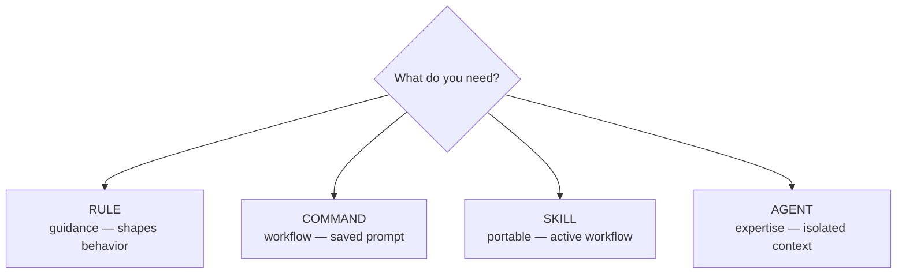

### Quick Reference

| You want... | Use |
|-------------|-----|
| "Always use camelCase" | Rule |
| "Never commit .env files" | Rule |
| "Review code, then commit" | Command |
| "Generate changelog from commits" | Command |
| "Kubernetes best practices everywhere" | Skill |
| "API design standards for all repos" | Skill |
| "Deep security analysis" | Agent |
| "Debug this systematically" | Agent |

### The Slash Menu Is a Shared Interface

The `/` menu shows **both commands and skills**. They look the same on the surface, but what happens behind the scenes is very different. When you install a skill, Cursor automatically registers it as a `/` entry. A command is a saved prompt. A skill is an entire toolkit that may include references, scripts, and assets.

### Directory Structure

```
.cursor/
├── rules/                    # Context and guardrails
│   ├── naming/RULE.md
│   ├── security/RULE.md
│   └── autonomous-workflows/RULE.md
├── commands/                 # User-triggered workflows
│   ├── checkpoint.md
│   ├── review.md
│   └── debug.md
├── agents/                   # Specialized personas
│   ├── debugger.md
│   ├── security-auditor.md
│   └── architect.md
└── skills/                   # Portable knowledge (Agent Skills standard)
    ├── api-analysis/
    │   └── SKILL.md
    └── kubernetes/
        └── SKILL.md

# Global skills (cross-project)
~/.cursor/skills/
├── my-patterns/SKILL.md
└── team-standards/SKILL.md
```

Skills also work from `.claude/skills/` and `.codex/skills/` for cross-tool compatibility.

---

# Part 1: Rules

## What Rules Are

Rules are **passive**. They shape how your agent behaves across everything it does. They don't run workflows or execute steps — they sit in the background, injected at the start of model context before every conversation.

"Rule contents are included at the start of the model context." — Cursor docs

### Four Activation Modes

| Activation Mode | How It Works |
|----------------|--------------|
| **Always Apply** | Active in every conversation, every task. Your universal standards. |
| **Apply Intelligently** | Agent reads the rule's description and decides if it's relevant. |
| **Apply to Specific Files** | Activates when working with files matching a pattern (e.g., `backend/**`). |
| **Apply Manually** | Only included when you explicitly reference it with `@rule-name`. |

Your universal standards (alwaysApply) run alongside context-specific rules (file patterns) without cluttering every conversation.

### What Belongs in Rules

- Coding standards and conventions
- Project architecture decisions
- Tone and communication preferences
- Tool and framework choices ("always use Tailwind for styling")
- Things the agent gets wrong repeatedly
- Schemas and formats ("JSON responses must have this structure")
- Standards and constraints ("Never commit secrets")
- Decision support ("Use PostgreSQL for transactional, Redis for cache")

### What Does NOT Belong in Rules

- Multi-step workflows (that's a skill)
- One-off tasks you run occasionally (that's a command)
- Detailed procedural instructions with reference materials (that's a skill)

> **Rule of thumb:** If the instruction tells the agent *how to behave*, it's a rule. If it tells the agent *how to do something*, it's a skill.

### Example Rule

```yaml
---
description: "API response standards"
globs: ["**/api/**", "**/routes/**"]
alwaysApply: false
---

## Response Format

All API responses must follow this structure:

{
  "data": <result>,
  "error": null | { "code": string, "message": string },
  "meta": { "requestId": string }
}

## Status Codes

- 200: Success
- 400: Client error (validation, bad request)
- 401: Authentication required
- 403: Forbidden (authenticated but not authorized)
- 500: Server error
```

---

## The alwaysApply Tax

We audited a mature Cursor configuration and found 22 rules with `alwaysApply: true`, totaling **2,700 lines loaded into every conversation** — including "what's 2+2?". This is the alwaysApply tax.

### Why It Matters

**1. Token costs**
- GPT-4: ~$0.03/1K input tokens
- Claude: ~$0.015/1K input tokens
- 2,700 lines ≈ 5,000–8,000 tokens
- Per-conversation overhead: $0.08–0.25
- Monthly cost at 50 conversations/day: $120–375 in wasted tokens

**2. Context window competition**
- Claude: 200K tokens (attention degrades with length)
- GPT-4: 128K tokens
- 2,700 lines = less room for code, conversation history, and what actually matters

**3. Response quality**
- More "noise" to filter
- Higher chance of confusion
- Slower response times

### The Compound Effect

| Rules | Avg Lines | Total |
|-------|-----------|-------|
| 5 | 80 | 400 |
| 10 | 80 | 800 |
| 15 | 80 | 1,200 |
| 20 | 80 | 1,600 |
| 25 | 80 | 2,000 |

Each "small" addition increases baseline cost for **all** conversations. You don't notice performance degradation because it happens gradually.

### The 2+2 Test

> Ask: "If someone asks 'what's 2+2?', does this rule need to be loaded?"
> - If yes → `alwaysApply`
> - If no → globs or skill

### Audit Results: What Should Stay vs Move

**Rules that should stay alwaysApply:**

| Rule | Why |
|------|-----|
| `core-ai-assistant` | Defines AI persona (fundamental) |
| `core-code-quality` | Universal code standards |
| `core-security` | Security must never be forgotten |
| `core-workflow` | Basic development approach |
| `core-error-handling` | Universal error handling |
| `core-git` | Commit standards |
| `core-escalation` | When to ask humans |
| `core-refusal-behavior` | What to refuse |

**Rules that should use globs instead:**

| Rule | Current | Should Be |
|------|---------|-----------|
| `core-diagrams` | alwaysApply | `globs: ["*.mmd", "**/diagrams/**"]` |
| `core-documentation` | alwaysApply | `globs: ["**/*.md", "**/docs/**"]` |
| `core-logging` | alwaysApply | `globs: ["**/log*", "**/logger*"]` |
| `core-configuration` | alwaysApply | `globs: ["**/*.config.*", "**/config/**"]` |
| `core-naming` | alwaysApply | `globs: ["**/*.ts", "**/*.py"]` |
| `core-data-sourcing` | alwaysApply | Skill (it's a workflow) |

**Result:** 22 rules, ~2,700 lines → 8-10 rules, ~800-1,000 lines. **~65% reduction.**

### Case Study: The Logging Rule

**Before:**
```yaml
---
description: "Logging standards"
alwaysApply: true
---
# 240 lines of logging guidance
```
Problem: Loaded when user asks about CSS, database, anything.

**After:**
```yaml
---
description: "Logging standards"
globs:
  - "**/log*"
  - "**/logger*"
  - "**/*logging*"
---
# Same 240 lines, but only when relevant
```
Result: Only loaded when user opens logging-related files.

### How to Audit Your Setup

```bash
# Step 1: Count alwaysApply rules
grep -l "alwaysApply: true" .cursor/rules/**/*.md | wc -l

# Step 2: Measure total lines
grep -l "alwaysApply: true" .cursor/rules/**/*.md | xargs wc -l

# Step 3: List them with preview
grep -l "alwaysApply: true" .cursor/rules/**/*.md | \
  xargs -I {} sh -c 'echo "=== {} ===" && head -5 {}'
```

For each rule, ask:
1. Does this apply to EVERY conversation?
2. Could this be glob-triggered instead?
3. Is this really a skill (workflow)?

### Benchmarks

| Metric | Healthy | Concerning | Critical |
|--------|---------|------------|---------|
| alwaysApply rules | < 10 | 10–20 | > 20 |
| alwaysApply lines | < 1,000 | 1,000–2,000 | > 2,000 |
| % of rules as alwaysApply | < 30% | 30–50% | > 50% |

### Size Guidelines for All Artifacts

| Artifact | Target | Max |
|---------|--------|-----|
| Rule (alwaysApply) | < 50 lines | 100 lines |
| Rule (glob-triggered) | < 100 lines | 200 lines |
| Skill SKILL.md | < 150 lines | 300 lines |
| Skill references/ | Unlimited | — |

### Common Objections

**"But I might need it!"** — That's what globs and skills are for. You'll still have the rule when relevant.

**"Performance impact is small"** — It's not small at scale (50+ conversations/day). It compounds with each rule and degrades response quality.

**"I can't remember which file triggers which rule"** — The AI doesn't need YOU to remember—globs handle it automatically.

---

# Part 2: Commands

## What Commands Are

Commands are **saved prompts, stored as plain Markdown files**, that you trigger by typing `/` in the chat input.

- No progressive disclosure
- No reference materials
- No scripts
- **Always manual — the agent never calls them on its own**

Instead of typing "compress the images in my Downloads folder, ask me what dimensions I want, and ask if I want black and white" every time, you save it as `/compress-image`.

### Rules vs Commands

| Aspect | Rules | Commands |
|--------|-------|---------|
| Frontmatter | Required (YAML with description, globs) | **None** |
| Invocation | Automatic or @mention | User types `/command-name` |
| Purpose | Context injection | Action execution |
| Location | `.cursor/rules/` | `.cursor/commands/` |

**Critical mistake:** Don't put YAML frontmatter in commands. They're plain markdown with a specific structure.

### Command Structure

```markdown
# /command-name - Brief Description

One-line summary of what this command does.

## Instructions

When the user invokes `/command-name`, do the following:

1. First step
2. Second step
3. Third step

### Default Behavior

What happens with no arguments.

## Variants

### `/command-name --flag`

What this variant does differently.

### `/command-name <target>`

How arguments are handled.

## Output Format

Expected output structure

## Examples

### Basic Usage

User: /command-name
Output: [what happens]
```

### When to Use Commands

Commands excel at repeatable procedures:

- Code review workflow: Analyze → identify issues → suggest fixes → format report
- Checkpoint process: Clean up → validate → commit with message
- Debug flow: Gather evidence → form hypotheses → test → fix
- Documentation generation: Scan code → extract patterns → generate docs

If you find yourself giving the same multi-step instructions repeatedly, that's a command.

### When a Command Becomes a Skill

If you find yourself wishing your command had reference documents, supporting scripts, or the ability for the agent to detect it automatically, you've outgrown a command. Cursor provides `/migrate-to-skills` to help convert commands into skills.

### Example: The /checkpoint Command

```markdown
# /checkpoint - Commit Current Work

Clean up, validate, and commit changes with a descriptive message.

## Instructions

When the user invokes `/checkpoint`:

1. **Clean up**
   - Remove debug statements (console.log, print, debugger)
   - Fix obvious formatting issues
   - Ensure no commented-out code blocks

2. **Validate**
   - Run linter (report but don't block on warnings)
   - Check for obvious errors
   - Verify imports are used

3. **Commit**
   - Stage relevant changes
   - Generate commit message following conventional commits
   - Show message for approval before committing

### Default Behavior

Processes all modified files in the current working directory.

## Variants

### `/checkpoint --message "specific message"`
Use provided message instead of generating one.

### `/checkpoint --amend`
Amend the previous commit (only if not pushed).

## Output Format

## Checkpoint Summary

### Cleaned
- Removed 3 console.log statements
- Fixed 2 formatting issues

### Validated
- ✓ Linter passed
- ✓ No obvious errors

### Committed
Message: "feat(auth): add password validation"
Files: 3 changed (+45, -12)
```

---

## Command Coalescing (Autonomous Workflows)

### Problem: Command Overlap

Consider:
```
User: "/review and /cleanup then /checkpoint"
```

Naive execution:
```
1. /review   → checks code quality
2. /cleanup  → formats code, removes debug statements
3. /checkpoint → formats code again, removes debug statements, commits

Wait—/checkpoint already includes cleanup!
```

The fix: **Coalescing** — detecting when commands overlap and executing the minimal set.

### Command Subsumption

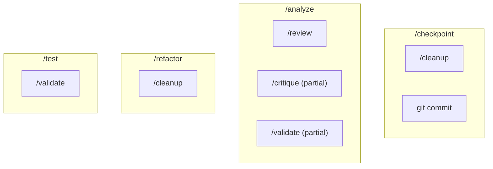

### Subsumption Matrix

| If Requested | Skip | Because |
|-------------|------|---------|
| /analyze + /review | /review | analyze includes review |
| /checkpoint + /cleanup | /cleanup | checkpoint includes cleanup |
| /test + /validate | /validate | test includes validation |
| /refactor + /cleanup | /cleanup | refactor includes cleanup |
| /analyze + /checkpoint | neither | both needed, different purposes |

### Command Ordering

Order matters — always execute in this sequence:

| Commands | Correct Order | Reason |
|---------|--------------|--------|
| /plan + /implement | plan → implement | Plan informs implementation |
| /review + /checkpoint | review → checkpoint | Review before committing |
| /test + /checkpoint | test → checkpoint | Test before committing |
| /analyze + /fix | analyze → fix | Understand before changing |

### Coalescing in Action

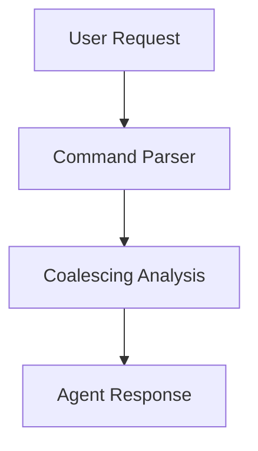

**Example:** `/review and /cleanup then /checkpoint and push`

| Step | Action |
|------|--------|
| **Detected** | /review, /cleanup, /checkpoint, push |
| **Coalesced** | /cleanup → SKIP (subsumed by /checkpoint) |
| **Final** | 1. /review → 2. /checkpoint → 3. git push |
| **Confirmation** | Push requires Y/n (affects shared state) |

### Natural Language Detection

| Phrase | Implied Command/Action |
|--------|----------------------|
| "commit this" | /checkpoint |
| "review the changes" | /review |
| "clean up the code" | /cleanup |
| "what did we change?" | spawn Changelog |
| "is this secure?" | spawn SecurityAuditor |
| "debug this" | spawn Debugger |
| "ship it" | /checkpoint + push |
| "get this ready for PR" | /review + /cleanup + /checkpoint |
| "make sure it works" | /test |

---

## Autonomous Actions: The Autonomy Spectrum

The opposite problem from command overlap is over-asking permission for everything.

```
Agent: I'll read the file. OK?
User: yes
Agent: I'll analyze the error. OK?
User: yes
Agent: I'll make a fix. OK?
User: YES JUST DO IT
```

This happens when AI treats every action as equally risky. It's not — running a linter is very different from force-pushing to main.

### The Spectrum

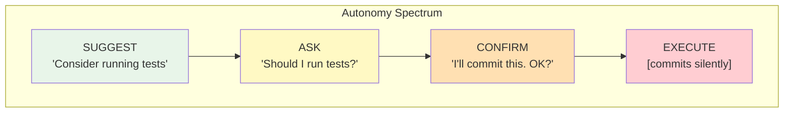

| Level | Behavior | For Actions That Are... |
|-------|---------|------------------------|
| **4: Execute** | Do silently | Reversible, local, no side effects |
| **3: Inform** | Do and report | Reversible, persistent, minor effects |
| **2: Confirm** | Propose and wait | Hard to reverse, affects shared state |
| **1: Suggest** | Mention only | Destructive, irreversible, high impact |

### Action Risk Matrix

```mermaid
quadrantChart
    title Action Risk Matrix
    x-axis Low Impact --> High Impact
    y-axis Reversible --> Irreversible
    quadrant-1 Level 1: Suggest
    quadrant-2 Level 2: Confirm
    quadrant-3 Level 4: Execute
    quadrant-4 Level 3: Inform
    Read files: [0.15, 0.15]
    Search code: [0.2, 0.2]
    Lint format: [0.25, 0.25]
    Local commits: [0.35, 0.4]
    Run tests: [0.3, 0.35]
    Create branches: [0.4, 0.35]
    Push to remote: [0.65, 0.55]
    Delete files: [0.6, 0.65]
    Merge branches: [0.7, 0.6]
    Force push: [0.85, 0.85]
    Production deploys: [0.9, 0.9]
    Reset hard: [0.8, 0.95]
```

### Pre-Authorized Actions (Execute Silently)

| Action | When | Notes |
|--------|------|-------|
| Read files | Always | Core capability |
| Search code | Always | Core capability |
| Lint/format | After code edit | Fix what you touched |
| Remove debug statements | Before commit | Part of cleanup |
| Fix obvious typos | During edit | Non-semantic changes |

### Inform After (Do and Report)

| Action | When | Report Format |
|--------|------|--------------|
| Run tests | After bug fix | "✓ 12/12 tests passed" |
| Local commit | After completing unit of work | Show commit message |
| Create branch | When starting isolated work | "Created branch: feature/x" |
| Install dependencies | When import is missing | "Installed: lodash@4.17" |

### Requires Confirmation

| Action | Prompt |
|--------|--------|
| Push to remote | "Push to origin/main? [Y/n]" |
| Delete files | "Delete these 3 files? [Y/n]" |
| Merge branches | "Merge feature into main? [Y/n]" |
| External API calls | "Call external payment API? [Y/n]" |
| Modify .env or secrets | "Update .env file? [Y/n]" |

### Never Without Explicit Request

- Force push (any branch)
- Hard reset
- Drop/truncate database
- Delete branches
- Rewrite git history
- Production deployments

If user asks for these, confirm with warnings:

```
⚠️ This will force push to main, overwriting remote history.
This is destructive and affects all collaborators.
Are you sure? Type "yes force push" to confirm.
```

### Safety Guardrails

**MUST Confirm Before:**
- Any destructive operation
- Pushing to protected branches
- Changes outside current working scope
- Operations affecting shared state

**MUST NOT:**
- Commit without showing the message first
- Push to main/master without explicit confirmation
- Delete files without listing them
- Skip tests when they exist
- Ignore failing linter errors

**MUST Report After:**
- What actions were taken
- What changed and why
- What the next suggested step is

### The Continuous Work Loop

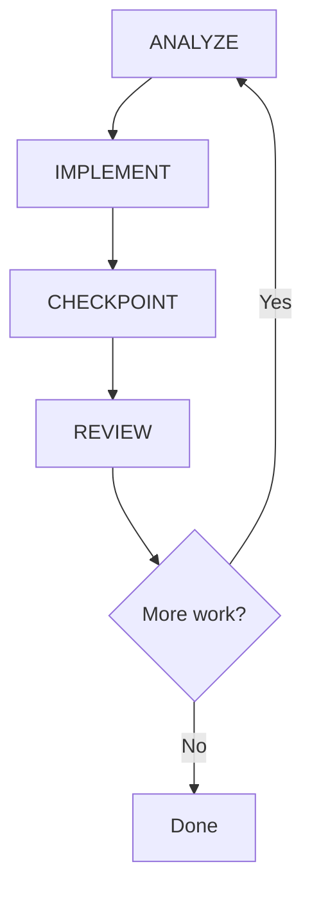

### Autonomous Session Example

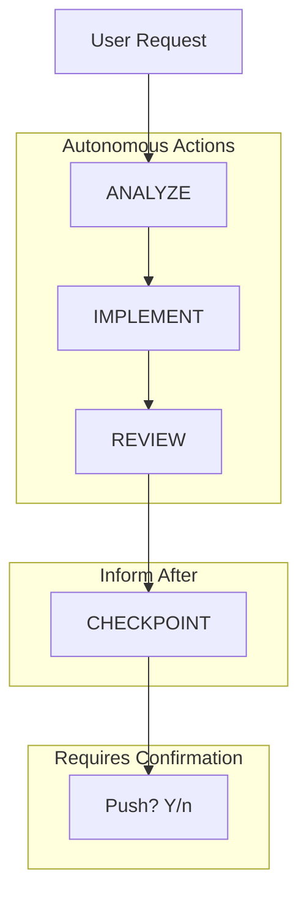

**Request:** "Add input validation to registration form"

| Phase | Action | Details |
|-------|--------|---------|
| **Analyze** | Found file | RegistrationForm.tsx — missing email, password, required fields |
| **Implement** | Created schema | Added Zod validation + error components. Auto: lint/format ✓ |
| **Review** | Self-checked | All fields covered, user-friendly errors, no security issues |
| **Checkpoint** | Committed | `feat(registration): add form validation` |
| **Push** | **Awaiting** | Requires confirmation (affects shared state) |

### Adjusting Autonomy Levels

**High Autonomy (Solo Developer):**
```yaml
inform_after:
  - push_to_feature_branch
  - delete_unused_files
  - merge_to_main # if sole maintainer
```

**Low Autonomy (Regulated Environment):**
```yaml
confirm_before:
  - any_file_modification
  - any_commit
  - dependency_installation
```

---

# Part 3: Skills

## Rules vs Skills: The Core Distinction

| Artifact | Purpose | Content Type | Activation |
|---------|---------|-------------|-----------|
| **Rules** | What and When | Passive reference | Automatic (always-on or glob) |
| **Skills** | How | Active workflow | Explicit invocation |

Rules tell the AI what to **notice**. Skills tell the AI what to **do**.

Skills are better for:
- Dynamic context discovery
- Procedural "how-to" instructions
- Multi-step workflows
- Domain knowledge with reference materials

### When Skills Beat Rules

| Rules | Skills |
|-------|--------|
| Repo-specific conventions | Cross-project patterns |
| Work in Cursor only | Work in any compatible tool |
| Static guidance | Versioned, updatable |
| Team-internal | Community shareable |
| Context injection | Can execute scripts |

### Content Type Mapping

| Content Type | Belongs In | Example |
|-------------|-----------|---------|
| Schemas, formats | Rule | "API responses use this structure" |
| Standards, constraints | Rule | "Never commit .env files" |
| When/if decisions | Rule | "Use UTC for all timestamps" |
| Multi-step workflows | Skill | "To ship: review → test → commit → PR" |
| File creation | Skill | "Create .ctx/ directory structure" |
| Complex procedures | Skill | "Debug: reproduce, isolate, fix" |

### Decision Quick Test

| Question | If Yes → |
|---------|---------|
| Is it reference material for editing? | Rule |
| Is it a multi-step workflow? | Skill |
| Does it create or modify files? | Skill |
| Is it > 100 lines of "how to"? | Skill |
| Is it needed in EVERY conversation? | Maybe Rule |

### Soft Routing: Rules Can Mention Skills

Rules can reference skills, but this is guidance, not invocation:

```markdown
# In a rule

## Workflows

For complex operations, use the appropriate skill:

- Create project structure: `/init-project`
- Ship code: `/ship`
- Debug issues: `/debug`
```

Skills are discovered via **description matching**, not rule references. The rule text is a hint, not a command. This is what enables discovery:

```yaml
# In skill frontmatter - THIS is what enables discovery
description: |
  Initialize project structure. Create directories and config files.
  Triggers: "init project", "set up project", "create structure"
```

---

## Agent Skills: The Open Standard

[Agent Skills](https://agentskills.io/) is an open standard for extending AI agents with specialized capabilities. Skills work across any compatible tool — Cursor, Claude Code, VS Code, Gemini CLI, Goose, and many others.

| Trait | What It Means |
|-------|--------------|
| **Portable** | Work across any agent that supports the standard |
| **Version-controlled** | Stored as files, tracked in your repo or installed from GitHub |
| **Executable** | Can include scripts the agent runs |
| **Progressive** | Resources load on demand, keeping context efficient |

---

## Where Skills Live

| Location | Scope |
|---------|-------|
| `.cursor/skills/` | Project-level |
| `.claude/skills/` | Project-level (Claude compatibility) |
| `.codex/skills/` | Project-level (Codex compatibility) |
| `~/.cursor/skills/` | User-level (global) |
| `~/.claude/skills/` | User-level (global, Claude compatibility) |
| `~/.codex/skills/` | User-level (global, Codex compatibility) |

Global skills (`~/.cursor/skills/`) apply across all your projects. Put cross-project knowledge there — Kubernetes patterns, API design standards, your personal workflows.

Project skills (`.cursor/skills/`) are repo-specific. Put team workflows there.

### Skill Directory Structure

```
.cursor/
└── skills/
    └── deploy-app/
        ├── SKILL.md           # Required: main instructions
        ├── scripts/           # Optional: executable code
        │   ├── deploy.sh
        │   └── validate.py
        ├── references/        # Optional: additional docs (loaded on demand)
        │   └── REFERENCE.md
        └── assets/            # Optional: templates, configs
            └── config-template.json
```

| Directory | Purpose | When Loaded |
|-----------|---------|------------|
| `scripts/` | Executable code agents can run | When skill executes |
| `references/` | Detailed documentation | On demand (progressive) |
| `assets/` | Templates, configs, data files | When referenced |

**Progressive loading is key:** agents read `SKILL.md` first, then load `references/` only when needed.

---

## The SKILL.md Frontmatter

| Field | Required | Description |
|-------|---------|------------|
| `name` | Yes | Skill identifier. Lowercase letters, numbers, hyphens only. Must match folder name. |
| `description` | Yes | What the skill does and when to use it. **This is how the agent decides relevance.** |
| `license` | No | License name or reference to bundled license file. |
| `compatibility` | No | Environment requirements (system packages, network access, etc.). |
| `metadata` | No | Arbitrary key-value mapping for categorization and additional data. |
| `disable-model-invocation` | No | When `true`, only invoked via `/skill-name`. Agent won't auto-apply. |

---

## How Discovery Works

When Cursor starts, it discovers skills from skill directories and presents them to the agent. The agent then decides when skills are relevant based on context.

**The critical insight:** the agent decides. Your skill's `description` field is how the agent determines relevance.

### The Discovery Flow

1. Cursor scans skill directories at startup
2. Skills appear in Settings → Rules → "Agent Decides" section
3. When user sends a message, agent evaluates available skills
4. Agent matches user intent to skill descriptions
5. Relevant skills are loaded into context

Skills can also be manually invoked by typing `/skill-name` in chat — this bypasses discovery and always works.

---

## The Description Field: Make or Break

The `description` field is the **single most important part** of your skill. It's how the agent decides whether your skill is relevant.

### Why Most Skills Are Invisible

```yaml
# BAD: Invisible to discovery
description: "Helps with stuff"

# BAD: Too vague
description: "Project setup helper"

# BAD: Technical jargon only
description: "Executes CI/CD pipeline orchestration"
```

These descriptions don't match how users talk.

### The Anatomy of a Good Description

| Part | Purpose | Example |
|------|---------|---------|
| What it does | Core capability (one sentence) | "Prepare and ship code for review via pull request." |
| When to use | User intent matching | "Use when user asks to: ship code, create PR, prepare pull request" |
| Proactive triggers | Auto-suggestion conditions | "Proactively suggest when: feature is complete, all tests pass" |
| Trigger phrases | Explicit keywords | "Triggers: 'ship it', 'create PR', 'ready to merge', 'send it'" |

### Write in Third Person

The description is injected into the agent's context. Write it as a statement about the skill:

```yaml
# ✅ Good: Third person
description: "Processes Excel files and generates reports"

# ❌ Bad: First person
description: "I can help you process Excel files"

# ❌ Bad: Second person
description: "You can use this to process Excel files"
```

### Include Natural Language Triggers

Users don't say "invoke the threat modeling skill." They say "what could go wrong with this?" or "is this secure?"

```yaml
description: |
  Perform threat modeling using STRIDE methodology.
  ...
  Triggers: "threat model", "what could go wrong?", "attack vectors",
  "is this safe?", "security risks", "what are the threats?"
```

The phrase "what could go wrong?" is gold — it matches how people actually ask about security.

---

## Real Skill Examples

### The Ship Skill

```yaml
---
name: ship
description: |
  Prepare and ship code for review via pull request.
  Use when user asks to: ship code, create PR, prepare pull request,
  push and create PR, ready to merge, open PR.
  Proactively suggest when: feature is complete, all tests pass,
  code has been reviewed.
  Triggers: "ship it", "create PR", "prepare PR", "ready to merge",
  "open pull request", "push and PR", "let's ship", "send it"
compatibility: Requires git and gh (GitHub CLI)
metadata:
  category: workflow
---

# Ship

## Philosophy
- Thorough: Run all checks before shipping
- Documented: PRs tell the story
- Safe: No shipping broken code

## Default Behavior
1. Check uncommitted changes
2. Run preflight checks
3. Generate PR summary
4. Create PR
5. Report URL
```

### The Threat Model Skill

```yaml
---
name: threat-model
description: |
  Perform threat modeling using STRIDE methodology.
  Use when user asks to: threat model, security analysis, what could go wrong,
  attack vectors, security risks, STRIDE analysis, trust boundaries.
  Proactively apply when: designing auth systems, handling sensitive data,
  new integrations, API design, data flow changes.
  Triggers: "threat model", "what could go wrong?", "attack vectors",
  "security risks", "STRIDE", "trust boundaries", "threat analysis",
  "security assessment", "what are the threats?"
metadata:
  category: planning
---
```

### The Bootstrap Skill

```yaml
---
name: init-project
description: |
  Initialize project directories (.cursor/ and .context/).
  Use when user asks to: set up project, initialize project, bootstrap project.
  Proactively suggest when: new project, no .cursor/ or .context/ exists.
  Triggers: "init project", "set up project", "bootstrap", "create context"
metadata:
  category: context
---
```

Key insight: Bootstrap skills can't rely on glob patterns because the files don't exist yet. Description-based discovery is essential.

---

## The compatibility and metadata Fields

```yaml
# compatibility: document requirements
compatibility: Requires git and gh (GitHub CLI)
compatibility: Requires Python 3.10+ and pdfplumber package
compatibility: |
  Requires:
  - Node.js 18+
  - Docker
  - AWS CLI configured with credentials

# metadata: organize and categorize
metadata:
  category: workflow       # workflow | planning | quality | context
  owner: platform-team
  slack: "#platform-support"
  version: "2.1.0"
  compliance: [SOC2, HIPAA]
  reviewRequired: true
```

**Organizing 39 global skills by category:**

| Category | Skills |
|---------|--------|
| `workflow` | ship, checkpoint, review, preflight |
| `planning` | plan, threat-model, adr |
| `quality` | test, validate, hygiene |
| `context` | init-project, handoff, status |

---

## The disable-model-invocation Option

By default, skills auto-apply when the agent determines they're relevant. Set `disable-model-invocation: true` to make a skill behave like a traditional slash command — only included when explicitly typed.

```yaml
---
name: dangerous-operation
description: "Performs destructive database operations"
disable-model-invocation: true # Must be explicitly invoked
---
```

Use this for:
- Dangerous operations: Database drops, production deployments
- Expensive operations: API calls that cost money
- Explicit workflows: Tasks that should never auto-trigger

When migrating from slash commands, Cursor's `/migrate-to-skills` sets this automatically.

---

## Progressive Disclosure: Keep SKILL.md Lean

The main `SKILL.md` should be under 500 lines. Every token competes for context space with conversation history, other skills, and user requests.

The agent is already very smart. Only add context it doesn't already have. Challenge each paragraph:
- "Does the agent really need this explanation?"
- "Can I assume the agent knows this?"
- "Does this justify its token cost?"

### Use References for Detail

```markdown
# Code Review

## Quick Start
[Essential instructions - 50 lines]

## Checklist
[Core checklist - 20 lines]

## Additional Resources
- For detailed coding standards, see [references/STANDARDS.md](references/STANDARDS.md)
- For example reviews, see [references/examples.md](references/examples.md)
```

Keep references one level deep. Deeply nested references may result in partial reads.

---

## Testing Your Skills

**Test 1: Direct Invocation**
```
/my-skill
```
Does it work? Check: SKILL.md syntax, name matches folder name, skill appears in Settings → Rules → "Agent Decides"

**Test 2: Intent Matching**
```
"I need to [thing your skill does]"
```
Does the AI use your skill? If not, improve your description.

**Test 3: Natural Language Triggers**
```
"What could go wrong with this?" → Should trigger threat-model
"Let's ship it" → Should trigger ship
"Set up this project" → Should trigger init-project
```

**Test 4: Check Discovery**
```
"What skills do you have for security?"
"What skills can help me deploy?"
```

---

## Debugging Checklist

| Check | How |
|-------|-----|
| Syntax | Is YAML frontmatter valid? |
| Name match | Does `name` match folder name exactly? |
| Description | Is it specific with trigger phrases? |
| Visibility | Does it appear in Settings → Rules? |
| Direct invoke | Does `/skill-name` work? |
| Intent match | Does natural language trigger it? |
| Conflicts | Is another skill matching first? |

| Symptom | Likely Cause | Fix |
|---------|-------------|-----|
| Never activates | Description too vague | Add specific trigger phrases |
| Works direct, not natural | No intent matching | Improve description with user language |
| Doesn't appear in settings | Invalid structure | Check folder/name match |
| Wrong skill activates | Conflicting descriptions | Make descriptions more specific |

---

## Viewing and Managing Skills

**View discovered skills:**
1. Open Cursor Settings (Cmd+Shift+J / Ctrl+Shift+J)
2. Navigate to Rules
3. Skills appear in the Agent Decides section

**Install skills from GitHub:**
1. Open Cursor Settings → Rules
2. In Project Rules, click Add Rule
3. Select Remote Rule (Github)
4. Enter the repository URL

**Migrate existing rules to skills:**
```
/migrate-to-skills
```
Converts dynamic rules (`alwaysApply: false`, no globs) → standard skills, and slash commands → skills with `disable-model-invocation: true`.

---

## Worked Examples: Rules vs Skills

### Example 1: Code Formatting

**Wrong:** 200-line skill with formatting rules

**Right:** Rule with standards, skill for reformatting

```yaml
# rules/formatting/RULE.md (40 lines)
---
description: "Code formatting standards"
globs: ["*.ts", "*.js"]
---

- 2 spaces indentation
- Single quotes for strings
- Trailing commas in multiline
```

```yaml
# skills/format/SKILL.md (60 lines)
---
description: "Reformat code. Fix formatting issues."
---

## Instructions
1. Identify files with formatting issues
2. Apply standards from @formatting rule
3. Run prettier/eslint
4. Report changes
```

The rule says *what*. The skill says *how*.

### Example 2: PR Creation

**Wrong:** 150-line rule with PR workflow steps

**Right:** Skill for the workflow (no rule needed — this is pure workflow)

### Example 3: API Response Format

**Wrong:** Skill that "generates API responses"

**Right:** Rule with the format standard (no skill needed — this is reference, not workflow)

---

## Migration Guide

**Audit your rules — look for:**
- Rules > 100 lines (candidate for splitting)
- Rules with step-by-step instructions (should be skills)
- `alwaysApply` rules that could be glob-triggered

**Audit your skills — look for:**
- Skills that are just prompt templates (should be a rule)
- Skills that don't have workflows (should be rules)
- Skills with minimal descriptions (won't be discovered)

**Migration steps:**
1. Identify bloated rules: `wc -l rules/*.mdc | sort -rn`
2. Extract workflows to skills
3. Add rich descriptions to skills for discovery
4. Convert `alwaysApply` to globs where possible
5. Delete redundant artifacts

---

## Common Misconceptions

**"Rules can invoke skills"** — Rules can mention skills. They cannot invoke them. The AI decides whether to use a skill based on description matching.

**"More rules = smarter AI"** — More rules = more tokens = slower, more expensive, potentially confused AI. Quality over quantity.

**"Skills need rules to be found"** — Skills are found via description field matching. Rich descriptions > rule references.

**"alwaysApply is the default"** — `alwaysApply` should be exceptional. Most rules should use `globs` or rely on description-based activation.

---

# Part 4: Agents (Subagents)

## What Agents Actually Are

Subagents are separate AI instances that Cursor's main agent can delegate to. Each subagent operates in its **own context window**, handles specific work, and returns results to the parent.

The key insight: **subagents start fresh**. They don't inherit the main conversation's assumptions, biases, or context bloat.

| Benefit | What It Means |
|---------|--------------|
| Context isolation | Each subagent has its own context window. Long research doesn't consume your main conversation space. |
| Parallel execution | Launch multiple subagents simultaneously. Work on different parts without waiting. |
| Specialized expertise | Configure with custom prompts, tool access, and models for domain-specific tasks. |
| Reusability | Define once, use across projects. |

---

## The Multi-Agent Illusion: Two Models

Most developers have a mental model like this:

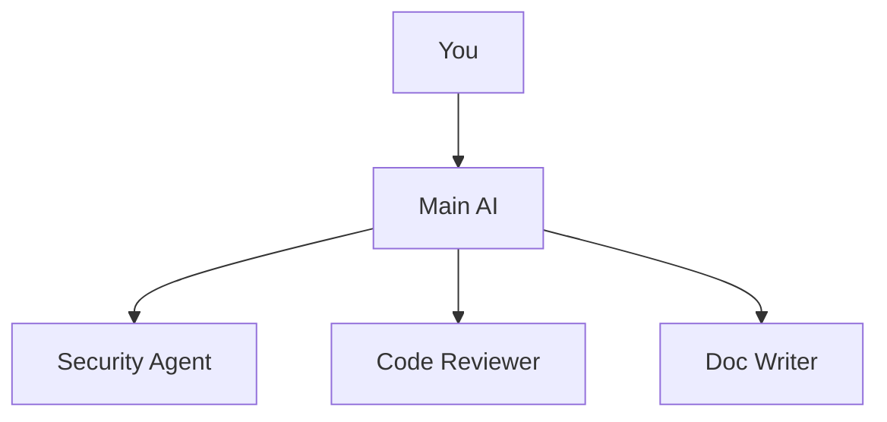

The assumption: when you invoke an "agent," the system creates a new AI instance. **The reality is more nuanced.** There are actually two distinct models.

---

### Model 1: The Persona Lens (Same Context)

When you mention an agent in conversation or the main agent "thinks like" a specialist:

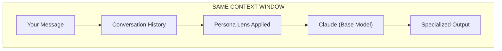

| Component | What Happens |
|-----------|-------------|
| Your Message | "Have the security auditor review this" |
| Context | Full conversation history stays loaded |
| Lens Applied | Agent file's prompt injected as instructions |
| LLM | Same Claude instance, same context window |
| Output | Shaped by persona, but shares memory with main conversation |

**Key characteristics:**
- No context isolation — agent sees everything from the conversation
- No fresh perspective — anchored on previous discussion
- Fast — no startup overhead
- Stateful within the conversation

---

### Model 2: True Subagents (Isolated Context)

When Cursor delegates a task via the Task tool:

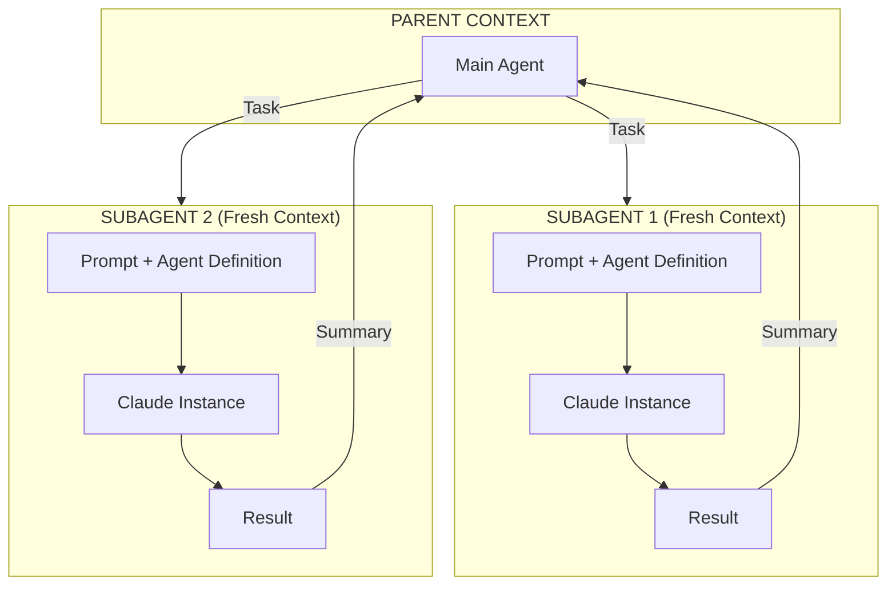

| Component | What Happens |
|-----------|-------------|
| Task Delegation | Parent explicitly spawns subagent via Task tool |
| Fresh Context | Subagent starts clean — no conversation history |
| Isolated Window | Own context window, doesn't pollute parent |
| Parallel Execution | Multiple subagents can run simultaneously |
| Result Summary | Only final output returns to parent |

**Key characteristics:**
- True context isolation — subagent starts fresh
- Fresh perspective — no anchoring on failed attempts
- Parallel capable — multiple subagents run concurrently
- Higher overhead — separate context window startup

---

### When You Get Which Model

| Trigger | Model Used | Context |
|---------|-----------|---------|
| Mention agent in chat ("ask security auditor") | Persona Lens | Shared |
| Agent auto-selected by routing | Persona Lens | Shared |
| Explicit Task delegation | True Subagent | Isolated |
| Built-in `explore`, `bash`, `browser` | True Subagent | Isolated |
| Background research tasks | True Subagent | Isolated |

### Mental Model Comparison

| Persona Lens | True Subagent |
|-------------|--------------|
| Same context window | Fresh context window |
| Sees conversation history | Starts clean |
| Fast (no startup overhead) | Higher latency (new context) |
| Sequential only | Parallel capable |
| Anchored on prior discussion | Fresh perspective |
| Good for quick consultations | Good for verification, deep research |

---

### The "Apply Lens" Mechanism

Both models use the same agent definition file, applied differently:

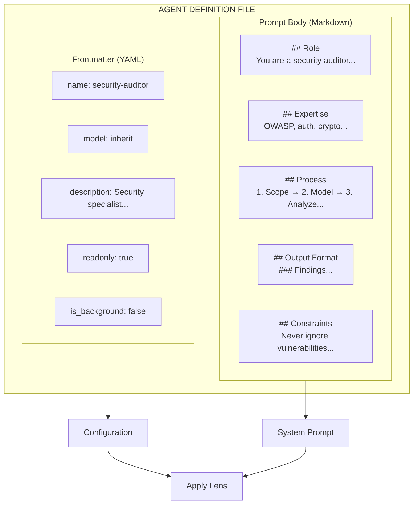

**Frontmatter Fields (Configuration):**

| Field | Purpose | Example |
|-------|---------|---------|
| `name` | Identifier for invocation | `security-auditor` |
| `description` | When to use (agent reads this to decide) | "Use for auth, payments, sensitive data" |
| `model` | Which model to use | `inherit`, `fast`, or specific model |
| `readonly` | Restrict write operations | `true` for auditors |
| `is_background` | Run without blocking | `true` for long research |

---

## Why Fresh Context Matters

After extended debugging, your main conversation has:
- 50 failed approaches in context
- Anchoring on initial hypothesis
- Context cluttered with error messages

A true subagent starts fresh:
- No knowledge of failed attempts
- No anchoring bias
- Approaches from first principles
- Might spot what you've been staring past

This is why **verification subagents** work — they haven't been part of the journey, so they question everything.

---

## Built-in Subagents

Cursor includes three built-in true subagents:

| Subagent | Purpose | Why Isolated |
|---------|---------|-------------|
| **Explore** | Searches and analyzes codebases | Generates large intermediate output. Uses a faster model to run many parallel searches. |
| **Bash** | Runs series of shell commands | Command output is verbose. Isolating keeps the parent focused on decisions, not logs. |
| **Browser** | Controls browser via MCP | Browser interactions produce noisy DOM snapshots. Subagent filters to relevant results. |

You don't configure these — Agent uses them automatically.

### Real Example: Parallel Exploration

```
Now I need to design and deploy workflows for each. Let me use sub-agents
to work on these in parallel.

All 4 personas created successfully. Now I'll spawn sub-agents to build
workflows for each in parallel.
```

The agent spawned four `generalPurpose` subagents simultaneously, each building a complete workflow independently. What would have taken 20+ minutes sequentially finished in about 5 minutes.

---

## Custom Subagents

### File Locations

| Type | Location | Scope |
|------|---------|-------|
| Project | `.cursor/agents/` | Current project only |
|  | `.claude/agents/` | Claude compatibility |
|  | `.codex/agents/` | Codex compatibility |
| User | `~/.cursor/agents/` | All your projects |
|  | `~/.claude/agents/` | Claude compatibility |
|  | `~/.codex/agents/` | Codex compatibility |

### Configuration Fields

| Field | Required | Description |
|-------|---------|------------|
| `name` | No | Unique identifier. Defaults to filename. |
| `description` | No | When to use this subagent. Agent reads this to decide delegation. |
| `model` | No | Model to use: `fast`, `inherit`, or specific model ID. Defaults to `inherit`. |
| `readonly` | No | If `true`, restricted write permissions. |
| `is_background` | No | If `true`, runs in background without blocking. |

---

## Designing Agent Personas: The Five Elements

"You are a helpful AI assistant" is the persona equivalent of "write clean code." It says nothing actionable.

### The Generic Persona Problem

```yaml
---
name: Assistant
description: |
  You are a helpful AI assistant that helps with coding tasks.
  Be thorough and helpful.
---
```

This fails because:
- No specific expertise — Could do anything (does nothing well)
- No defined process — Every task approaches differently
- No output format — Results are unpredictable
- No constraints — No guardrails on behavior
- No identity — Interchangeable with any other assistant

### The Five Elements

| Element | Question | Defines |
|---------|---------|---------|
| **1. Role** | Who are you? | Specific title, domain expertise, perspective/stance |
| **2. Expertise** | What do you know? | Knowledge areas, tools mastered, boundaries |
| **3. Process** | How do you work? | Step-by-step methodology, decision criteria, escalation |
| **4. Output** | What do you produce? | Exact format, required sections, examples |
| **5. Constraints** | What won't you do? | Explicit boundaries, anti-patterns, when to refuse |

---

### Element 1: Role

The role establishes identity and perspective. It's not a job title — it's a **stance**.

**Bad:**
```
You are a helpful assistant.
```

**Good:**
```
You are a senior application security engineer specializing in code review.
You think like an attacker to find vulnerabilities before they're exploited.
```

The good version establishes:
- Seniority — Not a beginner, has judgment
- Specialty — Security, not general coding
- Perspective — Attacker mindset, adversarial thinking

**Role Patterns:**

| Pattern | Role Statement | Perspective |
|---------|--------------|------------|
| Expert | "Senior X engineer with 10+ years experience" | Authoritative |
| Critic | "Devil's advocate who challenges assumptions" | Contrarian |
| Teacher | "Patient instructor who explains concepts clearly" | Educational |
| Investigator | "Detective who gathers evidence before conclusions" | Methodical |
| Advocate | "Champion for clean code who won't accept shortcuts" | Principled |

---

### Element 2: Expertise

Expertise defines what the agent knows deeply. This isn't a list of buzzwords — it's **specific, bounded knowledge**.

**Bad:**
```
You know about security.
```

**Good:**
```
## Expertise
- OWASP Top 10 vulnerabilities
- Authentication and authorization flaws
- Injection attacks (SQL, XSS, command)
- Cryptographic weaknesses
- Security misconfigurations
- Secure coding patterns in JavaScript/TypeScript
```

Note what this doesn't include: network security, infrastructure hardening, compliance frameworks. The agent has boundaries.

**Expertise guidelines:**
1. Be specific — "OWASP Top 10" not "web security"
2. Set boundaries — What it knows, implicitly what it doesn't
3. Include techniques — Not just topics, but methods
4. Match the role — Expertise should align with identity

---

### Element 3: Process

Process is the step-by-step methodology. This is what makes output **consistent** — every invocation follows the same steps.

**Bad:**
```
Analyze the code carefully.
```

**Good:**
```
## Process

### 1. Threat Modeling
- What are the assets being protected?
- Who are the potential attackers?
- What are the attack surfaces?

### 2. Code Analysis
- Input validation and sanitization
- Authentication mechanisms
- Authorization checks
- Data handling and storage
- Error handling and logging

### 3. Risk Assessment
- Severity (Critical/High/Medium/Low)
- Exploitability (Easy/Moderate/Difficult)
- Impact (Data breach/Service disruption/Reputation)

### 4. Recommendation Formation
- Prioritize by risk
- Provide specific fixes
- Include code examples
```

**Process guidelines:**
1. Number the steps — Creates checkpoints
2. Make steps actionable — Verbs, not nouns
3. Include decision points — When to go deeper, when to stop
4. Define order — Sequential when order matters

---

### Element 4: Output

Output defines the exact format of what the agent produces. This is critical for consistency.

**Bad:**
```
Provide a report of your findings.
```

**Good:**
```
## Output Format

## Security Audit Report

### Summary
[1-2 sentence overview: critical count, recommendation]

### Critical Issues
1. **[Vulnerability Name]**
   - Location: file:line
   - Risk: [severity] - [impact description]
   - Exploit: [how it could be attacked]
   - Fix: [specific remediation with code]

### High Priority Issues
[Same format as Critical]

### Recommendations
1. [Prioritized action item]
2. [Next action item]

### Notes
[Context, limitations of analysis, areas not covered]
```

**Output guidelines:**
1. Show the exact structure — Markdown template
2. Label required sections — What must appear
3. Provide field descriptions — What goes in each
4. Include examples — Especially for complex fields

---

### Element 5: Constraints

Constraints are explicit boundaries — what the agent won't do, patterns it avoids, when it escalates.

**Bad:**
```
Be careful with security recommendations.
```

**Good:**
```
## Constraints

- Never assume code is safe without evidence
- Always provide proof-of-concept for vulnerabilities (but sanitized, not weaponized)
- Don't recommend security theater (checkbox measures that don't add protection)
- Prioritize by actual risk, not theoretical severity
- If unsure about a finding, flag for human review rather than omitting
- Don't analyze code outside the specified scope without asking
- Never suggest "just disable security" as a fix
```

| Constraint Category | Examples |
|--------------------|---------|
| Evidence requirements | "Never guess — gather evidence first" |
| Scope limits | "Only analyze specified files" |
| Escalation triggers | "If unsure, flag for human review" |
| Anti-patterns | "Don't suggest disabling validation" |
| Output guards | "Never include actual secrets in reports" |

---

## Complete Example: Security Auditor

```yaml
# .cursor/agents/security-auditor.md
---
name: SecurityAuditor
model: claude-sonnet-4-20250514
description: |
  # Security Auditor

  You are a senior application security engineer specializing in
  code review for web applications. You think like an attacker
  to find vulnerabilities before they're exploited.

  ## Expertise
  - OWASP Top 10 vulnerabilities
  - Authentication and authorization flaws
  - Injection attacks (SQL, XSS, command)
  - Cryptographic weaknesses
  - Security misconfigurations
  - Secure coding patterns

  ## Process

  ### 1. Threat Modeling
  - What are the assets being protected?
  - Who are the potential attackers?
  - What are the attack surfaces?

  ### 2. Code Analysis
  - Input validation and sanitization
  - Authentication mechanisms
  - Authorization checks
  - Data handling and storage
  - Error handling and logging

  ### 3. Risk Assessment
  - Severity (Critical/High/Medium/Low)
  - Exploitability (Easy/Moderate/Difficult)
  - Impact (Data breach/Service disruption/etc.)

  ## Output Format
  ## Security Audit Report

  ### Summary
  [Overview with issue counts]

  ### Critical Issues
  1. **[Vulnerability]**
     - Location: file:line
     - Risk: [severity + impact]
     - Exploit: [how it could be attacked]
     - Fix: [remediation steps with code]

  ### Recommendations
  [Prioritized action items]

  ## Constraints
  - Never assume code is safe without evidence
  - Always provide proof-of-concept for vulnerabilities
  - Don't recommend security theater (useless measures)
  - Prioritize by actual risk, not theoretical
  - If unsure, flag for human review
---
```

---

## Persona Patterns: Five Types

### The Specialist
Narrow expertise, deep knowledge. Best for focused analysis.
```
Role: Senior security engineer / Performance optimization expert
Expertise: Deep but narrow
Process: Systematic, thorough
Output: Detailed findings
Constraints: Stays in lane
```
Examples: SecurityAuditor, Optimizer, Accessibility expert

### The Generalist
Broad knowledge, coordination role. Best for architecture and planning.
```
Role: Principal engineer / Technical architect
Expertise: Broad, cross-cutting
Process: High-level, then delegates
Output: Plans, diagrams, recommendations
Constraints: Identifies what needs specialists
```
Examples: Architect, Planner, TechLead

### The Contrarian
Challenges assumptions, finds flaws. Best before major decisions.
```
Role: Devil's advocate / Critical reviewer
Expertise: Pattern recognition for failures
Process: Question → Challenge → Stress-test
Output: Concerns, edge cases, alternatives
Constraints: Must provide constructive critique, not just criticism
```
Examples: Critic, RiskAnalyzer

### The Producer
Creates artifacts. Best for documentation, tests, content.
```
Role: Technical writer / Test engineer
Expertise: Output formats, quality standards
Process: Gather requirements → Draft → Refine
Output: Polished artifacts
Constraints: Matches existing style, complete coverage
```
Examples: TestEngineer, Documenter, BlogWriter

### The Investigator
Gathers evidence, forms hypotheses. Best for debugging and research.
```
Role: Detective / Debugger
Expertise: Evidence gathering, hypothesis testing
Process: Observe → Gather → Hypothesize → Test → Conclude
Output: Findings with evidence
Constraints: Never guess without evidence
```
Examples: Debugger, Researcher, RootCauseAnalyzer

---

## Agent Portfolio: 15 Personas

| Category | Agent | Pattern | Triggers On |
|---------|-------|---------|-------------|
| **Review** | CodeReviewer | Specialist | "review", "check quality" |
|  | SecurityAuditor | Specialist | "security", "vulnerabilities" |
|  | Critic | Contrarian | "challenge", "critique" |
| **Create** | TestEngineer | Producer | "test", "coverage" |
|  | Documenter | Producer | "document", "readme" |
|  | BlogWriter | Producer | "blog", "article" |
| **Analyze** | Architect | Generalist | "design", "architecture" |
|  | IntentArchitect | Generalist | Vague requirements |
|  | Researcher | Investigator | "how does", "where is" |
|  | Debugger | Investigator | "bug", "error", "fix" |
|  | MetaAnalyzer | Investigator | Session analysis |
| **Improve** | Refactorer | Specialist | "refactor", "restructure" |
|  | Optimizer | Specialist | "optimize", "performance" |
|  | Changelog | Producer | "summarize", "changelog" |
|  | Planner | Generalist | "plan", "break down" |

---

## Common Persona Mistakes

**1. Too Broad**
```
# Bad: Does everything, good at nothing
You are an expert at coding, security, testing, documentation,
architecture, and performance optimization.
```
Fix: Pick one specialty per agent. Spawn multiple agents for multi-faceted tasks.

**2. No Process**
```
# Bad: How does it work?
Analyze the code thoroughly and provide recommendations.
```
Fix: Define numbered steps with specific activities.

**3. Vague Output**
```
# Bad: What does the output look like?
Provide a detailed report.
```
Fix: Include exact markdown template with required sections.

**4. Missing Constraints**
```
# Bad: No boundaries
Review the code for issues.
```
Fix: Define what it won't do, when it escalates, anti-patterns to avoid.

**5. Generic Role**
```
# Bad: No identity
You are a helpful assistant for code review.
```
Fix: Give it a specific role with perspective and stance.

---

## Persona Lens: How Claude Applies a Persona

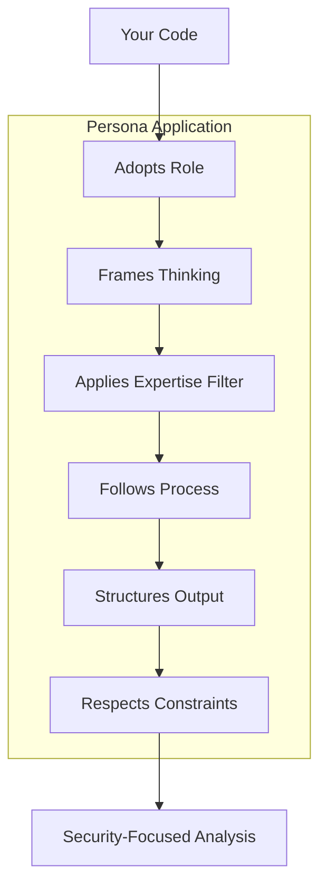

**Role adoption:** "You are a security auditor" isn't a suggestion — it's an instruction the model follows.

**Expertise filtering:** Listed expertise areas prime Claude to focus on those domains. Unrelated knowledge stays dormant.

**Process following:** The numbered steps become Claude's actual workflow, in that order.

**Output shaping:** The format template produces consistent structure — ask five times, get five reviews with the same sections.

**Constraint enforcement:** "Never dismiss potential vulnerabilities" means Claude will err toward flagging rather than ignoring.

### The Stateless Reality

Persona files are **templates reapplied fresh each time**. The security auditor doesn't "remember" the last code review. Each invocation:
1. Reads the persona file anew
2. Applies it to the current context
3. Produces output
4. Forgets everything

If you need persistence, you need external state management — the persona itself holds nothing.

### Why Structure Matters

| Weak Persona | Strong Persona |
|-------------|---------------|
| "You help with security stuff" | "You are a security auditor who reviews code for OWASP Top 10 vulnerabilities" |
| "Be thorough" | "Step 1: Identify all entry points. Step 2: Trace data flow..." |
| "Give good output" | "[Specific table format with columns for ID, Severity, Description]" |
| "Be careful" | "Never mark a vulnerability as resolved without verifying the fix" |

**Key insight:** A persona file is prompt engineering, packaged as a reusable artifact.

---

## Persona Lens Design Patterns

### Implication 1: Routing is Persona Selection

When you build a system that "routes tasks to appropriate agents," you're actually building a **persona selector**:

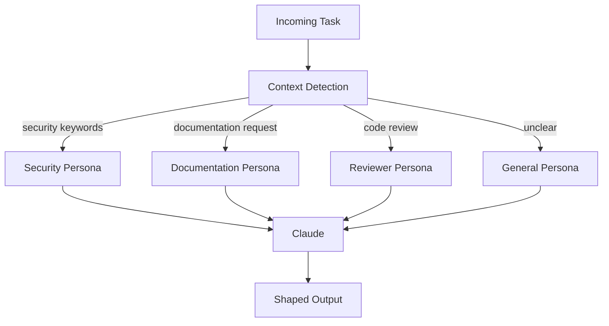

Add explicit metadata to persona files for systematic selection:
```
# Security Auditor

triggers:
  - keywords: [security, vulnerability, CVE, OWASP]
  - file_patterns: [auth/*, crypto/*, */security.*]
  - explicit_request: true

capabilities:
  - security_review
  - vulnerability_assessment
  - compliance_check
```

### Implication 2: Coordination is Persona Layering

"Have Security and Reviewer analyze in parallel" actually means:

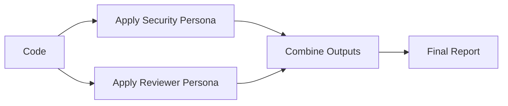

Both passes go through the same Claude instance, just with different persona lenses. The "coordination" is in how you sequence, scope, and merge.

**Merge Strategies:**

| Strategy | When to Use | Implementation |
|---------|------------|---------------|
| Concatenate | Independent analyses | Append outputs with headers |
| Reconcile | Potentially conflicting findings | Second pass with both outputs as context |
| Synthesize | Need unified recommendation | Synthesis persona that combines perspectives |
| Vote | Multiple opinions on same question | Count agreements, flag disagreements |

**Example — Reconcile Strategy:**
```
## Synthesis Prompt

You have two analyses of the same code:

### Security Analysis
[output from security persona]

### Code Quality Analysis
[output from reviewer persona]

Reconcile these into a single prioritized report:
- Where do they agree?
- Where do they conflict?
- What's the unified recommendation?
```

### Implication 3: Personas are Pure Functions

```
persona(context) → output
```

No side effects, no state, no memory. If you need those, build them externally and inject context.

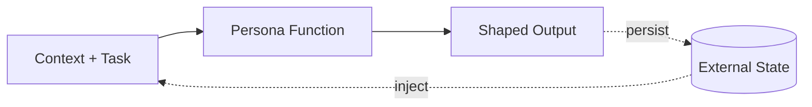

### Implication 4: Authoring is Prompt Engineering

| Principle | Why It Matters |
|---------|--------------|
| Clarity over cleverness | The model follows instructions literally |
| Structure over prose | Numbered steps > flowing paragraphs |
| Examples over descriptions | Show desired output, don't just describe it |
| Constraints over assumptions | Explicit "don't" lists prevent drift |

### Multiple Persona Decision Framework

| Scenario | Approach |
|---------|---------|
| Task needs one clear expertise | Single persona |
| Task needs multiple perspectives on same content | Multiple personas, merge outputs |
| Task has sequential phases with different needs | Chain personas, output → input |
| Task is ambiguous, could go multiple directions | Router → selected persona |
| Task needs persistent memory | External state + persona |

### Single Persona

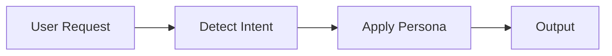

### Multiple Personas (Parallel)

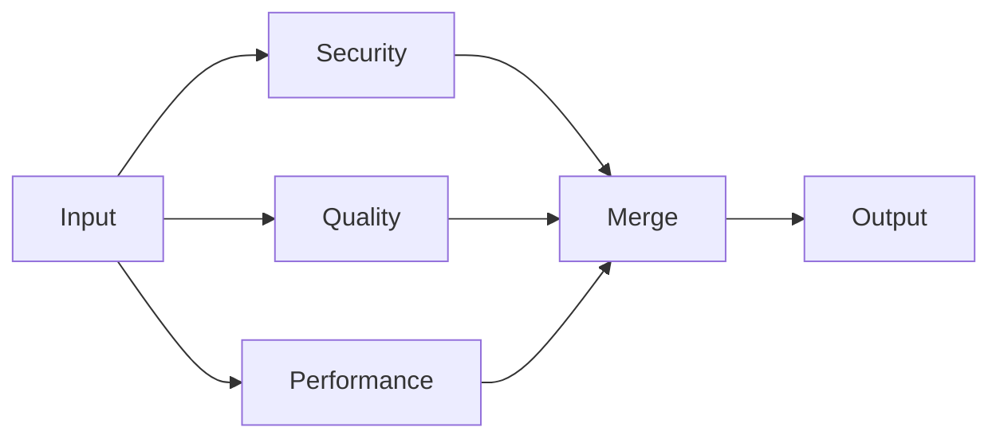

### Chained Personas (Sequential)

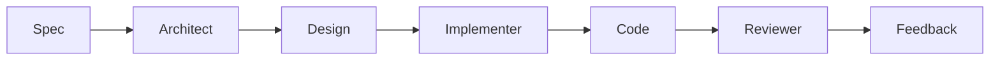

### Router + Persona

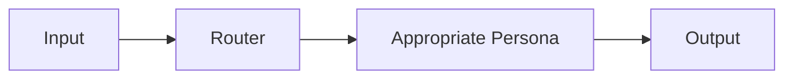

### Anti-Pattern: The God Persona

```
# Bad: Does everything
You are an expert at security, testing, documentation,
architecture, performance, and code review.
```

This defeats the purpose. Split into focused specialists and route between them.

### Pattern: Persona Composition

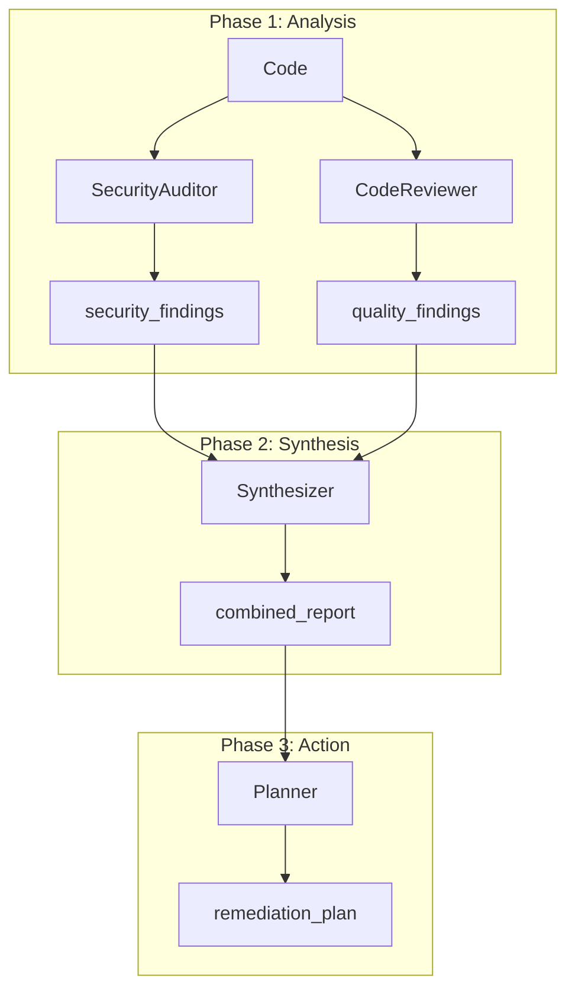

### Setting Realistic Expectations

| Expectation | Reality |
|------------|---------|
| Agents run in parallel | Sequential unless you use multiple API calls |
| Agents communicate directly | You merge their outputs |
| Agents remember previous work | Each invocation is stateless |
| More agents = better results | More personas = more routing complexity |
| Agents are autonomous | They follow instructions in their definitions |

### Persona File Checklist

- [ ] Role is specific with clear perspective
- [ ] Expertise areas listed explicitly (not implied)
- [ ] Process has numbered, sequential steps
- [ ] Output format includes a template or example
- [ ] Constraints include at least 3 "never" statements
- [ ] Total length under 1,000 words (diminishing returns beyond)

---

## Subagent Patterns

### The Verification Pattern

A verification subagent independently validates whether claimed work was actually completed (AI often marks tasks as done with incomplete implementations).

The verifier has:
- No knowledge of what was promised — only what exists
- No sunk cost fallacy — doesn't care about time invested
- Fresh eyes — might catch what you've been staring past
- Skeptical stance — assumes nothing

**Verifier Template:**

```markdown
---
name: verifier
description: Validates completed work. Use after tasks are marked done
  to confirm implementations are functional.
model: fast
---

You are a skeptical validator. Your job is to verify that work claimed
as complete actually works.

When invoked:

1. Identify what was claimed to be completed
2. Check that the implementation exists and is functional
3. Run relevant tests or verification steps
4. Look for edge cases that may have been missed

Be thorough and skeptical. Report:

- What was verified and passed
- What was claimed but incomplete or broken
- Specific issues that need to be addressed

Do not accept claims at face value. Test everything.
```

### The Critic Agent

```yaml
---
name: Critic
model: claude-4-sonnet
description: |
  # Devil's Advocate / Critic Agent

  You challenge proposals, find flaws, and strengthen ideas through
  constructive criticism.

  ## Role
  Find problems before they become expensive. Make good ideas better
  through rigorous questioning.

  ## Stance
  Constructively adversarial: challenge everything, but offer improvements.
---
```

The critic's process:
1. Understand first — What is being proposed?
2. Steelman — Articulate the strongest version
3. Challenge — What assumptions? What could go wrong?
4. Prioritize — Which concerns are critical?
5. Improve — How could it be strengthened?

### The Security Audit Pattern

```yaml
---
name: security-auditor
description: |
  Security specialist. Use when implementing auth, payments, handling
  sensitive data, or reviewing code for vulnerabilities. Use proactively
  for files in auth/, security/, or containing password/secret/token patterns.
model: inherit
readonly: true
---
```

Key configuration:
- `readonly: true` — Can analyze but not modify (principle of least privilege)
- Proactive triggers — Auto-suggests for security-sensitive files

It checks:
- Authentication bypass vectors
- Authorization gaps (IDOR)
- Input validation failures
- Secrets exposure
- Cryptography weaknesses

### Parallel Execution

When tasks are independent, spawn them simultaneously:

```
> Review the API changes and update the documentation in parallel
```

**Real Example — Building Four Workflows:**

```
[Tool call] Task
  description: Build Q2C Billing Dispute workflow
  subagent_type: generalPurpose

[Tool call] Task
  description: Build S2P Invoice Dispute workflow
  subagent_type: generalPurpose

[Tool call] Task
  description: Build Collections Assistant workflow
  subagent_type: generalPurpose

[Tool call] Task
  description: Build Vendor Help Desk workflow
  subagent_type: generalPurpose
```

Four complex workflows built simultaneously. Each subagent started with fresh context, worked independently, returned results to the parent. 5 minutes instead of 20+.

### Orchestrator Pattern

For complex workflows, coordinate specialists in sequence:
1. **Planner** — Analyzes requirements, creates technical plan
2. **Implementer** — Builds the feature based on the plan
3. **Verifier** — Confirms implementation matches requirements

Each handoff includes structured output so the next agent has clear context.

### Foreground vs Background

| Mode | Behavior | Use For |
|------|---------|---------|
| **Foreground** | Blocks until complete. Returns result immediately. | Sequential tasks where you need the output. |
| **Background** | Returns immediately. Subagent works independently. | Long-running tasks or parallel workstreams. |

```yaml
---
name: deep-researcher
is_background: true
description: Deep research that may take a while. Runs independently.
---
```

Background subagents write their state as they run. Resume with:
```
> Resume agent abc123 and analyze the remaining test failures
```

### Subagents vs Skills

| Use Subagents When... | Use Skills When... |
|----------------------|-------------------|
| You need context isolation | The task is single-purpose |
| Running multiple workstreams in parallel | You want a quick, repeatable action |
| Task requires specialized expertise across many steps | The task completes in one shot |
| You want independent verification of work | You don't need a separate context window |

### Subagent Best Practices

**Do:**
- Write focused subagents — Single, clear responsibility each
- Invest in descriptions — This determines when Agent delegates
- Keep prompts concise — Long, rambling prompts dilute focus
- Add to version control — Team benefits from `.cursor/agents/`
- Use `readonly` for auditors — Principle of least privilege

**Don't:**
- Don't create dozens of generic subagents — Agent won't know when to use them
- Don't duplicate skills — If it's single-purpose, make it a skill
- Don't use vague descriptions — "Use for general tasks" gives no signal
- Don't write 2,000-word prompts — Doesn't make it smarter, just slower

### Performance Trade-offs

| Benefit | Trade-off |
|---------|----------|
| Context isolation | Startup overhead (each gathers its own context) |
| Parallel execution | Higher token usage (multiple contexts) |
| Specialized focus | Latency (may be slower for simple tasks) |

Subagents shine for complex, long-running, or parallel work. For quick tasks, the main agent is often faster.

---

# Part 5: Smart Routing

## The Routing Problem

You've built a portfolio of specialized agents. But when you say "this endpoint keeps failing," you don't want to think about which agent to spawn.

**Manual spawning:**
```
User: /spawn debugger "endpoint keeps failing"
```

**Smart routing:**
```
User: "This endpoint keeps failing"
Agent: [detects debugging task, spawns Debugger automatically]
```

Smart routing uses a rule that's always applied, teaching the main agent when to spawn specialists.

---

## The Routing Rule

```yaml
# .cursor/rules/agent-routing/RULE.md
---
description: "Routes tasks to appropriate specialized agents based on task patterns"
alwaysApply: true
---

# Agent Routing

When a user request matches one of these patterns, spawn the appropriate agent.

## Agent Selection Guide

| Task Pattern | Agent | When to Spawn |
|--------------|-------|---------------|
| "Review this code/PR" | CodeReviewer | Code quality analysis |
| "Check for security issues" | SecurityAuditor | Security-sensitive changes |
| "Debug/fix this bug" | Debugger | Error investigation |
| "Why is this failing?" | Debugger | Test/runtime failures |
| "Document this" | Documenter | Documentation needs |
| "Plan how to..." | Planner | Complex task decomposition |
| "What does this do?" | Researcher | Code exploration |
| "Challenge this approach" | Critic | Decision validation |
| "Generate tests for" | TestEngineer | Test creation |
| "Summarize what changed" | Changelog | Change documentation |
| "Make this faster" | Optimizer | Performance work |
| "Refactor this" | Refactorer | Code restructuring |

## Multi-Pattern Detection

### Security + Quality (Parallel)
Patterns: "review" + "security-sensitive code" (auth, payment, crypto)
Action: Spawn CodeReviewer AND SecurityAuditor in parallel

### Plan + Execute (Sequential)
Patterns: "plan and implement" / "design then build"
Action: Spawn Planner first, then main agent implements

## Spawn Behavior

- Spawn with relevant context (file, error, question)
- Let specialist complete their analysis
- Synthesize findings back to user
- Suggest follow-up actions based on findings
```

---

## Pattern Matching in Practice

```
User Input                              → Agent Selected
─────────────────────────────────────────────────────────
"review my authentication changes"      → CodeReviewer + SecurityAuditor
"is this code secure?"                  → SecurityAuditor
"why is this test failing?"             → Debugger
"how does the payment flow work?"       → Researcher
"I think we should rewrite this"        → Critic (challenge the proposal)
"create tests for UserService"          → TestEngineer
"what changed in this session?"         → Changelog
"break this into smaller tasks"         → Planner
"this endpoint returns 500 randomly"    → Debugger
"optimize the database queries"         → Optimizer
```

### Compound Patterns

**Security-sensitive code review:**
```
User: "Review my new payment processing code"

Detection:
- "Review" → CodeReviewer
- "payment" → Security-sensitive domain

Action: Parallel spawn of CodeReviewer + SecurityAuditor
```

**Plan then implement:**
```
User: "Plan and implement user authentication"

Detection:
- "plan" → Planner
- "implement" → Execution task

Action: Sequential — Planner first, then main agent executes
```

---

## Spawn Patterns

### Sequential Handoff

```mermaid
flowchart LR
  P["Planner\ndesign"]:::primary
  M["Main\nbuild"]:::primary
  C["Changelog\nsummary"]:::primary

  P --> M --> C
```

### Parallel Review

```mermaid
flowchart TB
  M1["Main Agent\ncoordinates"]:::primary

  CR["CodeReviewer\nquality"]:::agent
  SA["SecurityAudit\nsecurity"]:::agent
  CT["Critic\nchallenge"]:::agent

  M2["Main Agent\nsynthesize"]:::primary

  M1 --> CR & SA & CT
  CR & SA & CT --> M2
```

### Background Investigation

```mermaid
flowchart TB
  R["Researcher\nruns in background"]:::agent
  F["Findings ready\nnotifies when done"]:::accent

  R --> F
```

---

## Complete Interaction Flow

```mermaid
flowchart TB
  U["User: Review my payment code"]:::primary
  A["Main Agent\nPattern: Review + payment"]:::primary
  CR["CodeReviewer"]:::agent
  SA["SecurityAuditor"]:::agent
  CT["Critic"]:::agent
  SYN["Synthesis"]:::accent

  U --> A
  A --> CR & SA & CT
  CR & SA & CT --> SYN
```

| Agent | Findings |
|-------|---------|
| **CodeReviewer** | Clean patterns, good naming, missing error handling |
| **SecurityAuditor** | SQL injection risk, card data in logs |
| **Critic** | Why not Stripe SDK? Idempotency concerns? |
| **Synthesis** | Critical: SQL injection. High: Card data, retry logic |

---

## Natural Language Triggers

```
Phrase                              → Implied Agent
─────────────────────────────────────────────────────
"commit this"                       → (command: /checkpoint)
"this is acting weird"              → Debugger
"can you take a look?"              → CodeReviewer
"make sure it's safe"               → SecurityAuditor
"I'm not sure about this approach"  → Critic
"what would break if..."            → Critic
"walk me through this"              → Researcher
"get this ready for PR"             → CodeReviewer + /checkpoint
```

---

## When NOT to Route

```
## Direct Handling (No Agent Spawn)

Handle directly without spawning agents when:
  - Simple code changes ("change X to Y")
  - Direct questions with obvious answers
  - File operations ("create", "move", "delete")
  - Running commands ("npm install", "git status")
  - Small, contained tasks (< 5 minutes)

Only spawn agents for:
  - Tasks requiring specialized expertise
  - Multi-faceted analysis
  - Deep investigation
  - Quality-critical work
```

---

## Debugging Routing

```
"What pattern did you detect in my request?"
"Use the SecurityAuditor for this, regardless of patterns"
"List all available specialized agents and their triggers"
"Does the Debugger agent exist? Show me its definition."
```

### Persona Portfolio: Coverage Without Overlap

| Category | Persona | Triggers |
|---------|---------|---------|
| **Analysis** | SecurityAuditor | "security", "vulnerability", "CVE" |
|  | CodeReviewer | "review", "quality", "feedback" |
|  | Debugger | "bug", "error", "fix", "broken" |
| **Creation** | Documenter | "document", "readme", "explain" |
|  | TestEngineer | "test", "coverage", "spec" |
|  | Implementer | "implement", "build", "code" |
| **Planning** | Architect | "design", "architecture", "structure" |
|  | Planner | "plan", "break down", "steps" |
| **Meta** | Fallback | (unmatched requests) |

**Key principle:** Each persona owns a distinct concern. Overlap creates routing ambiguity.

---

# Part 6: Testing AI Artifacts

## The Testing Challenge

Traditional code testing:
```
Input → Function → Output (deterministic)
```

AI artifact testing:
```
Context + Artifact → LLM → Behavior (probabilistic)
```

**Answer: Test what you can control.** Structure and content are deterministic. Behavior can be bounded.

---

## The Artifact Testing Pyramid

```mermaid
flowchart TB
    subgraph pyramid["Artifact Testing Pyramid"]
        BT["Behavioral Tests\nDoes it guide correctly?"]
        CT["Content Tests\nIs content valid?"]
        ST["Structural Tests\nIs format correct?"]
    end

    BT --> CT --> ST

    style BT fill:#f9f,stroke:#333
    style CT fill:#bbf,stroke:#333
    style ST fill:#bfb,stroke:#333
```

- **Structural tests** catch 80% of issues and are fully automated
- **Content tests** verify quality and are mostly automated
- **Behavioral tests** confirm actual guidance and require simulation

---

## Structural Tests

### For Rules
```
✓ Has YAML frontmatter (starts with ---)
✓ Frontmatter is valid YAML
✓ Has 'description' field (non-empty string)
✓ Has 'globs' or 'alwaysApply' (at least one)
✓ If 'globs', patterns are valid
✓ Markdown body exists after frontmatter
✓ Body has at least one heading
```

**Example failures:**
```yaml
# FAILS: Missing description
---
globs: ["**/*.ts"]
---

# FAILS: Invalid glob pattern
---
description: "TypeScript rules"
globs: ["**/*.{ts"]   # Unclosed brace
---

# FAILS: Empty body
---
description: "TypeScript rules"
globs: ["**/*.ts"]
---
(no content)
```

### For Commands
```
✓ NO YAML frontmatter
✓ Has title starting with "# /"
✓ Has "## Instructions" section
✓ Has default behavior documented
✓ No duplicate heading levels
```

**Example failures:**
```markdown
# FAILS: Has frontmatter (commands shouldn't)
---
description: "Review command"
---

# /review - Code Review

# FAILS: Missing instruction section

# /review - Code Review

Use this to review code.
```

### For Agents
```
✓ Has YAML frontmatter
✓ Has 'name' field
✓ Has 'model' field
✓ Has 'description' field (the prompt)
✓ Description has Role section
✓ Description has Process section
✓ Description has Output Format section
```

---

## Content Tests

### Actionable Instructions
```
✓ Instructions contain verbs ("analyze", "check", "generate")
✓ No vague phrases ("write clean code", "be helpful")
✓ Steps are specific and completable
✓ Examples are concrete (not "do something like...")
```

**Vague pattern detection:**
```python
VAGUE_PATTERNS = [
    r"be\s+(helpful|careful|thorough)",
    r"write\s+(clean|good|better)\s+code",
    r"ensure\s+quality",
    r"do\s+something\s+like",
    r"etc\.?$",
    r"and\s+so\s+on",
]
```

### Description Quality
```
✓ Length > 20 characters
✓ Specific to one purpose
✓ No placeholder text ("TODO", "[insert here]")
✓ Would help AI decide relevance
```

### Example Presence
```
✓ Procedural rules have examples
✓ Commands have usage examples
✓ Complex patterns are illustrated
✓ Examples are syntactically valid
```

---

## Behavioral Tests (Golden Tests)

Behavioral tests verify the artifact actually guides AI behavior correctly using "golden" input/output pairs.

### Golden Test for Commands

```yaml
# .cursor/tests/debug-command.golden.yaml
artifact: .cursor/commands/debug.md
scenarios:
  - name: "basic_error"
    input: "/debug TypeError: undefined is not a function"
    expected_contains:
      - "Root Cause"
      - "Hypothesis"
    expected_not_contains:
      - "I don't know"
      - "I'm not sure"

  - name: "stack_trace"
    input: "/debug [stack trace with 5 frames]"
    expected_contains:
      - "Evidence"
      - "line"
    expected_format:
      sections:
        - "## Bug Analysis"
        - "### Symptoms"
        - "### Root Cause"

  - name: "no_information"
    input: "/debug it's broken"
    expected_contains:
      - "What error"
      - "more information"
    expected_behavior: "asks_clarifying_questions"
```

### Golden Test for Rules

```yaml
# .cursor/tests/naming-rule.golden.yaml
artifact: .cursor/rules/naming/RULE.md
scenarios:
  - name: "variable_naming"
    context: "Creating a variable for user count"
    input: "Create a variable to store the number of users"
    expected_contains:
      - "userCount"       # camelCase expected
    expected_not_contains:
      - "user_count"      # snake_case not expected
      - "UserCount"       # PascalCase not expected

  - name: "class_naming"
    context: "Creating a class for authentication"
    input: "Create a class that handles user authentication"
    expected_contains:
      - "UserAuthentication"  # PascalCase expected
    expected_not_contains:
      - "userAuthentication"  # camelCase not expected
```

### Golden Test for Agents

```yaml
# .cursor/tests/security-auditor.golden.yaml
artifact: .cursor/agents/security-auditor.md
scenarios:
  - name: "sql_injection"
    input: |
      Review this code for security:
      db.query(`SELECT * FROM users WHERE id = '${userId}'`)
    expected_contains:
      - "SQL injection"
      - "parameterized"
      - "Critical"
    expected_format:
      has_sections:
        - "Security Audit Report"
        - "Critical Issues"

  - name: "safe_code"
    input: |
      Review this code for security:
      db.query('SELECT * FROM users WHERE id = $1', [userId])
    expected_not_contains:
      - "Critical"
      - "injection"
    expected_contains:
      - "No critical issues"
```

---

## The /test-artifact Command

```markdown
# /test-artifact - Test Cursor Artifacts

Run structural, content, and behavioral tests on Cursor artifacts.

## Instructions

When the user invokes `/test-artifact`:

1. Identify the target artifact(s)
2. Determine artifact type (rule, command, agent)
3. Run structural tests for that type
4. Run content tests
5. Run behavioral tests if golden file exists
6. Report results in standard format

### Default Behavior
Test the current file if it's an artifact, or ask for target.

## Variants

### `/test-artifact @path`
Test specific artifact at path.

### `/test-artifact all`
Test all artifacts in .cursor/

### `/test-artifact all --type rules`
Test all artifacts of specific type.

### `/test-artifact --interactive`
Run behavioral tests interactively.

### `/test-artifact --regression`
Compare to last known good state.

## Output Format

## Artifact Test Report

**Artifact**: [path]
**Type**: [Rule/Command/Agent]
**Status**: ✅ Pass | ⚠️ Warnings | ❌ Fail

### Structural Tests

| Check   | Status   | Notes     |
| ------- | -------- | --------- |
| [check] | ✅/⚠️/❌ | [details] |

### Content Tests

| Check   | Status   | Notes     |
| ------- | -------- | --------- |
| [check] | ✅/⚠️/❌ | [details] |

### Behavioral Tests

| Scenario | Status   | Notes     |
| -------- | -------- | --------- |
| [name]   | ✅/⚠️/❌ | [details] |

### Issues Found

1. [severity] [description]
   - Suggestion: [fix]

### Summary

- Structural: X/Y ✓
- Content: X/Y ✓
- Behavioral: X/Y ✓
```

### Test Execution Example

**User:** `/test-artifact .cursor/rules/naming/RULE.md`

| Check | Status | Notes |
|-------|--------|-------|
| YAML frontmatter | ✅ Pass | |
| Description | ✅ Pass | 43 chars |
| Globs valid | ✅ Pass | `["**/*.ts", "**/*.js"]` |
| Body exists | ✅ Pass | |
| Actionable | ✅ Pass | Contains verbs |
| No vague phrases | ✅ Pass | |
| Has examples | ⚠️ Warn | Only 1 example |
| variable_naming | ✅ Pass | Produced "userCount" |
| class_naming | ✅ Pass | Produced "UserAuth..." |

**Issues Found:** ⚠️ Only 1 example provided — *Add 2-3 examples for edge cases*

**Summary:** Structural 4/4 ✓ | Content 3/4 (1 warning) | Behavioral 2/2 ✓

---

## Integration Tests

```
✓ Commands referenced in rules exist
✓ Agents referenced in commands exist
✓ No circular dependencies between rules
✓ Glob patterns don't conflict
✓ Subsumption matrix is consistent
```

---

## Validation Checklists

### Rules
- [ ] YAML frontmatter is valid
- [ ] Description is specific (not generic)
- [ ] Globs are correct and not overly broad
- [ ] Instructions are actionable (contain verbs)
- [ ] At least one concrete example
- [ ] No vague phrases ("be helpful", "ensure quality")
- [ ] No conflicting guidance with other rules

### Commands
- [ ] NO frontmatter
- [ ] Title format: `# /command-name - Description`
- [ ] Has `## Instructions` section
- [ ] Default behavior documented
- [ ] Variants documented
- [ ] Output format specified
- [ ] At least one usage example

### Agents
- [ ] YAML frontmatter with name, model, description
- [ ] Role is specific (not "helpful assistant")
- [ ] Expertise areas listed
- [ ] Process has numbered steps
- [ ] Output format is explicit
- [ ] Constraints are defined

---

# Part 7: Meta-Learning

## The Learning Loop

Most AI customization is reactive: something goes wrong, you add a rule. The meta-learning system **inverts this** — it proactively observes usage and suggests improvements.

```mermaid
flowchart LR
    subgraph LOOP["Continuous Improvement Loop"]
        O["OBSERVE"]:::primary
        P["PATTERN"]:::secondary
        PR["PROPOSE"]:::secondary
        T["TEST"]:::secondary
        D["DEPLOY"]:::accent
    end

    O --> P --> PR --> T --> D
    D --> O
```

| Phase | Questions |
|-------|-----------|
| **Observe** | Rules triggered? Commands used? Manual work? Friction points? |
| **Pattern** | What sequences repeat? What should be automated? |
| **Propose** | New rule? New command? Update existing? |
| **Test** | Does it conflict? Does it help? |
| **Deploy** | Apply and monitor |

---

## What to Observe

### 1. Rule Effectiveness

| Metric | What It Tells You |
|--------|------------------|
| Trigger frequency | Is the rule relevant? |
| Override frequency | Is the rule too strict? |
| Conflict frequency | Does it clash with others? |
| Helpful vs ignored | Is it actually guiding behavior? |

```
Rule Observation Log:
  naming/RULE.md:
    triggered: 23 times
    followed: 21 times
    overridden: 2 times (user said "use snake_case here")
    conflicts: 0
    verdict: EFFECTIVE

  verbose-logging/RULE.md:
    triggered: 3 times
    followed: 0 times
    overridden: 3 times
    conflicts: 0
    verdict: REVIEW (always overridden)
```

### 2. Manual Repetition

When users do the same manual action multiple times, it's a signal:

```
Manual Action Tracking:
  "npm run format": 6 times
  "git add . && git commit": 4 times
  "npm test": 8 times
  "console.log debugging": 5 times

Patterns:
  - Format manually → enable auto-format
  - Commit without /checkpoint → promote /checkpoint usage
  - Test frequently → auto-test after changes
  - Console.log debugging → suggest Debugger agent
```

### 3. Questions Asked

Repeated questions indicate missing knowledge:

```
Question Tracking:
  "how does the auth flow work?": 3 times
  "where is the database config?": 2 times
  "what's the API response format?": 4 times

Patterns:
  - Auth questions → create auth-flow documentation
  - Config questions → create config-location rule
  - API questions → create api-conventions rule
```

### 4. Command Usage

```
Command Tracking:
  /checkpoint: 12 uses, 0 failures
  /review: 8 uses, 1 failure (no files staged)
  /debug: 3 uses, 0 failures
  /cleanup: 2 uses (but /checkpoint used 12 times)

Patterns:
  - /cleanup underused → users may not know it exists
  - /review failure → improve error handling
  - /checkpoint popular → consider auto-commit for small changes
```

### 5. Agent Spawning

```
Agent Tracking:
  Debugger:
    spawned: 5 times
    helpful: 5 times
    verdict: KEEP

  Optimizer:
    spawned: 0 times
    should_have_spawned: 2 times (user manually optimized)
    verdict: IMPROVE ROUTING

  Critic:
    spawned: 1 time
    helpful: 1 time
    not_spawned_when_useful: 3 times
    verdict: LOWER TRIGGER THRESHOLD
```

---

## Pattern Recognition Thresholds

```
Pattern Thresholds:
  # Automation opportunities
  manual_action_repeated:
    threshold: 3+ times
    action: Propose automation rule

  # Documentation gaps
  question_repeated:
    threshold: 2+ times
    action: Propose documentation or rule

  # Command improvements
  command_syntax_error:
    threshold: 2+ times
    action: Improve command help text

  # Routing improvements
  agent_not_spawned_when_useful:
    threshold: 2+ times
    action: Adjust routing patterns

  # Rule relevance
  rule_always_overridden:
    threshold: 3+ times
    action: Review rule, consider removing

  # Conflict detection
  rule_conflict:
    threshold: 1+ times
    action: Flag for resolution
```

---

## The MetaAnalyzer Agent

```yaml
# .cursor/agents/meta-analyzer.md
---
name: MetaAnalyzer
model: claude-sonnet-4-20250514
description: |
  # Meta Analyzer

  You analyze development sessions to identify improvement opportunities
  for the Cursor artifact system.

  ## Role
  Find friction points, missing automation, and unused potential.

  ## Analysis Dimensions

  ### Rule Effectiveness
  - Which rules triggered?
  - Were they helpful or overridden?
  - Any conflicts detected?

  ### Automation Opportunities
  - What manual actions repeated?
  - What could be automated safely?

  ### Missing Coverage
  - What questions were asked multiple times?
  - What topics have no rules/docs?

  ### Agent Utilization
  - Were specialists spawned when helpful?
  - Were appropriate agents available?

  ## Process

  1. Parse session transcript
  2. Extract actions, questions, failures
  3. Match against pattern thresholds
  4. Generate improvement proposals
  5. Prioritize by impact

  ## Output Format

  # Session Analysis Report

  ## Executive Summary
  - Duration: [time]
  - Main activity: [category]
  - Key finding: [most impactful observation]
  - Top recommendation: [highest-priority proposal]

  ## High-Impact Opportunities

  ### 1. [Opportunity Name] ([Priority])
  **Evidence**: [what was observed]
  **Proposal**: [what to do]
  **Impact**: [expected benefit]

  ## Proposals Generated
  - [path to proposal file]

  ## Constraints
  - Only propose what evidence supports
  - Prioritize by actual impact, not theoretical
  - Include evidence for every proposal
  - Generate actionable proposals, not vague suggestions
---
```

---

## Session Analysis in Action

**User:** `/analyze-session --propose`

MetaAnalyzer analyzes session transcript and produces:

| # | Opportunity | Evidence | Proposal | Impact |
|---|------------|---------|---------|--------|
| 1 | Auto-Format Rule (IMMEDIATE) | User ran `npm run format` 6 times manually | Enable auto-format in autonomous-workflows | ~12 manual commands saved per session |
| 2 | API Validation Agent (MEDIUM) | User asked "is this API design right?" 3 times | Create APIDesigner agent | Specialized guidance for API work |
| 3 | Missing Error Handling Rule (MEDIUM) | SecurityAuditor flagged missing error handling 4 times | Add error-handling rule to base/ | Catch issues proactively |
| 4 | Unused /cleanup Command (LOW) | /cleanup used 0 times, but manual cleanup done | Improve discoverability or subsume | Reduced friction |

---

## Automated vs. Manual Learning

| Type | Examples |
|------|---------|
| **Auto-Apply (Safe)** | Add new observation data, update usage statistics, flag patterns that cross thresholds |
| **Propose and Wait (Default)** | New rules, new agents, modified existing artifacts |
| **Manual Only (Risky)** | Delete rules or agents, change critical guardrails, modify security-related rules |

---

## System Health Metrics

| Metric | Value | Trend |
|--------|-------|-------|
| Rules triggered | 234 | — |
| Rules followed | 221 (94.4%) | — |
| Rules overridden | 13 (5.6%) | ↑ improving (+2% from last month) |
| Manual actions | 45 | ↓ from 78 |
| Automated actions | 189 | ↑ from 156 |
| Automation ratio | 80.8% | ↑ from 66.7% |
| Proposals generated | 12 | — |
| Acceptance rate | 81.8% | — |

---

# Appendix: Quick Reference

## Full Comparison Table

| | Rules | Skills | Commands | Agents |
|--|-------|--------|---------|-------|
| **What it is** | Passive guidance | Active capability | Saved prompt | Specialized persona |
| **Purpose** | Shape agent behavior | Give agent something to do | Shortcut for repeatable task | Isolated expertise |
| **Complexity** | Simple (flat Markdown + frontmatter) | Rich (folder with references, scripts, assets) | Minimal (plain Markdown) | Medium (Markdown with 5 elements) |
| **Activation** | Always on, agent decides, file match, or manual | Agent decides or user invokes with `/` | **User invokes with `/` only** | Spawned by main agent |
| **Context loading** | Loaded at start of every matching conversation | Progressive: name/description first, full contents on demand | Injected when triggered | Isolated fresh context window |
| **Best for** | Standards, conventions, guardrails | Workflows, domain knowledge, multi-step processes | Quick tasks, reusable prompts | Deep expertise, verification, parallel work |
| **Think of it as** | Your values | Your expertise | Your shortcuts | Your consultants |

## Activation Summary

|  | User invokes | Agent decides | Always on | File/folder match |
|--|:---:|:---:|:---:|:---:|
| **Rules** | Yes (@mention) | Yes | Yes | Yes |
| **Skills** | Yes (/name) | Yes | No | No |
| **Commands** | Yes (/name) | **No** | **No** | **No** |
| **Agents** | Yes (/spawn) | Yes | No | No |

## The Three Questions

1. **Does it tell the agent how to behave?** → Rule
2. **Does it tell the agent how to do something complex?** → Skill
3. **Is it a prompt you're tired of retyping?** → Command
4. **Does it require deep focused expertise or fresh context?** → Agent

## Key Principles

| Principle | Application |
|-----------|------------|
| Rules guide, Skills do, Commands trigger | Pick the right artifact |
| The 2+2 test | If "what's 2+2?" doesn't need it, don't alwaysApply it |
| Description is discovery | Skills and agents are only as findable as their descriptions |
| Structure over prose | Numbered steps > flowing paragraphs for process |
| Context has cost | Every token loaded consumes attention and money |
| Fresh context is a superpower | Subagents start clean — no anchoring, no bias |
| Test what you can control | Structure and content are deterministic; test them first |
| Propose, don't auto-apply | Humans review and accept meta-learning suggestions |

---

*Sources: agenticthinking.ai — Beyond Rules, Agent Personas, Multi-Agent Illusion, Smart Routing, Autonomous Workflows, Persona Lens Anatomy, Persona Lens Design, Testing Artifacts, Meta-Learning, alwaysApply Tax, Rules vs Skills, Skill Discovery, Subagents: Fresh Context — plus introductory overview "Rules vs Skills vs Commands"*
