# Cursor for Verification Engineers

> All examples are drawn from hardware verification workflows: SystemVerilog/UVM testbenches, specification reading, CSR verification, coverage closure, and simulation automation.

---

## The Mental Model (Verification Context)

> **Rules guide. Skills do. Commands trigger. Agents specialize.**

In verification terms:
- **Rules** → your team's coding standards, naming conventions, and methodology guidelines — always active in the background
- **Skills** → verification procedures you activate: "run CSR compliance check," "extract test plan from spec," "generate UVM sequence"
- **Commands** → repeatable simulation workflows you trigger with a slash: `/run-sim`, `/check-coverage`, `/tb-checkpoint`
- **Agents** → specialist personas: SpecReader, CsrChecker, CoverageAnalyzer, TbReviewer

---

## The Four Artifact Types

| Type | Purpose | Invocation | When to Use |
|------|---------|------------|-------------|
| **Rules** | Persistent context and guardrails | Automatic or @mention | UVM coding standards, naming conventions, methodology policies |
| **Commands** | User-triggered workflows | `/command` — manual only | Run simulation, check coverage, commit waveform snapshot |
| **Skills** | Portable knowledge modules | Agent decides OR `/skill-name` | CSR verification, spec parsing, coverage closure workflows |
| **Agents** | Specialized AI personas | Spawned by main agent | Deep spec analysis, scoreboard review, CSR compliance audit |

### Activation Matrix

Commands are the only artifact type that is **always manual** — the agent will never call them automatically.

|  | User invokes | Agent decides | Always on | File/folder match |
|--|:---:|:---:|:---:|:---:|
| **Rules** | Yes | Yes | Yes | Yes |
| **Skills** | Yes | Yes | No | No |
| **Commands** | Yes | **No** | **No** | **No** |

### The Problem: Everything in Rules

Most verification teams start with rules and put everything there:

- UVM naming conventions → Rule ✓
- Simulation run workflow → Rule (awkward)
- CSR compliance verification procedure → Rule (wrong tool)
- Reusable coverage closure knowledge → Rule (won't scale)

The fix: Use the right artifact for the job.

### Decision Flowchart

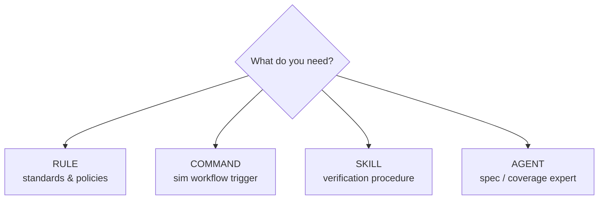

### Quick Reference

| You want... | Use |
|-------------|-----|
| "Always use `_e` suffix for enum types" | Rule |
| "Never drive interface signals from monitor" | Rule |
| "Run simulation with coverage, then check holes" | Command |
| "Generate test plan from this spec section" | Skill |
| "Verify all CSR registers against spec" | Skill |
| "Deep analysis of uncovered assertions" | Agent |
| "Review my scoreboard for functional correctness" | Agent |

### Directory Structure

```
.cursor/
├── rules/
│   ├── uvm-coding-standard/RULE.md
│   ├── csr-access-policy/RULE.md
│   ├── naming-convention/RULE.md
│   └── autonomous-workflows/RULE.md
├── commands/
│   ├── run-sim.md
│   ├── check-coverage.md
│   ├── tb-checkpoint.md
│   └── generate-csr-test.md
├── agents/
│   ├── spec-reader.md
│   ├── csr-checker.md
│   ├── coverage-analyzer.md
│   └── tb-reviewer.md
└── skills/
    ├── csr-verification/
    │   └── SKILL.md
    ├── coverage-closure/
    │   └── SKILL.md
    └── spec-extraction/
        └── SKILL.md

# Global skills (cross-project)
~/.cursor/skills/
├── uvm-patterns/SKILL.md
└── protocol-verification/SKILL.md
```

---

# Part 0: Elaborated Worked Examples

The examples below use one reference project — an **APB-attached SPI master (`apb_spi_master`)**. Software configures the block through **APB CSRs**; the DUT drives an **SPI bus** (`sclk`, `mosi`, `miso`, `cs_n`) to a loopback or SPI slave BFM. Every artifact type (rule, command, skill, agent) is shown against the same DUT.

```
  CPU / testbench                DUT                    SPI world
  ───────────────                ───                    ─────────
  APB writes CSRs  ──APB──►  apb_spi_master  ──SPI──►  spi_slave_bfm
  (CTRL, TX_DATA)              (shift engine)          (or MOSI-MISO loopback)
```

### Reference Project Layout

```
apb_spi_verif/
├── rtl/                              # DUT — read-only for verification
│   └── apb_spi_master.sv
├── spec/
│   └── APB_SPI_Master_Spec_v2.0.pdf
├── tb/
│   ├── interfaces/
│   │   ├── apb_if.sv                 # CSR programming port
│   │   └── spi_if.sv                 # DUT SPI pins
│   ├── agents/
│   │   ├── apb/                      # Programs registers
│   │   │   ├── apb_agent.sv
│   │   │   ├── apb_driver.sv
│   │   │   └── apb_monitor.sv
│   │   └── spi/                      # Monitors / drives SPI bus (BFM)
│   │       ├── spi_agent.sv
│   │       ├── spi_driver.sv
│   │       └── spi_monitor.sv
│   ├── reg_model/
│   │   └── apb_spi_reg_block.sv
│   ├── env/
│   │   └── apb_spi_env.sv
│   ├── sequences/
│   │   ├── apb_base_seq.sv
│   │   ├── apb_slverr_inj_seq.sv
│   │   ├── spi_mode0_8b_seq.sv
│   │   ├── spi_cpol_cpha_sweep_seq.sv
│   │   └── csr_reset_check_seq.sv
│   ├── tests/
│   │   ├── apb_spi_base_test.sv
│   │   ├── csr_reset_test.sv
│   │   ├── csr_rw_test.sv
│   │   └── spi_loopback_test.sv
│   ├── coverage/
│   │   ├── apb_trans_cg.sv
│   │   └── spi_xfer_cg.sv
│   ├── scoreboard/
│   │   └── spi_scoreboard.sv
│   └── top/
│       └── tb_top.sv
├── tests/
│   └── regression.list
└── .cursor/
    ├── rules/ ...
    ├── commands/ ...
    ├── agents/ ...
    └── skills/ ...
```

---

## 0.1 Reading the Specification (SpecReader)

### Spec Excerpt — APB Register Map (§4.2)

| Offset | Register   | Field        | Bits   | Access | Reset | Description |
|--------|------------|--------------|--------|--------|-------|-------------|
| 0x00   | CTRL_REG   | enable       | [0]    | RW     | 0x0   | SPI block enable. 1 = operational |
| 0x00   | CTRL_REG   | cpol         | [1]    | RW     | 0x0   | Clock polarity (SPI mode bit) |
| 0x00   | CTRL_REG   | cpha         | [2]    | RW     | 0x0   | Clock phase (SPI mode bit) → Mode 0 default |
| 0x00   | CTRL_REG   | master_en    | [3]    | RW     | 0x1   | 1 = master mode (reset enabled per spec) |
| 0x00   | CTRL_REG   | clk_div      | [11:4] | RW     | 0x4   | SCLK divider from pclk (default ÷8) |
| 0x00   | CTRL_REG   | reserved     | [31:12]| RSVD   | 0x0   | Read 0, write 0 |
| 0x04   | STATUS_REG | busy         | [0]    | RO     | 0x0   | 1 while shift engine active |
| 0x04   | STATUS_REG | tx_empty     | [1]    | RO     | 0x1   | TX FIFO empty (reset empty) |
| 0x04   | STATUS_REG | rx_valid     | [2]    | RO     | 0x0   | RX FIFO has unread byte |
| 0x04   | STATUS_REG | mode_fault   | [3]    | RO     | 0x0   | Multi-master / CS conflict detected |
| 0x08   | TX_DATA    | tx_byte      | [7:0]  | WO     | —     | Write pushes byte to TX FIFO |
| 0x0C   | RX_DATA    | rx_byte      | [7:0]  | RO     | —     | Read pops byte from RX FIFO |
| 0x10   | XFER_LEN   | byte_count   | [7:0]  | RW     | 0x0   | Bytes per transaction (1–64) |
| 0x14   | CS_CTRL    | cs_n         | [0]    | RW     | 0x1   | Chip select (active low), default deasserted |
| 0x18   | INT_EN     | done_ie      | [0]    | RW     | 0x0   | Interrupt when transfer completes |
| 0x18   | INT_EN     | rx_ie        | [1]    | RW     | 0x0   | Interrupt when RX FIFO non-empty |
| 0x1C   | INT_STAT   | done         | [0]    | W1C    | 0x0   | Sticky transfer-done flag |
| 0x1C   | INT_STAT   | rx_avail     | [1]    | W1C    | 0x0   | Sticky RX-available flag |

### Spec Excerpt — SPI Protocol (§5.x)

| Req ID | Spec Ref | Requirement (verbatim) | Test Scenario | Priority |
|--------|----------|------------------------|---------------|----------|
| REQ-APB01 | §3.1 | "The CSR interface shall comply with APB4." | `apb_protocol_sanity_test` | HIGH |
| REQ-APB02 | §3.4 | "Back-to-back APB writes without idle shall be supported when PREADY is high." | `apb_back2back_wr_seq` | HIGH |
| REQ-APB03 | §3.6 | "PSLVERR shall be asserted for unmapped CSR addresses." | `apb_slverr_inj_seq` | HIGH |
| REQ-CSR01 | §4.2 | "CTRL_REG.enable shall be 0 after reset." | `csr_reset_test` | HIGH |
| REQ-CSR02 | §4.2 | "STATUS_REG.busy shall be RO." | `csr_rw_test` | HIGH |
| REQ-CSR03 | §4.2 | "INT_STAT.done shall clear on write-1-to-clear." | `csr_w1c_test` | HIGH |
| REQ-SPI01 | §5.1 | "Data shall be transmitted MSB first on MOSI." | `spi_msb_first_check` | HIGH |
| REQ-SPI02 | §5.2 | "CS_n shall be asserted before the first SCLK edge and deasserted after the last." | `spi_cs_timing_test` | HIGH |
| REQ-SPI03 | §5.3 | "All four SPI modes (CPOL/CPHA combinations) shall be supported." | `spi_cpol_cpha_sweep_seq` | HIGH |
| REQ-SPI04 | §5.4 | "When XFER_LEN.byte_count is 0, the block shall not start a transfer and shall set STATUS.mode_fault." | `spi_zero_len_test` | HIGH |
| REQ-SPI05 | §5.5 | "In loopback, received bit on MISO shall match transmitted bit on MOSI for each SCLK cycle." | `spi_loopback_test` | HIGH |

### Open Questions Flagged by SpecReader

1. **§4.2 CTRL_REG.master_en reset = 1** — Master enabled at reset; confirm whether SPI pins tri-state until `enable` is set.
2. **§5.3 Mode 3 at clk_div = 1** — Minimum divider for timing closure not stated; need max SCLK from spec Table 5.1.
3. **§5.4 byte_count = 0** — Should `mode_fault` latch until W1C, or auto-clear when `byte_count` reprogrammed?

---

## 0.2 Complete CSR Register Model

Full `uvm_reg` block for the APB SPI master CSR map:

```systemverilog
// tb/reg_model/apb_spi_reg_block.sv
class spi_ctrl_reg extends uvm_reg;
  rand uvm_reg_field enable;
  rand uvm_reg_field cpol;
  rand uvm_reg_field cpha;
  rand uvm_reg_field master_en;
  rand uvm_reg_field clk_div;
  rand uvm_reg_field reserved;

  `uvm_object_utils(spi_ctrl_reg)

  virtual function void build();
    enable    = uvm_reg_field::type_id::create("enable");
    cpol      = uvm_reg_field::type_id::create("cpol");
    cpha      = uvm_reg_field::type_id::create("cpha");
    master_en = uvm_reg_field::type_id::create("master_en");
    clk_div   = uvm_reg_field::type_id::create("clk_div");
    reserved  = uvm_reg_field::type_id::create("reserved");

    // Spec §4.2 — CTRL_REG
    enable.configure(   this, 1,  0, "RW", 0, 1'b0,   1, 0, 0);
    cpol.configure(     this, 1,  1, "RW", 0, 1'b0,   1, 0, 0);
    cpha.configure(     this, 1,  2, "RW", 0, 1'b0,   1, 0, 0);
    master_en.configure(this, 1,  3, "RW", 0, 1'b1,   1, 0, 0);
    clk_div.configure(  this, 8,  4, "RW", 0, 8'h04,  1, 0, 0);
    reserved.configure( this, 20, 12,"RO", 0, 20'h0,  1, 0, 0);
  endfunction
endclass

class spi_status_reg extends uvm_reg;
  rand uvm_reg_field busy;
  rand uvm_reg_field tx_empty;
  rand uvm_reg_field rx_valid;
  rand uvm_reg_field mode_fault;

  `uvm_object_utils(spi_status_reg)

  virtual function void build();
    busy       = uvm_reg_field::type_id::create("busy");
    tx_empty   = uvm_reg_field::type_id::create("tx_empty");
    rx_valid   = uvm_reg_field::type_id::create("rx_valid");
    mode_fault = uvm_reg_field::type_id::create("mode_fault");

    busy.configure(      this, 1, 0, "RO", 0, 1'b0, 1, 0, 0);
    tx_empty.configure(  this, 1, 1, "RO", 0, 1'b1, 1, 0, 0);  // empty at reset
    rx_valid.configure(  this, 1, 2, "RO", 0, 1'b0, 1, 0, 0);
    mode_fault.configure(this, 1, 3, "RO", 0, 1'b0, 1, 0, 0);
  endfunction
endclass

class spi_int_stat_reg extends uvm_reg;
  rand uvm_reg_field done;
  rand uvm_reg_field rx_avail;

  `uvm_object_utils(spi_int_stat_reg)

  virtual function void build();
    done     = uvm_reg_field::type_id::create("done");
    rx_avail = uvm_reg_field::type_id::create("rx_avail");
    done.configure(    this, 1, 0, "W1C", 0, 1'b0, 1, 0, 0);
    rx_avail.configure(this, 1, 1, "W1C", 0, 1'b0, 1, 0, 0);
  endfunction
endclass

class apb_spi_reg_block extends uvm_reg_block;
  rand spi_ctrl_reg      CTRL;
  rand spi_status_reg    STATUS;
  rand uvm_reg           TX_DATA;   // WO — simplified as RW in model
  rand uvm_reg           RX_DATA;   // RO
  rand uvm_reg           XFER_LEN;
  rand uvm_reg           CS_CTRL;
  rand uvm_reg           INT_EN;
  rand spi_int_stat_reg  INT_STAT;

  `uvm_object_utils(apb_spi_reg_block)

  virtual function void build();
    default_map = create_map("csr_map", 0, 4, UVM_LITTLE_ENDIAN);

    CTRL     = spi_ctrl_reg::type_id::create("CTRL");
    STATUS   = spi_status_reg::type_id::create("STATUS");
    INT_STAT = spi_int_stat_reg::type_id::create("INT_STAT");
    // TX_DATA, RX_DATA, XFER_LEN, CS_CTRL, INT_EN — same pattern

    CTRL.configure(this);
    STATUS.configure(this);
    INT_STAT.configure(this);
    CTRL.build();
    STATUS.build();
    INT_STAT.build();

    default_map.add_reg(CTRL,     'h00, "RW");
    default_map.add_reg(STATUS,   'h04, "RO");
    default_map.add_reg(TX_DATA,  'h08, "RW");
    default_map.add_reg(RX_DATA,  'h0C, "RO");
    default_map.add_reg(XFER_LEN, 'h10, "RW");
    default_map.add_reg(CS_CTRL,  'h14, "RW");
    default_map.add_reg(INT_EN,   'h18, "RW");
    default_map.add_reg(INT_STAT, 'h1C, "RW");
    lock_model();
  endfunction
endclass
```

### Common Model Bugs (for CsrChecker practice)

```systemverilog
// BUG 1: enable reset is 1 in model but spec says 0
enable.configure(this, 1, 0, "RW", 0, 1'b1, 1, 0, 0);  // WRONG

// BUG 2: busy marked RW instead of RO
busy.configure(this, 1, 0, "RW", 0, 1'b0, 1, 0, 0);     // WRONG

// BUG 3: cpha reset wrong — spec Mode 0 default (CPOL=0, CPHA=0) but model has cpha=1
cpha.configure(this, 1, 2, "RW", 0, 1'b1, 1, 0, 0);     // WRONG — breaks REQ-SPI03 default
```

CsrChecker should flag all three with spec table row citations.

---

## 0.3 Complete Testbench Initialization

### APB Interface — CSR Port (`tb/interfaces/apb_if.sv`)

```systemverilog
interface apb_if (input logic pclk, input logic preset_n);
  logic        PSEL, PENABLE, PWRITE, PREADY, PSLVERR;
  logic [31:0] PADDR, PWDATA, PRDATA;

  clocking drv_cb @(posedge pclk);
    default input #1step output #1ns;
    output PSEL, PENABLE, PWRITE, PADDR, PWDATA;
    input  PREADY, PRDATA, PSLVERR;
  endclocking

  clocking mon_cb @(posedge pclk);
    default input #1step;
    input PSEL, PENABLE, PWRITE, PADDR, PWDATA, PREADY, PRDATA, PSLVERR;
  endclocking

  modport drv_mp (clocking drv_cb, input pclk, preset_n);
  modport mon_mp (clocking mon_cb, input pclk, preset_n);
endinterface
```

### SPI Interface — DUT Pins (`tb/interfaces/spi_if.sv`)

```systemverilog
interface spi_if (input logic sclk_ref);
  logic       cs_n;
  logic       mosi;
  logic       miso;

  // Spec §5.1: sample MISO on configured edge; monitor uses SPI clock
  clocking mon_cb @(posedge sclk_ref);
    default input #1step;
    input cs_n, mosi, miso;
  endclocking

  // Slave BFM / loopback drives MISO
  clocking slv_cb @(posedge sclk_ref);
    default output #0;
    output miso;
    input  mosi, cs_n;
  endclocking

  modport dut_mp  (input cs_n, mosi, miso, sclk_ref);
  modport mon_mp  (clocking mon_cb, input sclk_ref);
  modport slv_mp  (clocking slv_cb, input sclk_ref);

  // Loopback tie-off for basic tests (MISO follows MOSI with 1-cycle delay in BFM)
endinterface
```

### Top Module (`tb/top/tb_top.sv`)

```systemverilog
module tb_top;
  parameter real PCLK_PERIOD = 20.0;   // 50 MHz APB — Spec §2.1

  logic pclk, preset_n;
  logic sclk;                          // Tied from DUT or observed

  initial begin
    pclk = 0;
    forever #(PCLK_PERIOD/2) pclk = ~pclk;
  end

  initial begin
    preset_n = 0;
    repeat (5) @(posedge pclk);
    preset_n = 1;
  end

  apb_if apb_vif(pclk, preset_n);
  spi_if spi_vif(sclk);

  apb_spi_master dut (
    .pclk    (pclk),
    .preset_n(preset_n),
    .psel    (apb_vif.PSEL),
    .penable (apb_vif.PENABLE),
    .pwrite  (apb_vif.PWRITE),
    .paddr   (apb_vif.PADDR),
    .pwdata  (apb_vif.PWDATA),
    .prdata  (apb_vif.PRDATA),
    .pready  (apb_vif.PREADY),
    .pslverr (apb_vif.PSLVERR),
    .sclk    (sclk),
    .cs_n    (spi_vif.cs_n),
    .mosi    (spi_vif.mosi),
    .miso    (spi_vif.miso)
  );

  // SPI slave BFM: loopback for REQ-SPI05
  spi_loopback_bfm #(.PIPE_DELAY(0)) slv_bfm (
    .vif(spi_vif),
    .sclk(sclk)
  );

  initial begin
    uvm_config_db#(virtual apb_if)::set(
      null, "uvm_test_top.env.apb_agent.*", "vif", apb_vif);
    uvm_config_db#(virtual spi_if)::set(
      null, "uvm_test_top.env.spi_agent.*", "vif", spi_vif);
    run_test();
  end
endmodule
```

### Environment `build_phase` (`tb/env/apb_spi_env.sv`)

```systemverilog
class apb_spi_env extends uvm_env;
  apb_agent          apb_agent;    // Programs CSRs
  spi_agent          spi_agent;    // Monitors SPI + optional slave BFM
  apb_spi_reg_block  reg_model;
  apb_reg_adapter    reg_adapter;
  spi_scoreboard     scb;

  `uvm_component_utils(apb_spi_env)

  function void build_phase(uvm_phase phase);
    super.build_phase(phase);
    apb_agent = apb_agent::type_id::create("apb_agent", this);
    spi_agent = spi_agent::type_id::create("spi_agent", this);
    scb       = spi_scoreboard::type_id::create("scb", this);

    reg_model = apb_spi_reg_block::type_id::create("reg_model");
    reg_model.build();
    reg_model.lock_model();
    reg_model.reset();

    reg_adapter = apb_reg_adapter::type_id::create("reg_adapter");
    reg_model.default_map.set_sequencer(apb_agent.sequencer, reg_adapter);
  endfunction

  function void connect_phase(uvm_phase phase);
    super.connect_phase(phase);
    spi_agent.monitor.ap.connect(scb.spi_fifo);
    apb_agent.monitor.ap.connect(scb.apb_fifo);
  endfunction
endclass
```

### Initialization Sequence — Program SPI Mode Before Transfer

```systemverilog
class spi_csr_init_seq extends uvm_sequence;
  apb_spi_reg_block reg_model;
  `uvm_object_utils(spi_csr_init_seq)

  task body();
    uvm_status_e status;
    uvm_reg_data_t rd;

    // 1. Verify reset: enable=0, cpol=cpha=0 (Mode 0), tx_empty=1
    reg_model.CTRL.enable.read(status, rd, UVM_BACKDOOR);
    if (rd != 0) `uvm_error("INIT", "CTRL.enable not 0 at reset")

    // 2. Program SPI Mode 0, divider, enable block
    reg_model.CTRL.cpol.write(status, 0, UVM_FRONTDOOR);
    reg_model.CTRL.cpha.write(status, 0, UVM_FRONTDOOR);
    reg_model.CTRL.clk_div.write(status, 8'h08, UVM_FRONTDOOR);
    reg_model.CTRL.enable.write(status, 1, UVM_FRONTDOOR);

    // 3. Deassert CS (active low) — idle bus
    reg_model.CS_CTRL.write(status, 32'h1, UVM_FRONTDOOR);

    // 4. Clear sticky interrupts
    reg_model.INT_STAT.done.write(status, 1, UVM_FRONTDOOR);
    reg_model.INT_STAT.rx_avail.write(status, 1, UVM_FRONTDOOR);
  endtask
endclass
```

### SPI Transfer Sequence — 8-Byte Write/Read (`tb/sequences/spi_mode0_8b_seq.sv`)

```systemverilog
class spi_mode0_8b_seq extends uvm_sequence;
  apb_spi_reg_block reg_model;
  byte payload[] = '{8'hA5, 8'h3C, 8'hFF, 8'h00, 8'h55, 8'hAA, 8'h12, 8'h34};

  task body();
    uvm_status_e status;
    uvm_reg_data_t rd;
    int i;

    // Program length — Spec §4.2 XFER_LEN
    reg_model.XFER_LEN.write(status, payload.size(), UVM_FRONTDOOR);

    // Assert CS — Spec §5.2
    reg_model.CS_CTRL.write(status, 32'h0, UVM_FRONTDOOR);

  // Push TX bytes (each write to TX_DATA starts/shifts per design)
    foreach (payload[i]) begin
      reg_model.TX_DATA.write(status, payload[i], UVM_FRONTDOOR);
    end

    // Poll STATUS.busy — wait for shift engine
    do reg_model.STATUS.busy.read(status, rd, UVM_FRONTDOOR);
    while (rd[0] == 1);

    // Read back RX FIFO — loopback should match payload
    foreach (payload[i]) begin
      reg_model.RX_DATA.read(status, rd, UVM_FRONTDOOR);
      if (rd[7:0] != payload[i])
        `uvm_error("SPI", $sformatf("loopback mismatch idx %0d exp %02h got %02h",
          i, payload[i], rd[7:0]))
    end

    // Deassert CS
    reg_model.CS_CTRL.write(status, 32'h1, UVM_FRONTDOOR);
  endtask
endclass
```

---

## 0.4 Complete CSR Tests (Generated by `/generate-csr-test`)

### Reset Value Test (`tb/tests/csr_reset_test.sv`)

```systemverilog
class csr_reset_test extends apb_spi_base_test;
  `uvm_component_utils(csr_reset_test)

  task run_phase(uvm_phase phase);
    uvm_status_e status;
    uvm_reg_data_t val;
    uvm_reg regs[$];
    string reg_name;

    phase.raise_objection(this);

    env.reg_model.get_registers(regs);

    foreach (regs[i]) begin
      reg_name = regs[i].get_name();
      regs[i].read(status, val, UVM_BACKDOOR);
      if (status != UVM_IS_OK) begin
        `uvm_error("CSR_RST", $sformatf("%s read failed", reg_name))
        continue;
      end
      if (val != regs[i].get_reset())
        `uvm_error("CSR_RST", $sformatf(
          "%s: reset mismatch exp=0x%0h got=0x%0h",
          reg_name, regs[i].get_reset(), val))
      else
        `uvm_info("CSR_RST", $sformatf("%s PASS (0x%0h)", reg_name, val), UVM_LOW)
    end

    phase.drop_objection(this);
  endtask
endclass
```

### RW Accessibility Test — RO Field Check (`tb/tests/csr_rw_test.sv`)

```systemverilog
task check_ro_field(uvm_reg_field fld, string id);
  uvm_status_e status;
  uvm_reg_data_t before, after, wr_val;

  fld.read(status, before, UVM_FRONTDOOR);
  assert(status == UVM_IS_OK);

  wr_val = before ^ 32'hFFFF_FFFF;  // Toggle all bits
  fld.write(status, wr_val, UVM_FRONTDOOR);
  assert(status == UVM_IS_OK);

  fld.read(status, after, UVM_FRONTDOOR);
  assert(status == UVM_IS_OK);

  if (after != before)
    `uvm_error(id, $sformatf(
      "RO violation: before=0x%0h after=0x%0h wrote=0x%0h",
      before, after, wr_val))
  else
    `uvm_info(id, "RO field unchanged after write — PASS", UVM_MEDIUM)
endtask

task run_phase(uvm_phase phase);
  phase.raise_objection(this);
  check_ro_field(env.reg_model.STATUS.busy,       "STATUS.busy");
  check_ro_field(env.reg_model.STATUS.tx_empty, "STATUS.tx_empty");
  check_ro_field(env.reg_model.STATUS.rx_valid, "STATUS.rx_valid");
  phase.drop_objection(this);
endtask
```

### SPI Loopback Test (`tb/tests/spi_loopback_test.sv`)

```systemverilog
class spi_loopback_test extends apb_spi_base_test;
  `uvm_component_utils(spi_loopback_test)

  task run_phase(uvm_phase phase);
    spi_csr_init_seq  init_seq;
    spi_mode0_8b_seq  xfer_seq;

    phase.raise_objection(this);
    init_seq = spi_csr_init_seq::type_id::create("init_seq");
    init_seq.reg_model = env.reg_model;
    init_seq.start(null);

    xfer_seq = spi_mode0_8b_seq::type_id::create("xfer_seq");
    xfer_seq.reg_model = env.reg_model;
    xfer_seq.start(null);
    phase.drop_objection(this);
  endtask
endclass
```

### W1C Test for `INT_STAT.done`

```systemverilog
task check_w1c_field(uvm_reg_field fld);
  uvm_status_e status;
  uvm_reg_data_t val;

  // Set sticky bit via backdoor (simulate hardware event)
  fld.write(status, 1'b1, UVM_BACKDOOR);
  fld.read(status, val, UVM_FRONTDOOR);
  assert(val == 1);

  // Write 1 to clear (spec §4.2 W1C)
  fld.write(status, 1'b1, UVM_FRONTDOOR);
  fld.read(status, val, UVM_FRONTDOOR);
  if (val != 0)
    `uvm_error("W1C", "Field did not clear on write-1")
endtask
```

---

## 0.5 Directed Sequence for Coverage Closure

### APB Covergroup (`tb/coverage/apb_trans_cg.sv`)

```systemverilog
covergroup apb_trans_cg with function sample(bit is_write, bit [1:0] rsp, bit b2b);
  cp_kind: coverpoint is_write { bins rd = {0}; bins wr = {1}; }
  cp_rsp: coverpoint rsp {
    bins okay   = {2'b00};
    bins slverr = {2'b11};   // REQ-APB03
  }
  cx_wr_slverr: cross cp_kind, cp_rsp {
    bins wr_slverr = binsof(cp_kind.wr) && binsof(cp_rsp.slverr);
  }
endgroup
```

### SPI Transfer Covergroup (`tb/coverage/spi_xfer_cg.sv`)

```systemverilog
covergroup spi_xfer_cg with function sample(
  bit cpol, bit cpha, int unsigned num_bytes, bit cs_glitch
);
  option.per_instance = 1;

  cp_mode: coverpoint {cpol, cpha} {
    bins mode0 = {2'b00};   // REQ-SPI03
    bins mode1 = {2'b01};
    bins mode2 = {2'b10};
    bins mode3 = {2'b11};
  }

  cp_len: coverpoint num_bytes {
    bins single = {1};
    bins few    = {[2:4]};
    bins many   = {[5:64]};
    bins illegal_zero = {0};  // REQ-SPI04 — expect mode_fault, not normal xfer
  }

  cp_cs: coverpoint cs_glitch {
    bins clean  = {0};
    bins glitch = {1};      // CS toggled mid-transfer — error path
  }

  cx_mode_len: cross cp_mode, cp_len;
endgroup
```

### Directed Sequence — SPI Mode Sweep (`tb/sequences/spi_cpol_cpha_sweep_seq.sv`)

```systemverilog
class spi_cpol_cpha_sweep_seq extends uvm_sequence;
  apb_spi_reg_block reg_model;

  task body();
    uvm_status_e status;
    bit modes[$] = '{2'b00, 2'b01, 2'b10, 2'b11};

    foreach (modes[i]) begin
      reg_model.CTRL.cpol.write(status, modes[i][1], UVM_FRONTDOOR);
      reg_model.CTRL.cpha.write(status, modes[i][0], UVM_FRONTDOOR);
      `uvm_info("SWEEP", $sformatf("SPI Mode %0d (CPOL=%0b CPHA=%0b)",
        i, modes[i][1], modes[i][0]), UVM_LOW)
      // Run 4-byte loopback sub-transfer per mode
      run_loopback_n_bytes(4);
    end
  endtask
endclass
```

### Directed Sequence — Inject SLVERR on APB (`tb/sequences/apb_slverr_inj_seq.sv`)

```systemverilog
class apb_slverr_inj_seq extends apb_base_seq;
  `uvm_object_utils(apb_slverr_inj_seq)

  task body();
    apb_transaction tr;

    // Use unmapped address per spec §3.6
    tr = apb_transaction::type_id::create("tr");
    start_item(tr);
    tr.kind   = APB_WRITE;
    tr.addr   = 32'h0000_FFFC;   // Unmapped — DUT asserts PSLVERR
    tr.data   = 32'hDEAD_BEEF;
    tr.expect_slverr = 1;
    finish_item(tr);

    `uvm_info("SEQ", "Sent write to unmapped addr — expect PSLVERR", UVM_MEDIUM)
  endtask
endclass
```

### Coverage Exclusion File

```systemverilog
// EXCLUDE: Spec §5.3 — SPI Mode 3 at clk_div=0 not supported (min divider is 4)
// Instance: spi_xfer_cg.cp_mode.mode3_at_div0

// EXCLUDE: Spec §5.4 — byte_count=0 is illegal path, covered by mode_fault test not xfer
// Instance: spi_xfer_cg.cp_len.illegal_zero  (sample only in spi_zero_len_test)
```

---

## 0.6 Monitor vs Driver — Rule Enforcement Example

### APB: Passive Monitor

**Wrong (monitor drives — violates passive monitor rule):**

```systemverilog
// apb_monitor.sv — INCORRECT
task run_phase(uvm_phase phase);
  forever begin
    @(vif.mon_cb);
    if (vif.mon_cb.PSEL && !vif.mon_cb.PENABLE)
      vif.mon_cb.PREADY = 1;   // ERROR: monitor must never drive
    // ...
  end
endtask
```

**Correct (passive monitor + separate driver):**

```systemverilog
// apb_monitor.sv — CORRECT
task run_phase(uvm_phase phase);
  apb_transaction tr;
  forever begin
    @(vif.mon_cb);
    if (vif.mon_cb.PSEL && vif.mon_cb.PENABLE && vif.mon_cb.PREADY) begin
      tr = apb_transaction::type_id::create("tr");
      tr.kind = vif.mon_cb.PWRITE ? APB_WRITE : APB_READ;
      tr.addr = vif.mon_cb.PADDR;
      tr.data = vif.mon_cb.PWRITE ? vif.mon_cb.PWDATA : vif.mon_cb.PRDATA;
      tr.slverr = vif.mon_cb.PSLVERR;
      ap.write(tr);
    end
  end
endtask

// apb_driver.sv — drives PREADY only here
task drive_transfer(apb_transaction tr);
  @(vif.drv_cb);
  vif.drv_cb.PSEL    <= 1;
  vif.drv_cb.PENABLE <= 1;
  vif.drv_cb.PWRITE  <= (tr.kind == APB_WRITE);
  vif.drv_cb.PADDR   <= tr.addr;
  vif.drv_cb.PWDATA  <= tr.data;
  do @(vif.drv_cb); while (!vif.drv_cb.PREADY);
  vif.drv_cb.PSEL    <= 0;
  vif.drv_cb.PENABLE <= 0;
endtask
```

### SPI: Monitor Samples Bus; Slave BFM Drives MISO Only

**Wrong — SPI monitor drives MOSI (master line):**

```systemverilog
// spi_monitor.sv — INCORRECT
@(vif.mon_cb);
vif.mon_cb.mosi = expected_mosi;  // ERROR: monitor never drives
```

**Correct — SPI monitor captures; slave BFM drives MISO for loopback:**

```systemverilog
// spi_monitor.sv — CORRECT (passive on MOSI/SCLK/CS)
task run_phase(uvm_phase phase);
  spi_transaction tr;
  forever begin
    @(vif.mon_cb);
    if (!vif.mon_cb.cs_n) begin
      tr = spi_transaction::type_id::create("tr");
      tr.mosi = vif.mon_cb.mosi;
      tr.miso = vif.mon_cb.miso;
      tr.sclk_edge = 1;
      ap.write(tr);
    end
  end
endtask

// spi_loopback_bfm.sv — drives MISO only (slave role)
always @(posedge sclk) begin
  if (!vif.cs_n)
    vif.slv_cb.miso <= vif.slv_cb.mosi;  // 0-delay loopback for REQ-SPI05
end
```

---

## 0.7 Command Session Transcripts (Expected Output)

### `/run-sim --test csr_reset_test --seed 42`

```
## Simulation Summary

**Test**: csr_reset_test
**Seed**: 42
**Result**: FAIL

### UVM Report
- UVM_INFO:    847
- UVM_WARNING: 2
  - [CSR_INIT] INT_EN.err_ie reset is 1 — confirm with designer (Spec §4.2)
- UVM_ERROR:   1
  - [CSR_RST] CTRL.enable: reset mismatch exp=0x0 got=0x1
- UVM_FATAL:   0

### Coverage
- Functional coverage: 12% (early test — only CSR path exercised)
- Code coverage:        8%
- Coverage DB: cov_work/csr_reset_test_42/

### Suggested Next Steps
1. Fix CTRL.enable reset in apb_spi_reg_block.sv line 22 (1'b1 → 1'b0)
2. Re-run: /run-sim --test csr_reset_test --seed 42 --no-compile
```

### `/run-sim --test spi_loopback_test --seed 7`

```
## Simulation Summary

**Test**: spi_loopback_test
**Seed**: 7
**Result**: PASS

### UVM Report
- UVM_INFO:    1204
- UVM_WARNING: 0
- UVM_ERROR:   0
- UVM_FATAL:   0

### Coverage
- Functional coverage: 64% (spi_xfer_cg mode0/1 covered, mode2/3 pending)
- apb_trans_cg: 41%
- Coverage DB: cov_work/spi_loopback_test_7/
```

### `/check-coverage --threshold 90`

```
## Coverage Analysis Report

**Merged runs**: 12
**Overall functional coverage**: 88.1%
**Overall code coverage**:        90.4%

### ⚠️ Uncovered Functional Bins

| Covergroup    | Bin                    | Current | Suggested Test              |
|--------------|------------------------|---------|----------------------------|
| apb_trans_cg | cp_rsp.slverr          | 0%      | apb_slverr_inj_seq         |
| spi_xfer_cg  | cp_mode.mode2          | 0%      | spi_cpol_cpha_sweep_seq    |
| spi_xfer_cg  | cp_mode.mode3          | 0%      | spi_cpol_cpha_sweep_seq    |
| spi_xfer_cg  | cp_len.many            | 42%     | spi_mode0_64b_seq          |
| spi_xfer_cg  | cp_cs.glitch           | 0%      | spi_cs_glitch_test         |

### ⚠️ Uncovered Code

| Module          | Line | Type   | Notes                              |
|----------------|------|--------|------------------------------------|
| apb_spi_master | 156  | Branch | mode_fault state not entered       |
| apb_spi_master | 203  | FSM    | SPI Mode 2 shift path              |

### 🔴 Assertions Never Fired

| Assertion                 | Location              | Notes                    |
|--------------------------|-----------------------|--------------------------|
| assert_cs_setup_before_sclk | apb_spi_master.sv:72 | REQ-SPI02 timing check   |
| assert_msb_first_mosi    | apb_spi_master.sv:95  | REQ-SPI01                |

### Recommended Closure Order
1. spi_cpol_cpha_sweep_seq  (closes mode2/mode3 — REQ-SPI03)
2. apb_slverr_inj_seq       (closes APB SLVERR bins)
3. spi_zero_len_test        (mode_fault + assert coverage)
```

### CsrChecker Agent — Sample Report

```
## CSR Compliance Report: apb_spi_reg_block

### Summary
- Registers checked: 9
- PASS: 6
- FAIL: 3
- CRITICAL: 2

### Critical Issues

1. **CTRL.enable** — Spec reset 0x0, model reset 0x1 (spi_ctrl_reg.sv:22)
2. **STATUS.busy** — Spec RO, model RW (spi_status_reg.sv:38)

### Warnings

1. **CTRL.cpha** — Spec default Mode 0 (CPHA=0), model reset CPHA=1
   - Impact: Default SPI mode wrong until software rewrites CTRL

### Clean Registers
CTRL.cpol, CTRL.clk_div, STATUS.tx_empty, TX_DATA map, RX_DATA map, INT_STAT
```

---

## 0.8 End-to-End Day Flow (All Artifacts Together)

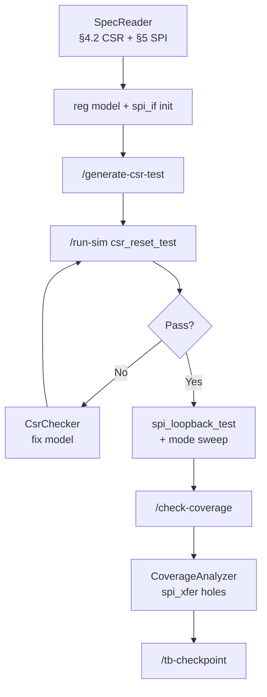

| Step | Artifact | What You Do | Outcome |
|------|----------|-------------|---------|
| 1 | **Agent** SpecReader | "Extract APB CSR + SPI reqs from spec §4–5" | REQ-APB*, REQ-CSR*, REQ-SPI* |
| 2 | **Rule** uvm-coding-standard | Edit `apb_spi_reg_block.sv`, `spi_if.sv` | Naming + passive monitors |
| 3 | **Skill** var-initialization | "Set up apb_if, spi_if, config_db" | `tb_top.sv`, dual-agent env |
| 4 | **Command** `/generate-csr-test` | Generate CSR tests | `csr_reset_test`, `csr_rw_test` |
| 5 | **Command** `/run-sim` | `csr_reset_test` | UVM_ERROR on CTRL.enable |
| 6 | **Agent** CsrChecker | Audit reg model vs §4.2 table | Fix enable, busy, cpha reset |
| 7 | **Command** `/run-sim` | `spi_loopback_test` | REQ-SPI05 pass |
| 8 | **Skill** coverage-closure | After `/check-coverage` | `spi_cpol_cpha_sweep_seq` for mode2/3 |
| 9 | **Command** `/tb-checkpoint` | Commit | `tb: SPI mode sweep + loopback` |

---

# Part 1: Rules

## What Rules Are

Rules are **passive**. They shape how the agent responds when working in your verification environment. They are injected into the model context before every conversation — like your team's methodology handbook always being open on the desk.

"Rule contents are included at the start of the model context." — Cursor docs

Rules don't run simulations. They don't invoke tools. They sit in the background, ensuring every suggestion the agent makes is consistent with your verification methodology.

### Four Activation Modes

| Activation Mode | How It Works |
|----------------|--------------|
| **Always Apply** | Active in every conversation. Core verification standards. |
| **Apply Intelligently** | Agent reads the rule's description and decides if it's relevant. |
| **Apply to Specific Files** | Activates when working with files matching a pattern (e.g., `tb/**`, `*.sv`). |
| **Apply Manually** | Only included when you explicitly reference it with `@rule-name`. |

### What Belongs in Rules

- UVM class naming conventions (`_env`, `_agent`, `_mon`, `_scb`, `_seq`, `_drv`)
- SystemVerilog coding standards (signal naming, always block style, clocking blocks)
- Interface and signal driving policies ("monitors are passive — never drive")
- CSR access methodology ("always access registers through `uvm_reg`, never direct backdoor unless explicitly required")
- Assertion naming conventions (`assert_property_<module>_<condition>`)
- Coverage group naming and bin policies
- Tool invocation conventions (simulator flags, seed policy)
- Things the agent gets wrong repeatedly about your verification environment

### What Does NOT Belong in Rules

- Multi-step simulation and coverage workflows (that's a skill)
- One-off test generation you run occasionally (that's a command)
- Detailed CSR verification procedures with reference register maps (that's a skill)

> **Rule of thumb:** If it tells the agent *how to write* verification code, it's a rule. If it tells the agent *how to run* a verification procedure, it's a skill.

### Example Rule: UVM Coding Standard

```yaml
---
description: "UVM component naming, coding conventions, and methodology standards"
globs: ["tb/**/*.sv", "tb/**/*.svh", "**/uvm_*.sv"]
alwaysApply: false
---

## UVM Naming Conventions

### Class Suffixes
- Environment:    `<dut>_env`
- Agent:          `<dut>_agent`
- Monitor:        `<dut>_monitor` (passive — never drives)
- Scoreboard:     `<dut>_scoreboard`
- Sequence:       `<name>_seq`
- Driver:         `<dut>_driver`
- Sequencer:      `<dut>_sequencer`
- Transaction:    `<dut>_transaction` or `<dut>_item`
- Interface:      `<dut>_if`

### Signal Naming
- Clocks:     `clk_<domain>`
- Resets:     `rst_n_<domain>` (active low)
- DUT ports:  exact match to RTL specification
- TB signals: `tb_<signal_name>`

### Coding Standards
- All `always` blocks must use `always_ff`, `always_comb`, or `always_latch`
- Interface signals driven only from driver — never monitor
- Use `uvm_info`, `uvm_warning`, `uvm_error`, `uvm_fatal` — no `$display`
- All phases must call `super.<phase_name>(phase)`

## CSR Access Policy
- Use `uvm_reg` for all CSR read/write operations
- Backdoor access only permitted in initialization sequences with comment `// BACKDOOR: <justification>`
- Always check `uvm_status_e` return status after register operations
```

### Example Rule: CSR Access Policy

```yaml
---
description: "CSR register access and initialization policies"
globs: ["**/csr/**", "**/reg_model/**", "**/*_reg_block*"]
alwaysApply: false
---

## Register Access Rules

All CSR accesses must go through the register model:

```sv
// CORRECT — through uvm_reg
uvm_status_e status;
reg_block.ctrl_reg.write(status, wr_data, UVM_FRONTDOOR);
assert(status == UVM_IS_OK);

// INCORRECT — direct signal assignment outside of init sequence
force dut.ctrl_reg = wr_data;
```

## Initialization Sequence
- All register block initialization must use `reset_reg_model()` before tests
- Default values must match specification Table 3.x reset values
- Reserved fields must be written as 0 unless spec states otherwise

## Field Access Width
- Never write a full register word if only one field is being configured
- Use field-level API: `reg_block.ctrl_reg.enable_field.write(...)`
```

### Example Rule: Assertion and Coverage Naming

```yaml
---
description: "SVA assertion and functional coverage naming conventions"
globs: ["**/*_sva.sv", "**/assertions/**", "**/*_cg.sv", "**/coverage/**"]
alwaysApply: false
---

## Assertion Naming

Format: `assert_<module>_<condition>`

```systemverilog
// CORRECT
assert_spi_cs_before_sclk: assert property (@(posedge pclk) disable iff (!preset_n)
  spi_xfer_start |-> ##1 (!cs_n)
) else `uvm_error("SVA", "CS_n not asserted before first SCLK — Spec §5.2")

assert_spi_zero_len_fault: assert property (@(posedge pclk) disable iff (!preset_n)
  (byte_count == 0 && xfer_start) |-> ##[1:5] mode_fault
) else `uvm_error("SVA", "mode_fault not set for byte_count=0 — Spec §5.4")

// INCORRECT
assert1: assert property (...);   // no descriptive name
```

## Covergroup Naming

Format: `<interface_or_feature>_cg` with coverpoints `cp_<name>`

```systemverilog
// CORRECT — sampled from monitor, not driver
covergroup apb_trans_cg with function sample(apb_transaction tr);
  cp_write: coverpoint tr.kind { bins rd = {APB_READ}; bins wr = {APB_WRITE}; }
  cp_slverr: coverpoint tr.slverr { bins ok = {0}; bins err = {1}; }
endgroup

// INCORRECT — covergroup inside RTL module (belongs in TB)
```

## Coverage Exclusion Comments

Every excluded bin must cite spec:

```systemverilog
// EXCLUDE: APB_SPI_Master_Spec_v1.2 §2.1 — zero-length transfer prohibited
// Instance: rx_cg.cp_len.SIZE_0
```
```

### Example Rule: Testbench File Organization

```yaml
---
description: "Testbench directory structure and file placement standards"
globs: ["tb/**"]
alwaysApply: false
---

## File Placement

| Content | Directory | Example |
|---------|-----------|---------|
| Interfaces | `tb/interfaces/` | `apb_if.sv` |
| Agents | `tb/agents/<name>/` | `apb_driver.sv` |
| Register model | `tb/reg_model/` | `apb_spi_reg_block.sv` |
| Sequences | `tb/sequences/` | `apb_slverr_inj_seq.sv` |
| Tests | `tb/tests/` | `csr_reset_test.sv` |
| Coverage | `tb/coverage/` | `apb_trans_cg.sv` |
| Assertions (TB-side) | `tb/assertions/` | `apb_spi_master_sva.sv` |
| Top | `tb/top/` | `tb_top.sv` |

## Do Not Commit

- `*.wlf`, `*.fsdb` waveform files
- `cov_work/`, `*.ucdb`, `*.vdb` coverage databases
- `transcript`, `vsim.wlf`, `work/` compile library (use .gitignore)
```

---

## The alwaysApply Tax in Verification

A mature verification environment can accumulate dozens of rules, all with `alwaysApply: true`. Every token loaded on every conversation — including simple RTL questions — is wasted context.

### The 2+2 Test

> Ask: "If someone asks 'what does this SystemVerilog syntax mean?', does this rule need to be loaded?"
> - If yes → `alwaysApply`
> - If no → globs or skill

### Rules That Should Stay alwaysApply

| Rule | Why |
|------|-----|
| `core-uvm-methodology` | Fundamental verification approach |
| `core-security` (secrets, keys in tests) | Never commit test keys/passwords |
| `core-no-display` | Never use `$display` — use UVM macros |
| `core-passive-monitor` | Monitors must never drive — universal |
| `core-phase-super` | Always call `super.phase()` — universal |

### Rules That Should Use Globs

| Rule | Current | Should Be |
|------|---------|-----------|
| `csr-access-policy` | alwaysApply | `globs: ["**/csr/**", "**/reg_model/**"]` |
| `coverage-naming` | alwaysApply | `globs: ["**/*_cg.sv", "**/coverage/**"]` |
| `assertion-style` | alwaysApply | `globs: ["**/*_sva.sv", "**/assertions/**"]` |
| `interface-naming` | alwaysApply | `globs: ["**/*_if.sv"]` |
| `sequence-coding` | alwaysApply | `globs: ["**/sequences/**"]` |

### Size Guidelines

| Artifact | Target | Max |
|---------|--------|-----|
| Rule (alwaysApply) | < 50 lines | 100 lines |
| Rule (glob-triggered) | < 100 lines | 200 lines |
| Skill SKILL.md | < 150 lines | 300 lines |
| Skill references/ | Unlimited | — |

### Audit Your Setup

```bash
# Count alwaysApply rules
grep -l "alwaysApply: true" .cursor/rules/**/*.md | wc -l

# Total lines loaded in every conversation
grep -l "alwaysApply: true" .cursor/rules/**/*.md | xargs wc -l
```

---

# Part 2: Commands

## What Commands Are

Commands are **saved prompts** — plain Markdown files triggered by typing `/` in chat. In verification, they are pre-written simulation and workflow procedures you invoke manually.

- No automatic activation
- No progressive loading
- **Always manual — the agent will never call a command on its own**

Instead of typing "run the regression with coverage enabled, collect the coverage database, then summarize uncovered bins" every time, you save it as `/run-regression`.

### Rules vs Commands

| Aspect | Rules | Commands |
|--------|-------|---------|
| Frontmatter | Required (YAML) | **None** |
| Invocation | Automatic or @mention | User types `/command-name` |
| Purpose | Standards context injection | Simulation action execution |
| Location | `.cursor/rules/` | `.cursor/commands/` |

**Critical mistake:** Do not put YAML frontmatter in commands.

### Command Structure

```markdown
# /command-name - Brief Description

One-line summary of what this command does.

## Instructions

When the user invokes `/command-name`, do the following:

1. First step
2. Second step
3. Third step

### Default Behavior

What happens with no arguments.

## Variants

### `/command-name --flag`
What this variant does differently.

## Output Format

Expected output structure

## Examples

### Basic Usage
User: /command-name
Output: [what happens]
```

---

### Example: The /run-sim Command

```markdown
# /run-sim - Run Simulation with Coverage

Compile, elaborate, and run the testbench with functional and code coverage enabled.

## Instructions

When the user invokes `/run-sim`:

1. **Compile**
   - Run `vlog` (or tool equivalent) on all `.sv` and `.svh` sources
   - Include `+define+UVM_NO_DEPRECATED`
   - Report compile errors — do not proceed on error

2. **Elaborate**
   - Run `vsim -c <tb_top> -do "..."`
   - Enable all coverage types: `+cover=bcesf`
   - Load the UVM register model if CSR test detected

3. **Simulate**
   - Run the test specified by `UVM_TESTNAME` (default: `base_test`)
   - Collect coverage database to `cov_work/<testname>/`
   - On `UVM_FATAL`: stop and report

4. **Post-Sim Summary**
   - Show pass/fail count from UVM report
   - Show coverage percentage if available
   - List any `UVM_ERROR` or `UVM_WARNING` messages

### Default Behavior

Runs `base_test` with seed 1. Compiles from scratch.

## Variants

### `/run-sim --test <testname>`
Run a specific UVM test by name.

### `/run-sim --seed <N>`
Run with specific seed for reproducibility.

### `/run-sim --no-compile`
Skip compilation — use previous elaboration.

### `/run-sim --regress`
Run all tests in regression list `tests/regression.list`.

## Output Format

## Simulation Summary

**Test**: `<testname>`
**Seed**: `<N>`
**Result**: PASS / FAIL

### UVM Report
- UVM_INFO:    [count]
- UVM_WARNING: [count] — [list any non-trivial ones]
- UVM_ERROR:   [count] — [list all]
- UVM_FATAL:   [count] — [list all]

### Coverage
- Functional coverage: [X]%
- Code coverage:        [X]%
- Coverage DB: `cov_work/<testname>/`
```

### Elaborated: Simulator Commands the Agent Runs

When `/run-sim` executes, the agent should use project-specific scripts or these Questa/ModelSim equivalents:

```bash
# 1. Compile (from project root)
vlog -sv +incdir+tb +incdir+tb/agents/apb \
  +define+UVM_NO_DEPRECATED \
  -f tb/filelist.f

# 2. Elaborate + simulate with coverage
vsim -c tb_top -voptargs=+acc \
  +UVM_TESTNAME=csr_reset_test \
  +UVM_VERBOSITY=UVM_MEDIUM \
  -sv_seed 42 \
  -coverage \
  -do "coverage save -onexit cov_work/csr_reset_test_42/cov.ucdb; run -all; quit -f"

# 3. Alternative: Makefile wrapper
make sim TEST=csr_reset_test SEED=42 COV=1
```

**`tests/regression.list` format:**

```
# test_name          seed    coverage    description
csr_reset_test       1       on          Reset value check all CSRs
csr_rw_test          1       on          RO/WO/W1C accessibility
apb_sanity_test      1       on          Basic APB read/write
spi_random_test      random  on          Random SPI len/mode/payload
```

**`/run-sim --regress` behavior:** Run each non-comment line sequentially; merge all `cov_work/<test>_*/` into `cov_work/merged.ucdb` after last test.

---

### Example: The /check-coverage Command

```markdown
# /check-coverage - Analyze Coverage Holes

Merge coverage databases and report uncovered bins, uncovered assertions, and toggle holes.

## Instructions

When the user invokes `/check-coverage`:

1. **Merge Databases**
   - Run `vcover merge cov_work/merged.ucdb cov_work/*/`
   - Report how many individual runs were merged

2. **Functional Coverage**
   - List all covergroups with < 100% coverage
   - For each: show uncovered bins and their cross-conditions
   - Flag any covergroup below threshold (default: 90%)

3. **Code Coverage**
   - Identify uncovered lines, branches, and FSM states
   - Highlight RTL blocks with 0% branch coverage

4. **Assertion Coverage**
   - List all assertions that never fired
   - List assertions that fired but never passed (only vacuously true)

5. **Recommendation**
   - Suggest new sequences or test scenarios to close each hole
   - Prioritize by: (1) spec-required coverage, (2) corner cases, (3) random hits

### Default Behavior

Merges all databases in `cov_work/` and generates full report.

## Variants

### `/check-coverage --module <module_name>`
Restrict analysis to a specific DUT module.

### `/check-coverage --cg <covergroup_name>`
Focus on a specific covergroup.

### `/check-coverage --threshold <N>`
Flag covergroups below N% (default: 90).

## Output Format

## Coverage Analysis Report

**Merged runs**: [N]
**Overall functional coverage**: [X]%
**Overall code coverage**: [X]%

### ⚠️ Uncovered Functional Bins

| Covergroup | Bin | Current | Required | Suggested Test |
|-----------|-----|---------|---------|----------------|
| `apb_trans_cg` | `wr_after_rd` | 0% | 100% | `directed_wr_after_rd_seq` |

### ⚠️ Uncovered Code

| Module | Line | Type | Notes |
|--------|------|------|-------|
| `ctrl_fsm` | 142 | Branch | `ERROR` state never entered |

### 🔴 Assertions Never Fired

| Assertion | Location | Condition |
|-----------|---------|-----------|
| `assert_no_back2back_wr` | `csr_if.sv:88` | Never triggered |
```

---

### Example: The /tb-checkpoint Command

```markdown
# /tb-checkpoint - Save Testbench Work State

Clean up testbench code, validate, and commit with a descriptive message.

## Instructions

When the user invokes `/tb-checkpoint`:

1. **Clean up**
   - Remove debug `$display` statements (replace with `uvm_info` if needed)
   - Remove commented-out dead code blocks
   - Fix obvious formatting (indentation, trailing whitespace)
   - Remove temporary `force`/`release` not marked with `// BACKDOOR:` comment

2. **Validate**
   - Check all modified `.sv` files compile cleanly (`vlog` lint)
   - Verify `uvm_reg` status checks are present after every register write
   - Confirm no monitor is driving any interface signal

3. **Commit**
   - Stage only testbench source files (not waveform dumps, not coverage DBs)
   - Generate commit message: `tb: <what changed>` (conventional TB commit style)
   - Show message for approval before committing

### Default Behavior

Processes all modified `.sv`, `.svh`, `.v` files.

## Variants

### `/tb-checkpoint --message "specific message"`
Use provided message instead of generating one.

### `/tb-checkpoint --lint-only`
Run lint validation only — do not commit.

## Output Format

## TB Checkpoint Summary

### Cleaned
- Removed [N] `$display` statements
- Fixed [N] formatting issues

### Validated
- ✓ Compile: clean
- ✓ No monitors driving signals
- ✓ Register writes have status checks

### Committed
Message: "tb: add APB write-after-read directed test"
Files: [N] changed (+[lines], -[lines])
```

---

### Example: The /generate-csr-test Command

```markdown
# /generate-csr-test - Generate CSR Read/Write Test

Generate a UVM test that walks all registers in a block, performing reset-value check, read/write/read, and field accessibility tests.

## Instructions

When the user invokes `/generate-csr-test`:

1. **Identify Register Block**
   - Ask: "Which register block? (e.g., `ctrl_reg_block`)"
   - Or infer from context if a reg model file is open

2. **Generate Reset Value Test**
   - For every register: read after reset, compare to spec-defined reset value
   - Flag mismatches as `UVM_ERROR`

3. **Generate RW Accessibility Test**
   - For each RW field: write walking-ones pattern, read back, verify
   - For each RO field: attempt write, verify value did not change
   - For each WO field: write, verify write completed without error
   - For reserved fields: write 0, verify no side effect

4. **Generate CSR Aliasing Test**
   - If spec defines aliased addresses, verify both addresses reach same register

5. **Output Files**
   - `tests/csr_reset_test.sv` — reset value checks
   - `tests/csr_rw_test.sv` — read/write accessibility
   - `tests/csr_alias_test.sv` — aliasing checks (if applicable)

## Variants

### `/generate-csr-test --reg <reg_name>`
Generate tests for a single register only.

### `/generate-csr-test --field <field_name>`
Generate tests for a single field only.
```

### Elaborated: Full Generated Test Package

After `/generate-csr-test --reg ctrl_reg_block`, the agent produces:

**File: `tb/tests/csr_reset_test.sv`** — see §0.4 above.

**File: `tb/sequences/csr_rw_walking_seq.sv`** (walking-ones for RW fields):

```systemverilog
class csr_rw_walking_seq extends uvm_sequence;
  apb_spi_reg_block reg_model;
  uvm_reg_field fields[$];

  task body();
    uvm_status_e status;
    uvm_reg_data_t rd, wr;
    int width;

    reg_model.CTRL.get_fields(fields);
    foreach (fields[i]) begin
      if (fields[i].get_access() != "RW") continue;
      width = fields[i].get_n_bits();
      for (int b = 0; b < width; b++) begin
        wr = 1 << b;
        fields[i].write(status, wr, UVM_FRONTDOOR);
        fields[i].read(status, rd, UVM_FRONTDOOR);
        if (rd !== wr)
          `uvm_error("WALK", $sformatf("%s bit %0d: wr=0x%0h rd=0x%0h",
            fields[i].get_name(), b, wr, rd))
      end
      fields[i].write(status, '0, UVM_FRONTDOOR);  // restore
    end
  endtask
endclass
```

**File: `tb/tests/csr_alias_test.sv`** (when spec defines alias at 0x00 and 0x80):

```systemverilog
task check_alias(uvm_reg primary, uvm_reg alias_reg);
  uvm_status_e status;
  uvm_reg_data_t v1, v2;
  primary.write(status, 32'hA5A5_0001, UVM_FRONTDOOR);
  alias_reg.read(status, v2, UVM_FRONTDOOR);
  if (v2 != 32'hA5A5_0001)
    `uvm_error("ALIAS", "Aliased addresses returned different values")
endtask
```

---

## Command Coalescing (Verification Workflows)

### Problem: Overlapping Commands

```
User: "/run-sim and /tb-checkpoint then push to regression"
```

Without coalescing:
```
1. /run-sim   → compiles, runs sim
2. /tb-checkpoint → compiles again, validates, commits
3. push       → pushes

/tb-checkpoint already includes compile validation!
```

### Command Subsumption

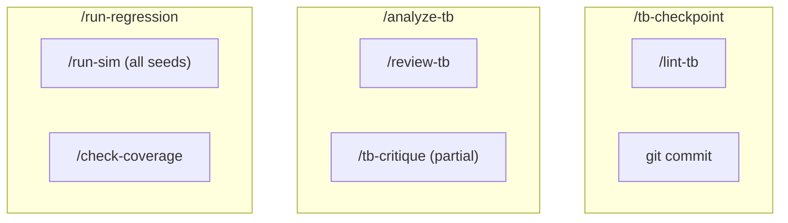

| If Requested | Skip | Because |
|-------------|------|---------|
| /analyze-tb + /review-tb | /review-tb | analyze includes review |
| /tb-checkpoint + /lint-tb | /lint-tb | checkpoint includes lint |
| /run-regression + /run-sim | /run-sim | regression subsumes single run |

### Command Ordering (Verification)

| Commands | Correct Order | Reason |
|---------|--------------|--------|
| /review-tb + /tb-checkpoint | review → checkpoint | Review before committing |
| /run-sim + /check-coverage | run-sim → check-coverage | Must have a DB before checking |
| /generate-csr-test + /run-sim | generate → run-sim | Create test before running it |
| /analyze-tb + /fix-tb | analyze → fix | Understand before changing |

---

## Autonomous Actions: The Verification Autonomy Spectrum

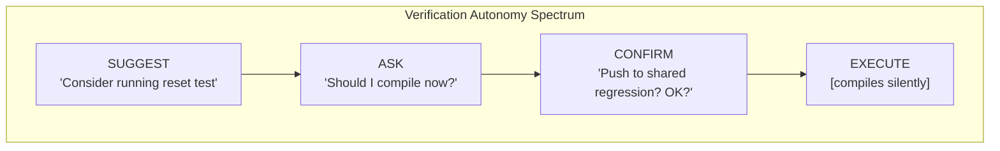

| Level | Behavior | For Actions That Are... |
|-------|---------|------------------------|
| **4: Execute** | Do silently | Reversible, local, no side effects |
| **3: Inform** | Do and report | Reversible, persistent, minor effects |
| **2: Confirm** | Propose and wait | Affects shared regression or team state |
| **1: Suggest** | Mention only | Destructive or irreversible |

### Pre-Authorized Actions (Execute Silently)

| Action | When | Notes |
|--------|------|-------|
| Read `.sv`, `.svh`, spec files | Always | Core capability |
| Search testbench codebase | Always | Core capability |
| Lint/compile check | After edit | Flag errors only |
| Remove `$display` debug statements | Before commit | Cleanup |
| Fix indentation/trailing whitespace | During edit | Non-functional |

### Inform After (Do and Report)

| Action | When | Report Format |
|--------|------|--------------|
| Run single simulation | After test creation | "✓ PASS — 0 UVM_ERROR, cov: 73%" |
| Local commit | After completing TB component | Show commit message |
| Generate CSR test file | When register block identified | "Generated: tests/csr_rw_test.sv" |
| Install missing Python libs for coverage analysis | When script missing dep | "Installed: pyuvm@2.4" |

### Requires Confirmation

| Action | Prompt |
|--------|--------|
| Push to shared regression server | "Push to origin/main regression branch? [Y/n]" |
| Delete waveform databases | "Delete 3 .wlf files? [Y/n]" |
| Overwrite team coverage database | "Merge and overwrite cov_work/team_merged.ucdb? [Y/n]" |
| Modify CSR register model (reg_block.sv) | "Modify shared register model? [Y/n]" |

### Never Without Explicit Request

- Force push to shared regression branch
- Drop/truncate shared coverage database
- Modify RTL source files (DUT is read-only for verification)
- Overwrite golden reference waveforms

---

### Continuous Verification Work Loop

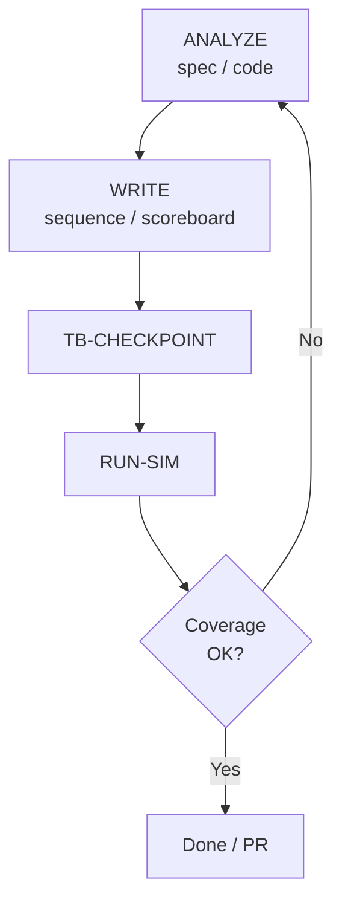

### Autonomous Session Example

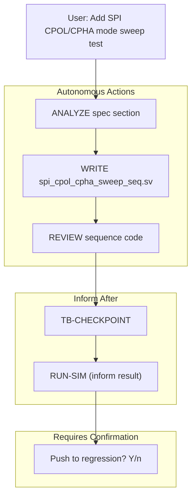

| Phase | Action | Details |
|-------|--------|---------|
| **Analyze** | Read spec | SPI §5.1 — modes 0–3 (CPOL/CPHA), CS setup, MSB-first |
| **Write** | Created sequence | `spi_cpol_cpha_sweep_seq.sv` — all four modes, 8-bit xfer |
| **Review** | Self-checked | All mode bins hit, STATUS.busy polled, no monitor driving |
| **Checkpoint** | Committed | `tb: add SPI mode sweep sequence` |
| **Sim** | **Reported** | PASS — 0 UVM_ERROR, func cov 81% |
| **Push** | **Awaiting** | Requires confirmation (affects shared regression) |

---

# Part 3: Skills

## Rules vs Skills for Verification

| Artifact | Purpose | Content Type | Activation |
|---------|---------|-------------|-----------|
| **Rules** | What and When | Passive reference | Automatic |
| **Skills** | How | Active procedure | Explicit invocation |

- **Rule:** "CSR reserved fields must be written as 0" ← passive, shapes all edits
- **Skill:** "To verify CSR registers: 1. Read spec table, 2. Generate reset-value test, 3. Run, 4. Compare..." ← active workflow

### Content Type Mapping

| Content Type | Belongs In | Verification Example |
|-------------|-----------|---------------------|
| Coding standards | Rule | "All `always` blocks must use `always_ff`" |
| Naming conventions | Rule | "Monitor suffix must be `_monitor`" |
| Access policies | Rule | "Always use `uvm_reg` for CSR access" |
| Multi-step verification procedures | Skill | "CSR compliance: read spec → generate test → run → compare" |
| Spec parsing workflows | Skill | "Extract test plan from specification document" |
| Coverage closure procedures | Skill | "Identify uncovered bins → write directed sequence → re-run" |

---

## Agent Skills: The Open Standard

[Agent Skills](https://agentskills.io/) is an open standard. Skills you write for Cursor also work in Claude Code, VS Code, Gemini CLI, and others — your UVM knowledge packages are portable.

| Trait | What It Means for Verification |
|-------|-------------------------------|
| **Portable** | UVM skill written once, works across all tool setups |
| **Version-controlled** | Stored as files alongside your testbench — tracked in Git |
| **Executable** | Can include Python scripts for coverage analysis or reg-model generation |
| **Progressive** | Spec reference tables load on demand — SKILL.md stays lean |

---

## Where Skills Live

| Location | Scope |
|---------|-------|
| `.cursor/skills/` | Project-level (this DUT/TB) |
| `~/.cursor/skills/` | User-level (all your verification projects) |
| `.claude/skills/` | Cross-tool compatibility |

Global skills for cross-project knowledge: UVM methodology, protocol verification patterns, common CSR idioms.

### Skill Directory Structure

```
.cursor/skills/csr-verification/
├── SKILL.md                    # Required
├── scripts/
│   ├── parse_reg_map.py        # Parse Excel/CSV register map
│   └── gen_csr_test.py         # Generate CSR test from reg model
├── references/
│   ├── CSR_CODING_GUIDE.md     # Detailed CSR verification methodology
│   └── COMMON_CSR_BUGS.md      # Known CSR bug patterns
└── assets/
    └── csr_test_template.sv    # UVM test template
```

| Directory | Purpose | When Loaded |
|-----------|---------|------------|
| `scripts/` | Executable: reg-map parsers, test generators | When skill executes |
| `references/` | Spec tables, methodology docs | On demand (progressive) |
| `assets/` | UVM templates, config files | When referenced |

---

## The SKILL.md Frontmatter

| Field | Required | Description |
|-------|---------|------------|
| `name` | Yes | Skill identifier. Lowercase, hyphens. Must match folder name. |
| `description` | Yes | What the skill does and when to use it. **How the agent decides relevance.** |
| `compatibility` | No | Tool requirements (Python version, simulator, etc.) |
| `metadata` | No | Category, team ownership, compliance tags. |
| `disable-model-invocation` | No | When `true`, only invoked via `/skill-name`. |

---

## Real Skill Examples

### The CSR Verification Skill

```yaml
---
name: csr-verification
description: |
  Verify CSR (Control and Status Register) registers against specification.
  Use when user asks to: verify registers, check CSR compliance, test register
  map, run CSR tests, validate reset values, check field accessibility.
  Proactively apply when: register model files are open, spec section mentions
  CSR map, user opens *_reg_block.sv or *_reg_map.sv files.
  Triggers: "verify CSRs", "check register values", "CSR compliance",
  "reset value check", "register accessibility", "field RW test",
  "CSR aliasing", "register map verification"
compatibility: Requires Python 3.8+ for register map parsing scripts
metadata:
  category: verification
  compliance: [functional-coverage, reg-model]
---

# CSR Verification Skill

## Scope

Verify all registers in a register block against the specification-defined:
- Reset values
- Field accessibility (RW, RO, WO, W1C, etc.)
- Field widths and positions
- Reserved field behavior
- Aliased address handling

## Process

### 1. Parse Specification
- Read the register map section from the spec (PDF, Excel, or inline table)
- Extract: register name, address offset, field name, width, access type, reset value
- Flag any registers in spec not present in `uvm_reg` model

### 2. Validate Register Model
- Cross-check `uvm_reg` model fields against spec table
- Report mismatches in: field width, access type, reset value

### 3. Generate Tests
- `csr_reset_test.sv`: Read all registers after reset, compare to spec reset value
- `csr_rw_test.sv`: Walking-ones for RW fields, verify RO fields are read-only
- `csr_reserved_test.sv`: Reserved fields always return 0 on read

### 4. Run and Report
- Run all CSR tests
- Report pass/fail per register
- Flag registers that failed with expected vs actual values

## Output Format

## CSR Compliance Report

### Summary
- Registers checked: [N]
- PASS: [N]
- FAIL: [N]
- MISMATCH (model vs spec): [N]

### Failures

| Register | Field | Expected | Got | Type |
|---------|-------|----------|-----|------|
| `CTRL_REG` | `enable` (reset) | `0x0` | `0x1` | Reset value mismatch |

### Model vs Spec Mismatches

| Register | Issue |
|---------|-------|
| `STATUS_REG.busy_flag` | Spec says RO, model says RW |

## Constraints
- Never modify RTL source files
- Flag mismatches as errors — do not auto-correct spec
- If spec is ambiguous, flag for human review
```

### Elaborated: CSR Skill Step-by-Step on `apb_spi_master`

**User:** "Verify all registers in apb_spi_master against the spec"

**Skill execution trace:**

| Step | Action | Detail |
|------|--------|--------|
| 1 | Load spec §4.2 table | 7 registers, 12 fields extracted |
| 2 | Parse `apb_spi_reg_block.sv` | 7 `uvm_reg` instances found |
| 3 | Cross-check | 2 mismatches: CTRL.enable reset, STATUS.busy access |
| 4 | Generate tests | `csr_reset_test.sv`, `csr_rw_test.sv` already exist — offer update |
| 5 | Run `/run-sim --test csr_reset_test` | 1 UVM_ERROR — confirms finding |
| 6 | Report | CSR Compliance Report (see §0.7 CsrChecker sample) |

**Walking-ones result table (excerpt):**

| Register.Field | Bit | Write | Read | Result |
|---------------|-----|-------|------|--------|
| CTRL.enable | 0 | 1 | 1 | PASS |
| CTRL.mode | 1 | 2 | 2 | PASS |
| CTRL.mode | 0 | 1 | 1 | PASS |
| TX_DATA.data | 0 | 1 | 1 | PASS |
| TX_DATA.data | 7 | 8'hFF | 8'hFF | PASS |
| CLK_DIV.div | 0 | 1 | 1 | PASS |
| CLK_DIV.div | 7 | 8'h0F | 8'h0F | PASS |

---

### The Coverage Closure Skill

```yaml
---
name: coverage-closure
description: |
  Analyze coverage holes and generate directed tests to close them.
  Use when user asks to: close coverage, fix coverage holes, improve
  functional coverage, write tests for uncovered bins, coverage closure.
  Proactively apply when: coverage report shows < 100% on any covergroup,
  after running /check-coverage command.
  Triggers: "coverage hole", "uncovered bin", "close coverage",
  "improve coverage", "100% coverage", "coverage miss", "uncovered assertion"
compatibility: Requires merged .ucdb or .vdb coverage database
metadata:
  category: verification
---

# Coverage Closure Skill

## Process

### 1. Parse Coverage Report
- Read merged coverage database or report file
- Identify all bins below threshold (default: < 100% functional, < 90% code)

### 2. Classify Holes
- **Reachable**: Bin is architecturally possible — needs a directed test
- **Unreachable**: Bin requires an impossible state combination — flag for exclusion
- **Spec-required**: Bin maps directly to a spec requirement — highest priority

### 3. Generate Directed Sequences
For each reachable hole:
- Identify the testbench stimulus path needed to hit the bin
- Write a directed `uvm_sequence` that targets that condition
- Add the sequence to the regression list

### 4. Verify Closure
- Re-run with new sequences
- Confirm bin is now covered
- Update coverage exclusion file for unreachable bins

## Output Format

## Coverage Closure Plan

### Holes to Close

| Covergroup | Bin | Priority | Directed Sequence |
|-----------|-----|---------|-------------------|
| `apb_trans_cg.rsp_type` | `SLVERR` | HIGH | `apb_slverr_inj_seq` |
| `ctrl_reg_cg.mode` | `LOOPBACK` | MED | `ctrl_loopback_seq` |

### Exclusions (Unreachable)

| Covergroup | Bin | Reason |
|-----------|-----|--------|
| `rx_cg.pkt_size` | `SIZE_0` | Spec prohibits zero-length packets |
```

### Elaborated: Coverage Closure Session

**Starting point:** `apb_trans_cg` at 73%, `cp_rsp.slverr` at 0%.

**CoverageAnalyzer reasoning:**

1. **Bin `cp_rsp.slverr`** — Reachable. Spec §3.6 requires SLVERR on illegal address. No exclusion.
2. **Action** — Write `apb_slverr_inj_seq` (see §0.5).
3. **Re-run** — `/run-sim --test apb_sanity_test --seed 99` with sequence added to base test.
4. **Result** — `cp_rsp.slverr` → 100%, `cx_wr_slverr` → 100%, overall `apb_trans_cg` → 91%.

**Scoreboard check after SLVERR sequence:**

```systemverilog
// spi_scoreboard.sv — must expect SLVERR on APB without UVM_ERROR storm
function void write(apb_transaction tr);
  if (tr.slverr) begin
    `uvm_info("SCB", $sformatf("SLVERR on %s addr=0x%0h — expected for unmapped",
      tr.kind.name(), tr.addr), UVM_MEDIUM)
    return;  // do not compare data on error response
  end
  // normal compare ...
endfunction
```

---

### The Spec Extraction Skill

```yaml
---
name: spec-extraction
description: |
  Read a hardware specification and extract a structured verification test plan.
  Use when user asks to: read spec, extract requirements, create test plan from
  spec, parse specification, identify test scenarios from document.
  Proactively apply when: a PDF, DOCX, or Markdown spec file is attached or open.
  Triggers: "read the spec", "extract test plan", "what does the spec say about",
  "derive tests from spec", "spec requirements", "what should I test",
  "testplan from specification"
metadata:
  category: planning
---

# Spec Extraction Skill

## Process

### 1. Identify Spec Sections Relevant to Verification
- Functional description sections
- Register/CSR tables
- Protocol timing diagrams
- Error handling sections
- Corner cases and constraints listed in spec

### 2. Extract Verification Requirements
For each spec statement containing a requirement (shall, must, shall not):
- Extract the requirement text
- Classify: functional, performance, CSR, protocol, error handling
- Assign a test scenario name

### 3. Generate Test Plan Table

| Req ID | Spec Section | Requirement | Test Scenario | Priority |
|--------|------------|-------------|--------------|---------|
| REQ-001 | 3.2 | "FIFO shall never overflow when flow control is enabled" | `fifo_no_overflow_fc_test` | HIGH |

### 4. Identify Missing Stimulus
- List scenarios required by spec that have no existing sequence
- Suggest sequence names and brief implementation notes

## Constraints
- Never paraphrase requirements — quote directly from spec
- Flag ambiguous requirements for human review
- Do not invent requirements not stated in spec
```

### Elaborated: Spec Extraction from SPI Spec Prose

**Input (spec §5.4 prose):**

> "When XFER_LEN.byte_count is programmed to zero, the SPI master shall not toggle SCLK and shall assert STATUS.mode_fault. The fault shall remain set until software clears INT_STAT or reprograms byte_count to a non-zero value."

**Extracted requirements:**

| Req ID | Verbatim fragment | Classification | Test Scenario |
|--------|------------------|----------------|---------------|
| REQ-SPI04a | "shall not toggle SCLK" | protocol | `spi_zero_len_test` |
| REQ-SPI04b | "shall assert STATUS.mode_fault" | CSR + functional | same test |
| REQ-SPI04c | "remain set until ... clears INT_STAT or reprograms byte_count" | functional | `spi_zero_len_clear_test` |

**Suggested sequence outline:**

```systemverilog
// spi_zero_len_test outline
reg_model.XFER_LEN.write(status, 0, UVM_FRONTDOOR);
reg_model.TX_DATA.write(status, 8'hFF, UVM_FRONTDOOR);  // attempt push
#200ns;
reg_model.STATUS.mode_fault.read(status, val, UVM_FRONTDOOR);
assert(val[3] == 1);
// SPI monitor: zero SCLK edges while cs_n low — Spec §5.4
spi_monitor.check_sclk_count(0);
```

---

### The Variable Initialization Skill

```yaml
---
name: var-initialization
description: |
  Generate correct variable initialization for UVM testbench components based
  on design spec and interface parameters.
  Use when user asks to: initialize testbench variables, set up interface
  parameters, configure DUT interface, initialize UVM config database,
  set up clocking blocks, configure virtual interface.
  Triggers: "initialize variables", "set up tb config", "configure interface",
  "uvm_config_db setup", "virtual interface init", "clocking block config",
  "testbench initialization", "init sequence"
metadata:
  category: setup
---

# Variable Initialization Skill

## Process

### 1. Identify Interfaces and Parameters
- List all DUT interfaces with direction and signal list
- Extract clock domains and reset polarities from spec
- Identify interface parameters (APB data width, SPI frame width, max byte count)

### 2. Generate Parameter Initialization

```sv
// Interface parameters — match RTL spec Table 2.1
parameter int APB_DATA_WIDTH  = 32;   // Spec §2.1: APB PDATA width
parameter int APB_ADDR_WIDTH  = 12;   // Spec §2.1: CSR address space
parameter int SPI_DATA_WIDTH  = 8;    // Spec §3.1: byte-wide shift register
parameter int SPI_MAX_BYTES   = 64;   // Spec §4.5: XFER_LEN.byte_count max

// Clock periods (ns) — from timing spec Table 5.2
parameter real CLK_PERIOD_PCLK  = 10.0;  // 100 MHz APB clock
parameter real CLK_PERIOD_SPI   = 40.0;  // derived from CLK_DIV default
```

### 3. Generate uvm_config_db Initialization

```sv
// In top-level module or test base class build_phase:

// Virtual interface binding — must be set before run_phase
uvm_config_db #(virtual apb_if)::set(
  null, "uvm_test_top.env.apb_agent.*",
  "vif", apb_vif
);

// DUT parameters accessible from testbench
uvm_config_db #(int)::set(
  null, "uvm_test_top.*",
  "data_width", DATA_WIDTH
);
```

### 4. Generate Clocking Block Initialization

```sv
// Clocking block — aligns driver with clock edge per spec §5.1
clocking apb_drv_cb @(posedge clk);
  default input #1step output #1ns;
  output  PSEL, PENABLE, PWRITE, PADDR, PWDATA;
  input   PREADY, PRDATA, PSLVERR;
endclocking
```

### 5. CSR Register Block Initialization

```sv
// Register model initialization — call in test base build_phase
function void build_phase(uvm_phase phase);
  super.build_phase(phase);
  reg_model = ctrl_reg_block::type_id::create("reg_model", this);
  reg_model.build();
  reg_model.lock_model();
  reg_model.reset();  // Sets all fields to spec-defined reset values
  // Map to physical interface adapter
  reg_adapter = apb_reg_adapter::type_id::create("reg_adapter");
  reg_model.default_map.set_sequencer(
    env.apb_agent.sequencer, reg_adapter
  );
endfunction
```

## Output
Generate complete initialization file: `tb/tb_init_pkg.sv` with all parameters, `uvm_config_db` setup, and clocking block definitions.
```

### Elaborated: Full `tb_init_pkg` and Config Checklist

```systemverilog
// tb/tb_init_pkg.sv — package for shared TB parameters
package tb_init_pkg;
  // From APB_SPI_Master_Spec_v1.2 §2.1
  parameter int APB_DATA_WIDTH = 32;
  parameter int APB_ADDR_WIDTH = 32;
  parameter real APB_CLK_NS    = 20.0;   // 50 MHz
  parameter int APB_RESET_CYCLES = 5;

  // SPI parameters §5.x
  parameter int SPI_MAX_BYTES = 64;      // per XFER_LEN spec
  parameter int SPI_DEFAULT_CLK_DIV = 8;
endpackage
```

**`uvm_config_db` checklist (must all be set before `run_test()`):**

| Key | Type | Path | Set In |
|-----|------|------|--------|
| `vif` | `virtual apb_if` | `uvm_test_top.env.apb_agent.*` | `tb_top` initial |
| `reg_model` | `apb_spi_reg_block` | `uvm_test_top` | test `build_phase` |
| `data_width` | `int` | `uvm_test_top.*` | `tb_top` or env |
| `max_xfer_len` | `int` | `uvm_test_top.env.*` | test or env |

**Common initialization bugs:**

| Bug | Symptom | Fix |
|-----|---------|-----|
| `vif` not set | `uvm_fatal` "virtual interface not found" | Set in `tb_top` before `run_test()` |
| `reg_model` not reset | First test sees wrong reset values | Call `reg_model.reset()` in env `build_phase` |
| Wrong path string | Agent finds no `vif` | Path must match hierarchy: `uvm_test_top.env.apb_agent.driver` |
| Clocking block not used | Race on APB signals | Driver uses `vif.drv_cb`, monitor uses `vif.mon_cb` |

---

## The Description Field: Make or Break

The `description` field is how the agent decides whether your skill is relevant.

### Weak vs Strong Descriptions

```yaml
# BAD: Invisible to discovery
description: "Helps with verification stuff"

# BAD: Jargon only
description: "Executes UVM register model compliance verification flow"

# GOOD: Natural language + triggers + proactive conditions
description: |
  Verify CSR (Control and Status Register) registers against specification.
  Use when user asks to: verify registers, check CSR compliance, test register
  map, run CSR tests, validate reset values, check field accessibility.
  Proactively apply when: register model files are open, spec section mentions
  CSR map.
  Triggers: "verify CSRs", "check register values", "CSR compliance",
  "reset value check", "register accessibility"
```

### Write in Third Person

```yaml
# ✅ Good
description: "Analyzes coverage holes and generates directed UVM sequences to close them"

# ❌ Bad
description: "I can help you close coverage holes"
```

### The Anatomy of a Good Verification Description

| Part | Example |
|------|---------|
| What it does | "Verify CSR registers against specification." |
| When to use | "Use when user asks to: verify registers, check CSR compliance" |
| Proactive triggers | "Proactively apply when: register model files are open" |
| Trigger phrases | "Triggers: 'verify CSRs', 'reset value check', 'field accessibility'" |

---

## Progressive Disclosure: Keep SKILL.md Lean

Main `SKILL.md`: the procedure (under 150 lines).  
`references/`: the detailed spec tables, register maps, methodology documents.  
`scripts/`: Python tools for parsing, generating, analyzing.

```markdown
# CSR Verification

## Quick Start
[Core procedure — 50 lines]

## Additional Resources
- Detailed CSR methodology: [references/CSR_CODING_GUIDE.md](references/CSR_CODING_GUIDE.md)
- Common CSR bugs: [references/COMMON_CSR_BUGS.md](references/COMMON_CSR_BUGS.md)
- Register map parser: [scripts/parse_reg_map.py](scripts/parse_reg_map.py)
```

---

## Testing Your Skills

**Test 1: Direct Invocation**
```
/csr-verification
```

**Test 2: Intent Matching — say the thing without the skill name**
```
"I need to verify all the registers in my APB block against the spec"
→ Should trigger csr-verification
```

**Test 3: Natural Language Triggers**
```
"There are coverage holes in the APB transaction covergroup" → Should trigger coverage-closure
"Can you read this spec section and tell me what tests I need?" → Should trigger spec-extraction
"How do I initialize the virtual interface in my testbench?" → Should trigger var-initialization
```

---

## Debugging Checklist

| Symptom | Likely Cause | Fix |
|---------|-------------|-----|
| Never activates | Description uses internal jargon only | Add natural trigger phrases |
| Works direct, not natural | No intent matching | Improve description with user language |
| Doesn't appear in settings | Invalid structure | Check folder/name match |
| Wrong skill activates | Conflicting descriptions | Make descriptions more specific |

---

# Part 4: Agents (Subagents)

## What Agents Are for Verification

Agents are specialized AI personas with their own context window. In verification, they are the "specialist colleague" you hand work to:

| Agent | Role | When to Spawn |
|-------|------|--------------|
| **SpecReader** | Reads spec sections, extracts requirements | "Analyze spec section 4.2" |
| **CsrChecker** | Validates register model against spec | "CSR compliance audit" |
| **CoverageAnalyzer** | Analyzes coverage reports, suggests new tests | "Why is coverage stuck at 73%?" |
| **TbReviewer** | Reviews TB code for UVM compliance | "Review my scoreboard" |
| **Critic** | Challenges testplan assumptions | "Challenge this test approach" |

The key insight: **agents start fresh**. After hours of debugging a protocol issue, a fresh CsrChecker has no anchoring on your wrong hypothesis — it looks at the register model with clean eyes.

---

## The Two Models: Persona Lens vs True Subagent

### Model 1: The Persona Lens (Same Context)

When you mention an agent in conversation:

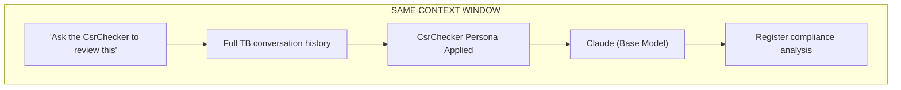

Fast, stateful, but anchored on your existing conversation. Good for quick consultations.

### Model 2: True Subagent (Isolated Context)

When the main agent delegates via Task tool:

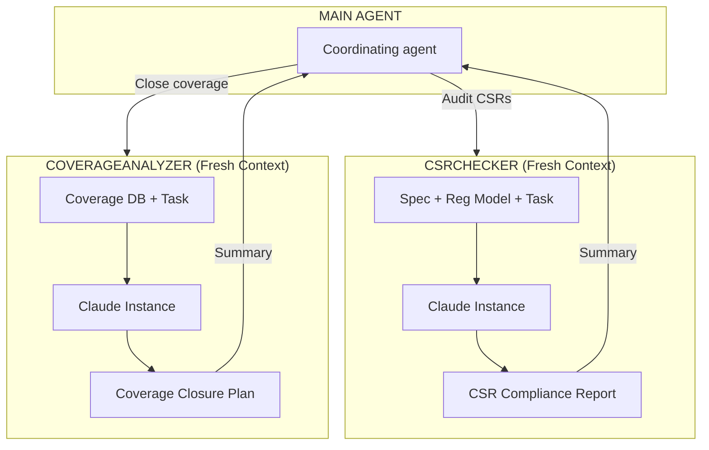

Fresh context. No anchoring. Parallel-capable. Good for deep audits and independent verification.

---

## Designing Verification Agent Personas: Five Elements

### Element 1: Role

**Bad:**
```
You are a helpful verification assistant.
```

**Good:**
```
You are a senior hardware verification engineer specializing in CSR
register compliance. You read register specifications the way an auditor
reads financial statements — looking for inconsistencies, missing
accessibility modes, and spec-model mismatches.
```

### Element 2: Expertise

**Bad:**
```
You know about UVM and registers.
```

**Good:**
```
## Expertise
- UVM register model (`uvm_reg`, `uvm_reg_block`, `uvm_reg_map`)
- CSR field access types: RW, RO, WO, W1C, W1S, RSVD
- Register aliasing and shadowing patterns
- APB/AHB/AXI register access protocols
- Reset value verification and POR behavior
- Common CSR implementation bugs (reset-on-read, write-clear mismatches)
```

Specify what is NOT included: RTL design, analog IP, DFT. The agent has boundaries.

### Element 3: Process

**Bad:**
```
Analyze the register model carefully.
```

**Good:**
```
## Process

### 1. Parse Specification Table
- Extract all register entries: name, offset, fields, access type, reset value
- Flag registers in spec missing from model and vice versa

### 2. Validate Model Fields
- For each register: cross-check field width, bit position, access type, reset value
- Report exact mismatches with spec reference

### 3. Accessibility Check
- RW fields: confirm write + read-back works
- RO fields: confirm write has no effect
- W1C fields: confirm write-1-to-clear behavior
- RSVD fields: confirm reads return 0, writes have no effect

### 4. Generate Compliance Report
- Pass/fail per register
- Severity: CRITICAL (spec mismatch), WARNING (ambiguous), INFO (confirmed)
```

### Element 4: Output

**Bad:**
```
Provide a report.
```

**Good:**
```
## Output Format

## CSR Compliance Report: [Block Name]

### Summary
- Registers checked: [N] | PASS: [N] | FAIL: [N]
- Spec-model mismatches: [N]
- Critical issues: [N]

### Critical Issues
1. **[REG_NAME].[FIELD]**
   - Spec: [access_type], reset=0x[value]
   - Model: [access_type], reset=0x[value]
   - Impact: [test will fail / DUT may behave incorrectly]
   - Fix: [exact change needed in reg model]

### Warnings
[Same format, lower severity]

### Clean Registers
[N] registers match specification exactly.
```

### Element 5: Constraints

**Bad:**
```
Be careful with your findings.
```

**Good:**
```
## Constraints
- Never modify RTL source — CsrChecker is read-only
- Never assume a spec is correct when model and spec disagree — flag both
- If spec is ambiguous (e.g., says "cleared on read" but doesn't specify), flag for human review
- Do not generate test code unless explicitly asked
- Prioritize findings that will cause simulation failures before style issues
```

---

## Complete Agent Definitions

### SpecReader Agent

```yaml
# .cursor/agents/spec-reader.md
---
name: SpecReader
model: claude-sonnet-4-20250514
description: |
  # Specification Reader

  You are a senior verification engineer who reads hardware specifications
  with precision. You extract verification requirements, identify testable
  conditions, and generate structured test plans.

  ## Role
  Extract what needs to be verified from prose, tables, and diagrams
  in a hardware specification. Think like a verification lead reviewing
  a spec before writing a testplan.

  ## Expertise
  - Hardware specification interpretation (PDF, DOCX, Markdown)
  - Functional requirement extraction (shall/must/should statements)
  - Protocol specification reading (APB, AHB, AXI, I2C, SPI, UART)
  - CSR/register map table interpretation
  - Timing constraint extraction

  ## Process

  ### 1. Identify Scope
  - Which section(s) of the spec are relevant?
  - What is the DUT boundary?

  ### 2. Extract Requirements
  - Find all "shall", "must", "shall not", "must not" statements
  - Classify: functional, protocol timing, CSR, error handling, performance

  ### 3. Build Test Plan Table

  | Req ID | Spec Ref | Requirement (verbatim) | Test Scenario | Priority |
  |--------|---------|----------------------|--------------|---------|
  | REQ-001 | §3.2 | "FIFO shall never overflow when..." | `fifo_no_overflow_fc_test` | HIGH |

  ### 4. Identify Gaps
  - List requirements with no proposed test scenario
  - Flag ambiguous requirements for clarification

  ## Output Format

  ## Verification Test Plan: [Module Name]

  ### Requirements Summary
  - Total requirements extracted: [N]
  - HIGH priority: [N]
  - MED priority: [N]
  - Ambiguous (need clarification): [N]

  ### Test Plan Table
  [Full table as above]

  ### Open Questions
  1. [Ambiguous requirement] — need clarification on [specific point]

  ## Constraints
  - Quote requirements verbatim — never paraphrase
  - Do not invent requirements not in the spec
  - Flag ambiguous text rather than interpreting it
  - Priority = HIGH if requirement uses "shall" or "must"
---
```

---

### CsrChecker Agent

```yaml
# .cursor/agents/csr-checker.md
---
name: CsrChecker
model: claude-sonnet-4-20250514
readonly: true
description: |
  # CSR Compliance Checker

  You are a senior hardware verification engineer specializing in register
  model compliance. You compare UVM register models against hardware
  specifications with the precision of an auditor.

  ## Role
  Find every mismatch between the register specification and the UVM
  register model implementation. You think about what will cause
  simulation failures — not just what looks different.

  ## Expertise
  - UVM register model: uvm_reg, uvm_reg_block, uvm_reg_map, uvm_reg_field
  - CSR field access types: RW, RO, WO, W1C, W1S, RC, RS, WARL, WLRL, RSVD
  - Reset value verification and POR (Power-On Reset) behavior
  - Register aliasing and mirrored value tracking
  - Common implementation bugs: reset-on-read, write-clear vs write-set mismatch

  ## Process

  1. Parse spec register table — extract: name, offset, field, bits, access, reset
  2. Parse UVM model — extract same fields from uvm_reg definitions
  3. Cross-check field by field — flag every mismatch
  4. Accessibility audit — verify access type behavior matches spec
  5. Reserved field audit — verify RSVD fields are properly constrained
  6. Generate compliance report

  ## Output Format

  ## CSR Compliance Report: [reg_block_name]

  ### Summary
  Registers checked: [N] | PASS: [N] | FAIL: [N] | CRITICAL: [N]

  ### Critical Issues (Simulation Will Fail)
  1. **[REG].[FIELD]**
     - Spec: [type], reset=0x[val]
     - Model: [type], reset=0x[val]
     - Fix: [exact code change in uvm_reg definition]

  ### Warnings (Behavior May Differ)
  [Same format]

  ## Constraints
  - Read-only — never modify RTL or register model
  - If spec is ambiguous, flag for human review — do not interpret
  - Always cite the spec table row/column for every finding
  - Prioritize findings that cause UVM_ERROR in simulation
---
```

---

### CoverageAnalyzer Agent

```yaml
# .cursor/agents/coverage-analyzer.md
---
name: CoverageAnalyzer
model: claude-sonnet-4-20250514
description: |
  # Coverage Analyzer

  You analyze functional and code coverage reports to identify holes,
  propose directed tests, and recommend exclusions for unreachable bins.

  ## Role
  Act as the verification engineer who owns coverage closure. Find
  every uncovered bin, understand why it's uncovered, and propose
  the minimum set of directed tests to close it.

  ## Expertise
  - UVM functional coverage: covergroup, coverpoint, cross, bins
  - SystemVerilog code coverage: line, branch, toggle, FSM state
  - Coverage exclusion methodology
  - Directed test stimulus design for coverage closure
  - Recognizing unreachable bins (architectural impossibilities)

  ## Process

  1. Parse coverage report — identify all bins below threshold
  2. Classify each hole: reachable, unreachable, spec-required
  3. For reachable holes: design directed stimulus sequence
  4. For unreachable holes: write exclusion with justification
  5. Prioritize: spec-required > corner cases > random

  ## Output Format

  ## Coverage Closure Plan

  ### Hole Classification

  | Covergroup.Bin | Current | Type | Action |
  |---------------|---------|------|--------|
  | `apb_trans_cg.rsp.SLVERR` | 0% | Reachable | Add `apb_slverr_inj_seq` |
  | `rx_cg.len.SIZE_0` | 0% | Unreachable | Exclude — spec §2.1 prohibits zero-length |

  ### Directed Sequences to Write

  | Sequence Name | Covers | Priority |
  |--------------|--------|---------|
  | `apb_slverr_inj_seq` | APB SLVERR response | HIGH |

  ## Constraints
  - Never mark a bin as unreachable without citing the spec
  - Unreachable exclusions must have a comment matching the pattern:
    `// EXCLUDE: <spec_reference> — <reason>`
  - Propose minimum sequences to close maximum bins
---
```

---

### TbReviewer Agent

```yaml
# .cursor/agents/tb-reviewer.md
---
name: TbReviewer
model: claude-sonnet-4-20250514
description: |
  # Testbench Code Reviewer

  You review SystemVerilog UVM testbench code for correctness, methodology
  compliance, and coverage completeness.

  ## Role
  Review testbench code the way a senior verification engineer reviews a
  colleague's work before a project milestone. Find bugs, methodology
  violations, and missing coverage — before simulation does.

  ## Expertise
  - UVM methodology (OVM/UVM 1.2): phases, factory, config_db, TLM ports
  - SystemVerilog: interfaces, clocking blocks, modports, assertions
  - Scoreboard design: reference models, in-order vs out-of-order checking
  - Functional coverage: covergroup placement and bin completeness
  - Common TB bugs: race conditions, driver-monitor coupling, phase ordering

  ## Process

  1. Identify TB component type (env, agent, driver, monitor, scoreboard, sequence, test)
  2. Check structural correctness: factory registration, phase calls, port connections
  3. Check methodology compliance: passive monitor, config_db usage, UVM macros
  4. Check coverage completeness: are all interesting conditions covered?
  5. Check for common bugs: time-zero races, missing uvm_status checks, unbounded loops

  ## Output Format

  ## TB Code Review: [filename]

  ### Summary
  Component type: [env/agent/driver/monitor/scoreboard/sequence/test]
  Overall: ✅ Clean | ⚠️ Warnings | ❌ Errors

  ### ❌ Errors (Will Cause Simulation Failure)
  1. **[Issue]** — Line [N]
     - Problem: [what is wrong]
     - Fix: [exact code change]

  ### ⚠️ Warnings (Methodology Violations)
  [Same format]

  ### 💡 Suggestions (Coverage / Style)
  [Same format]

  ## Constraints
  - Cite line numbers for every finding
  - Distinguish between "will cause failure" and "style issue"
  - Do not suggest changes to RTL/DUT
  - If unsure about intent, ask rather than assume
---
```

### Elaborated: TbReviewer Sample Review

**File under review:** `tb/scoreboard/spi_scoreboard.sv`

```
## TB Code Review: spi_scoreboard.sv

### Summary
Component type: scoreboard
Overall: ⚠️ Warnings

### ❌ Errors (Will Cause Simulation Failure)

1. **Null pointer on reg_model** — Line 47
   - Problem: `reg_model` used in `write()` but never assigned from `uvm_config_db`
   - Fix: In `build_phase`: `void'(uvm_config_db#(apb_spi_reg_block)::get(this, "", "reg_model", reg_model));`

### ⚠️ Warnings (Methodology Violations)

1. **Using `$display` for debug** — Line 62
   - Problem: `$display("compare fail addr=%h", tr.addr);`
   - Fix: `` `uvm_error("SCB", $sformatf("compare fail addr=0x%0h", tr.addr)) ``

2. **SLVERR not handled** — Line 55-70
   - Problem: Scoreboard compares data even when `tr.slverr==1`
   - Fix: Early return when `tr.slverr` (see §0.5 scoreboard snippet)

### 💡 Suggestions (Coverage / Style)

1. Add covergroup sample on successful compare — ties to `spi_xfer_cg.cp_mode`
2. Consider out-of-order APB if DUT pipelines responses (not in current spec)
```

### Elaborated: Debugger Agent — UVM_ERROR Trace

**User:** "UVM_ERROR: [CSR_RST] CTRL.enable: reset mismatch exp=0x0 got=0x1"

**Debugger process:**

| Step | Evidence | Conclusion |
|------|----------|------------|
| 1 | Error from `csr_reset_test` line 38 | Reset check failed on CTRL.enable |
| 2 | Backdoor read → got 1 | DUT or model reset is wrong |
| 3 | Read `ctrl_reg.sv` line 24 | Model has `1'b1` reset |
| 4 | Read spec §4.2 table | Spec says reset 0 |
| 5 | RTL reset input | `preset_n` released — DUT should reset to 0 |
| **Root cause** | Model bug | Fix `enable.configure(..., 1'b0, ...)` |

**Not** a DUT bug in this case — verification model was wrong.

---

## Persona Patterns for Verification

### The Specialist (CsrChecker, CoverageAnalyzer)
Deep expertise in one domain. Stays in lane.
```
Role: Senior CSR verification engineer
Expertise: Deep — register models, CSR access types, reset behavior
Process: Systematic audit: spec → model → compliance report
Output: Findings table with exact spec references
Constraints: Read-only. Cites spec. Flags ambiguity.
```

### The Investigator (Debugger, SpecReader)
Gathers evidence, forms hypotheses. Never guesses.
```
Role: Senior verification engineer reading spec like a detective
Expertise: Requirement extraction, protocol understanding
Process: Observe spec → extract requirements → classify → propose tests
Output: Structured test plan with evidence for every requirement
Constraints: Quote verbatim. Never paraphrase. Flag ambiguity.
```

### The Contrarian (Critic)
Challenges testplan assumptions before they become expensive bugs.
```
Role: Devil's advocate for testplan review
Expertise: Failure mode recognition, missed corner cases
Process: Steelman → challenge → stress-test → improve
Output: List of unchallenged assumptions and missing test scenarios
Constraints: Constructive — every challenge must come with a suggestion
```

### The Producer (TestGenerator, Documenter)
Creates artifacts: sequences, coverage groups, test plans.
```
Role: Senior verification engineer generating reusable TB components
Expertise: UVM sequence/coverage patterns, spec interpretation
Process: Gather requirements → draft → refine → validate
Output: Complete .sv files ready for integration
Constraints: Matches existing TB coding style. No assumptions about DUT.
```

---

## Common Persona Mistakes in Verification Context

**1. Too Broad**
```
# Bad: Does everything
You are an expert at UVM, SystemVerilog, coverage, CSR verification,
protocol analysis, formal verification, and power analysis.
```
Fix: Pick one domain per agent. Spawn CsrChecker and CoverageAnalyzer separately.

**2. No Process**
```
# Bad: How does it work?
Analyze the testbench thoroughly and provide feedback.
```
Fix: Define numbered steps — "1. Identify component type. 2. Check factory registration. 3. Check phase calls..."

**3. Vague Output**
```
# Bad: What does the output look like?
Provide a detailed review.
```
Fix: Show the exact markdown template with required sections (Errors, Warnings, Suggestions).

**4. Missing Constraints for Read-Only Agents**
```
# Bad: No boundaries
Review the register model for issues.
```
Fix: Explicitly add `- Never modify RTL source — CsrChecker is read-only`

---

# Part 5: Smart Routing for Verification

## The Routing Rule

```yaml
# .cursor/rules/agent-routing/RULE.md
---
description: "Routes verification tasks to appropriate specialized agents based on task patterns"
alwaysApply: true
---

# Verification Agent Routing

When a user request matches one of these patterns, spawn the appropriate agent.

## Agent Selection Guide

| Task Pattern | Agent | When to Spawn |
|-------------|-------|---------------|
| "Read this spec section" | SpecReader | Specification parsing |
| "Extract tests from spec" | SpecReader | Test plan creation |
| "Verify CSR registers" | CsrChecker | CSR compliance audit |
| "Check reset values" | CsrChecker | Register reset verification |
| "Why is coverage stuck?" | CoverageAnalyzer | Coverage closure |
| "What bins are uncovered?" | CoverageAnalyzer | Coverage analysis |
| "Review my scoreboard" | TbReviewer | TB code review |
| "Check this sequence" | TbReviewer | Methodology compliance |
| "Challenge this testplan" | Critic | Testplan validation |
| "Debug this UVM_ERROR" | Debugger | Error investigation |
| "Why is this assertion failing?" | Debugger | Assertion debug |
| "Generate coverage groups" | TestGenerator | Coverage creation |
| "Write a directed test" | TestGenerator | Test authoring |

## Multi-Pattern Detection

### CSR + Coverage (Sequential)
Patterns: "verify CSRs" + "improve coverage"
Action: CsrChecker first (find mismatches), then CoverageAnalyzer (close remaining holes)

### Spec + Implementation (Sequential)
Patterns: "read spec then write test"
Action: SpecReader first (extract requirements), then main agent implements

### Full Review (Parallel)
Patterns: "review everything before tape-in"
Action: Spawn TbReviewer + CoverageAnalyzer + CsrChecker in parallel

## Spawn Behavior

- Provide relevant context: spec section, register block, coverage report path
- Let specialist complete analysis
- Synthesize findings back to user with priority ordering
```

---

## Pattern Matching in Practice

```
User Input                                        → Agent Selected
─────────────────────────────────────────────────────────────────────
"read section 4.2 of the spec and tell me what to test"  → SpecReader
"the CTRL_REG reset value looks wrong"                   → CsrChecker
"coverage is stuck at 73% on the APB covergroup"         → CoverageAnalyzer
"review my APB scoreboard for correctness"               → TbReviewer
"I think we're missing SPI mode 2/3 tests"               → Critic
"UVM_ERROR from status check in csr_rw_test"             → Debugger
"write a directed sequence to hit the SLVERR bin"        → TestGenerator
```

### Compound Patterns

**Full pre-tapeout review:**
```
User: "Review everything before we tape in"

Detection:
- "review" + "everything" → multi-agent review needed

Action: Parallel spawn of TbReviewer + CoverageAnalyzer + CsrChecker
```

**Spec → test implementation:**
```
User: "Read spec section 5.3 and then write the test"

Detection:
- "Read spec" → SpecReader
- "write the test" → Implementation task

Action: Sequential — SpecReader first, then main agent implements
```

---

## Spawn Patterns

### Sequential: Spec → Implementation

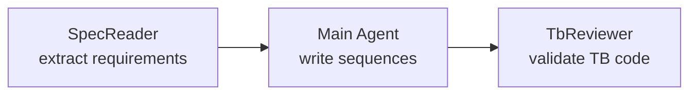

### Parallel: Full Review

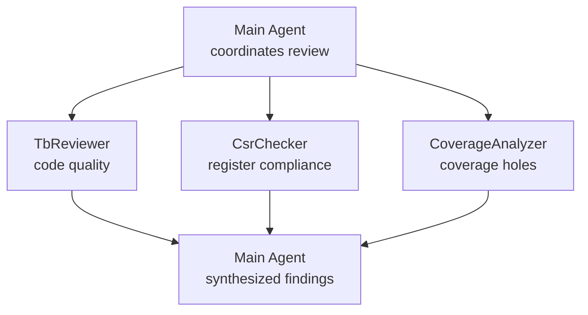

### Background: Long Coverage Analysis

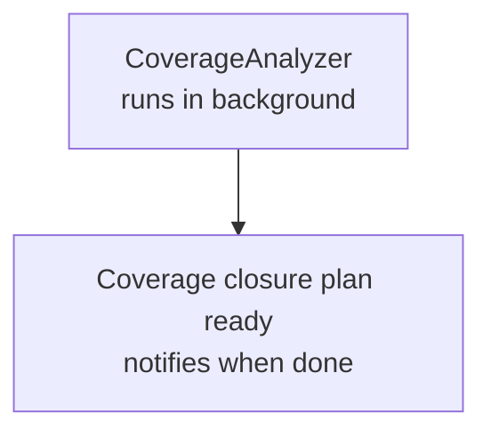

---

## Natural Language Triggers

```
Phrase                                    → Implied Agent/Command
─────────────────────────────────────────────────────────────────
"commit this testbench work"             → /tb-checkpoint
"the sim is showing a UVM_ERROR"         → Debugger
"can you take a look at my scoreboard?"  → TbReviewer
"make sure the CSRs are correct"         → CsrChecker
"I'm not sure we're testing this right"  → Critic
"what would break if we change the FSM?" → Critic
"walk me through this spec section"      → SpecReader
"get this ready for regression"          → TbReviewer + /tb-checkpoint
```

---

# Part 6: Testing Verification Artifacts

## The Artifact Testing Pyramid

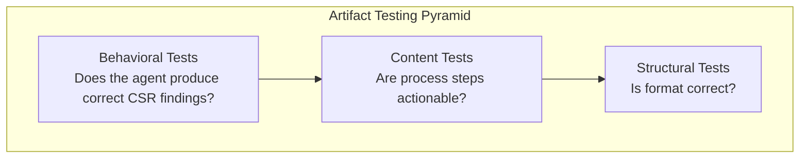

---

## Structural Tests

### For Rules (Verification Context)
```
✓ Has YAML frontmatter
✓ Has 'description' field (non-empty)
✓ Has 'globs' or 'alwaysApply'
✓ Globs match the right file types (*.sv, *.svh, *_reg_block*)
✓ Markdown body with at least one heading
```

### For Commands (Verification Context)
```
✓ NO YAML frontmatter
✓ Title: "# /command-name - Description"
✓ Has "## Instructions" section
✓ Default behavior documented (which test? which seed?)
✓ Has variants for common options (--test, --seed, --no-compile)
```

### For Agents (Verification Context)
```
✓ Has YAML frontmatter with name and model
✓ Description has Role section
✓ Description has Expertise section (specific — not generic "knows about UVM")
✓ Description has Process section with numbered steps
✓ Description has Output Format section with explicit template
✓ Description has Constraints section (includes read-only constraints)
```

---

## Content Tests

### Actionable Instructions
```
✓ Process steps contain verification verbs:
  "parse", "extract", "compare", "flag", "generate", "classify"
✗ No vague phrases:
  "analyze carefully", "be thorough", "check everything"
✓ Steps reference specific UVM classes or spec artifacts
✓ Examples use realistic register names, field names, signal names
```

### Description Quality for Verification Skills
```
✓ Includes natural language trigger phrases users actually say
✓ References specific protocols/standards (APB, UVM, CSR)
✓ Specifies tool requirements in 'compatibility' field
✓ Includes proactive trigger conditions (e.g., "when reg model file is open")
```

---

## Behavioral (Golden) Tests

### Golden Test: CsrChecker Agent

```yaml
# .cursor/tests/csr-checker.golden.yaml
artifact: .cursor/agents/csr-checker.md
scenarios:
  - name: "reset_value_mismatch"
    input: |
      Check this register model against the spec:
      Spec: CTRL_REG.enable, RW, reset=0x0
      Model: `uvm_field_int(enable, UVM_ALL_ON)` with reset value 0x1
    expected_contains:
      - "CTRL_REG"
      - "reset"
      - "mismatch"
      - "0x0"
      - "0x1"
    expected_not_contains:
      - "modify"
      - "change the RTL"

  - name: "ro_field_marked_rw"
    input: |
      Spec says STATUS_REG.busy is RO (read-only).
      Model defines it as uvm_reg_field with UVM_RW access.
    expected_contains:
      - "STATUS_REG"
      - "busy"
      - "RO"
      - "RW"
      - "mismatch"
    expected_format:
      has_sections:
        - "CSR Compliance Report"
        - "Critical Issues"

  - name: "all_clean"
    input: |
      Spec: DATA_REG.payload, RW, 32-bit, reset=0x0
      Model: `uvm_field_int(payload, UVM_ALL_ON)` 32-bit, reset=0x0
    expected_contains:
      - "match"
    expected_not_contains:
      - "CRITICAL"
      - "mismatch"

  - name: "w1c_field_check"
    input: |
      Spec: INT_STAT.done is W1C.
      Model: done.configure(..., "W1C", ...)
      Does the model match?
    expected_contains:
      - "W1C"
      - "PASS"
      - "INT_STAT"
    expected_not_contains:
      - "mismatch"
      - "CRITICAL"
```

### Golden Test: SpecReader Agent

```yaml
# .cursor/tests/spec-reader.golden.yaml
artifact: .cursor/agents/spec-reader.md
scenarios:
  - name: "shall_requirement"
    input: |
      Spec text: "When XFER_LEN.byte_count is zero the SPI master
      shall not toggle SCLK and shall assert STATUS.mode_fault."
    expected_contains:
      - "shall not toggle SCLK"
      - "mode_fault"
      - "spi_zero_len"
      - "HIGH"
      - "REQ-"
    expected_not_contains:
      - "paraphrase only"
      - "maybe"

  - name: "ambiguous_spec"
    input: |
      Spec: "Software may clear the interrupt by writing to INT_STAT."
      (Does not say W1C vs write-0)
    expected_contains:
      - "ambiguous"
      - "clarification"
      - "Open Questions"
```

### Golden Test: var-initialization Skill

```yaml
artifact: .cursor/skills/var-initialization/SKILL.md
scenarios:
  - name: "apb_vif_setup"
    input: |
      Set up testbench for APB agent with apb_if on pclk/preset_n.
      Hierarchy: uvm_test_top.env.apb_agent
    expected_contains:
      - "uvm_config_db"
      - "virtual apb_if"
      - "apb_agent"
      - "clocking"
      - "drv_cb"
    expected_not_contains:
      - "force dut"
```

### Golden Test: Coverage Closure Skill

```yaml
# .cursor/tests/coverage-closure.golden.yaml
artifact: .cursor/skills/coverage-closure/SKILL.md
scenarios:
  - name: "uncovered_bin"
    input: |
      Coverage report shows: apb_trans_cg.response_type bin SLVERR: 0/1 (0%)
    expected_contains:
      - "SLVERR"
      - "directed"
      - "sequence"
    expected_not_contains:
      - "exclude"   # SLVERR is reachable, should not be excluded

  - name: "unreachable_bin"
    input: |
      Coverage report shows: rx_cg.pkt_len bin SIZE_0: 0/1 (0%)
      Note: Spec section 2.1 states zero-length packets are prohibited.
    expected_contains:
      - "unreachable"
      - "exclude"
      - "spec"
    expected_not_contains:
      - "directed test"  # unreachable bins should not get directed tests
```

---

## Validation Checklists

### Rules (Verification)
- [ ] YAML frontmatter is valid
- [ ] Globs target correct file patterns (`*.sv`, `**/tb/**`)
- [ ] Instructions contain verification-specific verbs
- [ ] At least one concrete SystemVerilog example
- [ ] No vague phrases ("write clean code", "be careful")
- [ ] No conflicting guidance with other TB rules

### Commands (Verification)
- [ ] NO frontmatter
- [ ] Title: `# /command-name - Description`
- [ ] Has `## Instructions` section
- [ ] Default behavior states: which test, which seed, which scope
- [ ] Variants cover --test, --seed, --no-compile as appropriate
- [ ] Output format shows UVM pass/fail + coverage percentage

### Agents (Verification)
- [ ] Role is specific: "senior CSR verification engineer" not "helpful assistant"
- [ ] Expertise lists specific standards: UVM, OWASP is irrelevant — use AMBA, RFC, STRIDE per domain
- [ ] Process has numbered steps referencing verification artifacts
- [ ] Output template has a table with columns relevant to verification (Register, Field, Expected, Got)
- [ ] Constraints include read-only if agent should not modify DUT
- [ ] Constraints specify when to flag for human review vs auto-report

---

# Part 7: Meta-Learning for Verification

## The Learning Loop

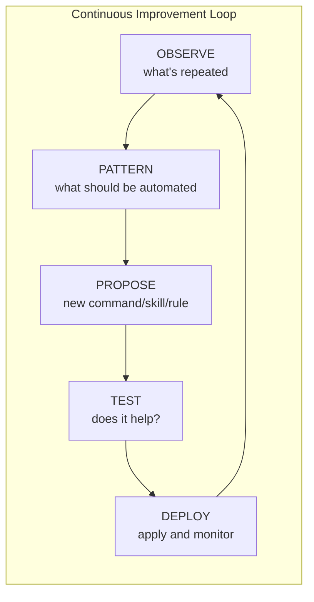

---

## What to Observe in Verification Workflows

### 1. Repeated Manual Simulation Steps

```
Manual Action Tracking:
  "vlog +define+UVM_NO_DEPRECATED tb/*.sv": 8 times
  "vsim -c -do 'coverage save; quit'": 6 times
  "manually checking reset values in register model": 5 times

Patterns:
  - Manual compile → automate into /run-sim
  - Manual coverage save → add to /run-sim default behavior
  - Manual reset value check → CSR verification skill needed
```

### 2. Repeated Questions About Spec

```
Question Tracking:
  "what is the reset value of CTRL_REG.enable?": 3 times
  "is STATUS_REG.busy read-only or read-write?": 4 times
  "what does the spec say about back-to-back writes?": 2 times

Patterns:
  - Repeated register questions → create spec-extraction skill
  - Repeated access-type questions → CSR rule with register table reference
  - Protocol questions → create protocol reference in skill references/
```

### 3. Coverage Analysis Patterns

```
Command Tracking:
  /run-sim: 15 uses, 2 failures (missing test name argument)
  /check-coverage: 7 uses, 0 failures
  /generate-csr-test: 1 use (underused despite CSR-heavy project)

Patterns:
  - /run-sim failures → improve error handling for missing UVM_TESTNAME
  - /generate-csr-test underused → improve skill discoverability or routing
```

### 4. Agent Effectiveness

```
Agent Tracking:
  CsrChecker:
    spawned: 6 times
    helpful: 6 times
    verdict: KEEP

  SpecReader:
    spawned: 1 time
    should_have_spawned: 4 times (user manually read spec and asked questions)
    verdict: IMPROVE ROUTING (add "read this section" trigger)

  CoverageAnalyzer:
    spawned: 0 times
    should_have_spawned: 3 times (user described coverage holes manually)
    verdict: LOWER TRIGGER THRESHOLD — add "stuck at X%" trigger
```

---

## Pattern Thresholds

```
manual_action_repeated:
  threshold: 3+ times
  action: Propose command or automation rule

spec_question_repeated:
  threshold: 2+ times
  action: Propose spec-extraction skill or CSR rule

agent_not_spawned_when_useful:
  threshold: 2+ times
  action: Adjust routing patterns or lower trigger threshold

rule_always_overridden:
  threshold: 3+ times
  action: Review rule — coding standard may be wrong for this project

command_failure_repeated:
  threshold: 2+ times
  action: Improve command error handling or default argument handling
```

---

## Session Analysis Example

**User:** `/analyze-session --propose`

MetaAnalyzer examines the session and produces:

| # | Opportunity | Evidence | Proposal | Impact |
|---|------------|---------|---------|--------|
| 1 | Auto-compile rule (IMMEDIATE) | `vlog` run manually 8 times | Add auto-compile to autonomous-workflows | ~16 manual commands saved per session |
| 2 | Spec extraction skill trigger (HIGH) | SpecReader not spawned 4 times when reading spec manually | Add "what does the spec say" routing trigger | Automated spec reading |
| 3 | CSR coverage — missing generated tests (MED) | /generate-csr-test used 1×, 3× CSR bugs found in review | Improve /generate-csr-test discoverability | Catch CSR bugs earlier |
| 4 | CoverageAnalyzer routing threshold (MED) | 3 times user described coverage holes without spawning agent | Lower routing trigger — add "stuck at" pattern | Automated coverage analysis |

---

## Automated vs Manual Learning for Verification

| Type | Examples |
|------|---------|
| **Auto-Apply (Safe)** | Update observation counters, flag repeated patterns |
| **Propose and Wait (Default)** | New routing rules, new command variants, updated skill descriptions |
| **Manual Only (Risky)** | Delete CSR rules, modify security/access policies, change golden reference values |

---

# Appendix: Quick Reference

## Full Comparison Table

| | Rules | Skills | Commands | Agents |
|--|-------|--------|---------|-------|
| **What it is** | Passive guidance | Active verification procedure | Saved simulation workflow | Specialized verification persona |
| **Purpose** | TB coding standards, access policies | CSR verification, coverage closure, spec extraction | `/run-sim`, `/check-coverage`, `/tb-checkpoint` | SpecReader, CsrChecker, CoverageAnalyzer, TbReviewer |
| **Activation** | Always on or glob-triggered | Agent decides or `/skill-name` | **User only — always manual** | Spawned by main agent |
| **Context loading** | Loaded every matching conversation | Progressive — description first, full contents on demand | Injected when triggered | Fresh isolated context window |
| **Best for** | Naming conventions, methodology enforcement | Multi-step verification procedures | Repeatable simulation tasks | Deep audits requiring fresh unbiased perspective |
| **Think of it as** | Your methodology handbook | Your verification procedure library | Your simulation shortcuts | Your specialist colleagues |

## The Three Questions

1. **Does it tell the agent how to write verification code?** → Rule
2. **Does it tell the agent how to run a verification procedure?** → Skill
3. **Is it a simulation workflow you're tired of typing?** → Command
4. **Does it require deep focused expertise or a fresh unbiased perspective?** → Agent

## Key Verification Principles

| Principle | Application |
|-----------|------------|
| Rules guide, Skills do, Commands trigger | Use rules for standards; skills for CSR/coverage workflows; commands for /run-sim |
| The 2+2 test | If "what does this SV syntax mean?" doesn't need the CSR access rule, don't alwaysApply it |
| Description is discovery | Skills are only as findable as their descriptions — include natural phrases like "what could go wrong" |
| Monitors are passive | Never drive interface signals from a monitor — this is a rule, not a skill |
| Fresh context is a superpower | CsrChecker started fresh has no anchoring on your wrong hypothesis about a reset value |
| Read-only agents protect the DUT | CsrChecker, CoverageAnalyzer — mark `readonly: true` — verification engineers never edit RTL |
| Quote specs verbatim | SpecReader must quote, not paraphrase — ambiguity gets flagged, not interpreted |
| Propose, don't auto-apply | MetaAnalyzer proposes routing improvements — human accepts before they change behavior |

## Verification Skill Categories

| Category | Skills |
|---------|--------|
| `verification` | csr-verification, coverage-closure, assertion-analysis |
| `planning` | spec-extraction, testplan-generation, risk-assessment |
| `setup` | var-initialization, tb-config, reg-model-init |
| `workflow` | run-regression, coverage-merge, waveform-analysis |

---

## Appendix B: Artifact Quick-Start Templates

Copy these into `.cursor/` to bootstrap a verification project.

### Minimal Rule — `rules/uvm-core/RULE.md`

```yaml
---
description: "Core UVM verification standards for all SystemVerilog testbench files"
globs: ["tb/**/*.sv", "tb/**/*.svh"]
alwaysApply: false
---
- Use `uvm_info`/`uvm_error` — never `$display` in UVM components
- Monitors are passive — never assign to interface signals in monitor
- Call `super.build_phase(phase)` (and all phases) in every override
- Check `uvm_status_e` after every `uvm_reg` read/write
```

### Minimal Command — `commands/run-sim.md`

```markdown
# /run-sim - Run UVM Test

## Instructions
When invoked: run `make sim TEST=${UVM_TESTNAME:-base_test} SEED=${SEED:-1} COV=1`.
Report UVM_ERROR/UVM_FATAL counts and functional coverage %.
On compile error: stop and show first 20 lines of log.
```

### Minimal Agent — `agents/csr-checker.md`

```yaml
---
name: csr-checker
readonly: true
description: |
  CSR register compliance auditor. Use for: verify registers, reset values,
  field accessibility, reg model vs spec. Triggers: "CSR", "register map",
  "reset value", "RO field", "W1C".
---
You compare uvm_reg models to specification tables field by field.
Report: register, field, spec value, model value, severity, fix.
Never edit RTL. Cite spec section for every finding.
```

### Minimal Skill — `skills/csr-verification/SKILL.md`

```yaml
---
name: csr-verification
description: |
  Verify CSR registers against specification. Use when: verify registers,
  check reset values, RO/W1C tests, register map compliance.
  Triggers: "verify CSR", "register reset", "field accessibility".
---
## Process
1. Parse spec register table
2. Compare to uvm_reg model
3. Run or generate csr_reset_test and csr_rw_test
4. Report compliance table
```

---

## Appendix C: Glossary (Verification)

| Term | Meaning in this guide |
|------|----------------------|
| CSR | Control/Status Register — memory-mapped registers in DUT |
| Reg model | `uvm_reg` hierarchy mirroring hardware register map |
| Frontdoor | Register access through bus (APB) like software |
| Backdoor | Direct peek/poke into reg model or HDL without bus cycles |
| W1C | Write-1-to-clear field |
| RSVD | Reserved — read 0, write ignored |
| SLVERR | APB error response for failed transfer |
| Covergroup | SystemVerilog functional coverage construct |
| Directed test | Non-random sequence targeting specific bin/bug |
| Persona lens | Same-context agent behavior (not isolated subagent) |

---

*Tailored for hardware verification engineers working with SystemVerilog/UVM testbenches, CSR register verification, specification reading, and coverage closure. Concepts sourced from agenticthinking.ai and adapted with verification-domain examples.*
